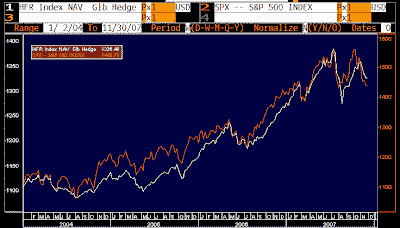

<!--yml
category: 未分类
date: 2024-05-18 01:16:18
-->

# Humble Student of the Markets: What exactly are hedge funds hedging?

> 来源：[https://humblestudentofthemarkets.blogspot.com/2007/11/what-exactly-are-hedge-funds-hedging.html#0001-01-01](https://humblestudentofthemarkets.blogspot.com/2007/11/what-exactly-are-hedge-funds-hedging.html#0001-01-01)

**Real alpha is**  **hard to find**

Can someone remind me why investors pay 2% and 20% fees?

This chart shows the weekly returns of the HFRX Global Hedge Fund Index and the S&P 500\. The HFRX Index is an investable index of hedge funds and returns are reported daily, net of fees.

Yes - you can choose other flavors of hedge fund indices but the results are going to be roughly the same. The correlation of most diversified hedge fund indices to the S&P 500 is 0.8 and up.

Bridgewater Associates did a study in 2004, updated in 2006, called

*Hedge Funds Selling Beta as Alpha*

showing that you can replicate the return patterns of many strategies with simple instruments. Some sample quotes:

***emerging market hedge funds are over 80% correlated to a simple 50/50 mix of emerging market equities and bonds...***

and

***M&A arb funds...do no better than simply buying the top 10 announced targets and selling the top 10 acquirers.***

A few years ago CALPERS noted that hedge funds fees were too high - a comment that the press seized on. They went on to say, however, something to the effect that they were not averse to paying for alpha, a comment that the press did not trumpet at the time.

***Real alpha is hard to find***

. There are a lot of crowded trades and strategies out there. The real trick for a hedge fund investor is to find a differentiated alpha.