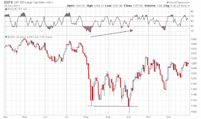

<!--yml
category: 未分类
date: 2024-05-18 01:53:56
-->

# Humble Student of the Markets: What rhymes with 2011?

> 来源：[https://humblestudentofthemarkets.blogspot.com/2021/10/what-rhymes-with-2011.html#0001-01-01](https://humblestudentofthemarkets.blogspot.com/2021/10/what-rhymes-with-2011.html#0001-01-01)

**Preface: Explaining our market timing models** 

We maintain several market timing models, each with differing time horizons. The "

**Ultimate Market Timing Model**

" is a long-term market timing model based on the research outlined in our post, 

[Building the ultimate market timing model](https://humblestudentofthemarkets.com/2016/01/26/building-the-ultimate-market-timing-model/)

. This model tends to generate only a handful of signals each decade.

The 

**Trend Asset Allocation Model**

 is an asset allocation model that applies trend following principles based on the inputs of global stock and commodity price. This model has a shorter time horizon and tends to turn over about 4-6 times a year. The performance and full details of a model portfolio based on the out-of-sample signals of the Trend Model can be found

[here](https://humblestudentofthemarkets.com/trend-model-report-card/)

.

My inner trader uses a 

**trading model**

, which is a blend of price momentum (is the Trend Model becoming more bullish, or bearish?) and overbought/oversold extremes (don't buy if the trend is overbought, and vice versa). Subscribers receive real-time alerts of model changes, and a hypothetical trading record of the email alerts is updated weekly 

[here](https://humblestudentofthemarkets.com/trading-track-record/)

. The hypothetical trading record of the trading model of the real-time alerts that began in March 2016 is shown below.

The latest signals of each model are as follows:

*   Ultimate market timing model: Buy equities*
*   Trend Model signal: Bullish*
*   Trading model: Bullish*

** The performance chart and model readings have been delayed by a week out of respect to our paying subscribers.***Update schedule**

: I generally update model readings on my 

[site](https://humblestudentofthemarkets.com/)

 on weekends and tweet mid-week observations at @humblestudent. Subscribers receive real-time alerts of trading model changes, and a hypothetical trading record of those email alerts is shown 

[here](https://humblestudentofthemarkets.com/trading-track-record/)

.

Subscribers can access the latest signal in real-time 

[here](https://humblestudentofthemarkets.com/my-inner-trader/)

.

**The 2011 template**

The market action today is somewhat reminiscent of 2011\. Then, the macro backdrop was characterized by a debt ceiling impasse in Washington and a Greek Crisis in Europe that threatened the very existence of the eurozone. I can remember endless European summits and plans to make plans for Greece. The news flow worsened and it seemed like no one was in charge in Europe, but the S&P 500 tested support multiple times while exhibiting a series of positive RSI divergences. The logjam was finally broken when the ECB stepped in and announced its LTRO program. Stocks bottomed and never looked back.

History doesn't repeat itself, but rhymes. Today, the market has been beset by a debt ceiling impasse in Washington and concerns over inflationary pressures which may or may not be transitory from supply chain bottlenecks. The logjam appears to have been temporarily broken when the Democrats and Republicans agreed to kick the can down the road and revisit the debt ceiling question in December. Stock prices duly staged a relief rally.

Does 2011 rhyme with 2021?

The full post can be found

[here](https://humblestudentofthemarkets.com/2021/10/10/what-rhymes-with-2011/)

.