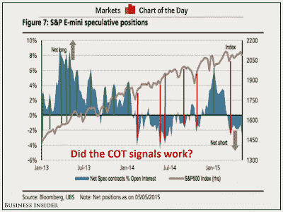

<!--yml
category: 未分类
date: 2024-05-18 03:21:35
-->

# Humble Student of the Markets: What the COT data really tells us about the stock market

> 来源：[https://humblestudentofthemarkets.blogspot.com/2015/05/what-cot-data-really-tells-us-about.html#0001-01-01](https://humblestudentofthemarkets.blogspot.com/2015/05/what-cot-data-really-tells-us-about.html#0001-01-01)

[Business Insider](http://www.businessinsider.com/sp-500-net-short-positions-2015-5)

featured a chart from UBS indicating that speculators were in a crowded short position in the SP 500 e-mini contract:

> It's been almost a year since traders were betting against the SP 500 like this.
> 
> According to data from UBS, as of last week, traders continued to add to short positions on SP 500 E-mini futures, meaning these folks were betting that stock prices would fall.

By implication, traders are in a crowded short and the stock market is likely to rise. The chart from UBS is shown below. I have annotated past "crowded short" readings in red and "crowded long" readings in green. Can anyone seriously tell me that they want to use this Commitment of Traders (COT) data to trade the stock market? First of all, the CRTC has three broad classifications for traders, namely hedgers, or commercials, large speculators (institutions and hedge funds) and small speculators (mostly individuals). It is unclear whether the "traders" referred to in the UBS report are large speculators, small speculators, or both.

I used to analyze COT data in the past and I found that SP 500 COT data was useless for calling market direction. However, large speculator and leveraged position (read: hedge funds) positions on the NASDAQ 100 (NQ) contract was a reasonable contarian indicator. The most likely reason is that the fast money uses NQ positions to make market direction bets as the NASDAQ 100 is perceived to be a high beta index.

Here is the NASDAQ 100 e-mini COT chart from

[barchart.com](http://www.barchart.com/chart.php?sym=NQ*1&style=technical&template=&p=DN&d=X&sd=&ed=&size=M&log=0&t=BAR&v=0&g=1&evnt=1&late=1&o1=&o2=&o3=&sh=150&indicators=COTLC(13369344,26112,153);COTFIN(13369344,26112,153,16750848)&chartindicator_3_code=COTLC&chartindicator_3_param_0=13369344&chartindicator_3_param_1=26112&chartindicator_3_param_2=153&chartindicator_5_code=COTFIN&chartindicator_5_param_0=13369344&chartindicator_5_param_1=26112&chartindicator_5_param_2=153&chartindicator_5_param_3=16750848&addindicator=&submitted=1&fpage=&txtDate=)

:

Currently, large speculators and hedge funds have started to unwind what was a crowded long position. As this data is reported weekly and with a lag, it is unclear how the COT data has shifted as the SPX has achieved an all-time high.

The moral of this story? Know how well your model works before jumping to conclusions.