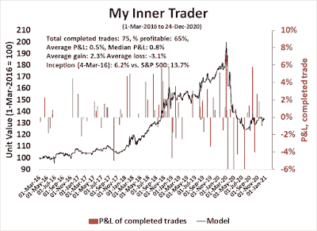
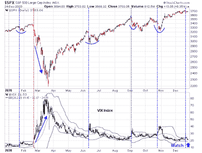

<!--yml
category: 未分类
date: 2024-05-18 02:06:52
-->

# Humble Student of the Markets: When does Santa's party end?

> 来源：[https://humblestudentofthemarkets.blogspot.com/2020/12/when-does-santas-party-end.html#0001-01-01](https://humblestudentofthemarkets.blogspot.com/2020/12/when-does-santas-party-end.html#0001-01-01)

**Preface: Explaining our market timing models**

We maintain several market timing models, each with differing time horizons. The "

**Ultimate Market Timing Model**

" is a long-term market timing model based on the research outlined in our post,

[Building the ultimate market timing model](https://humblestudentofthemarkets.com/2016/01/26/building-the-ultimate-market-timing-model/)

. This model tends to generate only a handful of signals each decade.

The

**Trend Asset Allocation Model**

is an asset allocation model that applies trend following principles based on the inputs of global stock and commodity price. This model has a shorter time horizon and tends to turn over about 4-6 times a year. In essence, it seeks to answer the question, "Is the trend in the global economy expansion (bullish) or contraction (bearish)?"

My inner trader uses a

**trading model**

, which is a blend of price momentum (is the Trend Model becoming more bullish, or bearish?) and overbought/oversold extremes (don't buy if the trend is overbought, and vice versa). Subscribers receive real-time alerts of model changes, and a hypothetical trading record of the email alerts are updated weekly

[here](https://humblestudentofthemarkets.com/trading-track-record/)

. The hypothetical trading record of the trading model of the real-time alerts that began in March 2016 is shown below.

The latest signals of each model are as follows:

*   Ultimate market timing model: Buy equities*
*   Trend Model signal: Bullish*
*   Trading model: Bullish*

** The performance chart and model readings have been delayed by a week out of respect to our paying subscribers.* **Update schedule**

: I generally update model readings on my 

[site](https://humblestudentofthemarkets.com/)

 on weekends and tweet mid-week observations at @humblestudent. Subscribers receive real-time alerts of trading model changes, and a hypothetical trading record of those email alerts is shown

[here](https://humblestudentofthemarkets.com/trading-track-record/)

.

Subscribers can access the latest signal in real-time 

[here](https://humblestudentofthemarkets.com/my-inner-trader/)

.

**The seasonal party**

In my last mid-week post, I outlined how the combination of an oversold reading and positive seasonality were combining to provide bullish tailwinds for stocks (see

[The most wonderful time of the year...](https://humblestudentofthemarkets.com/2020/12/23/the-most-wonderful-time-of-the-year/)

). So far, the market is behaving according to the script. The VIX Index retreated after breaching its upper Bollinger Band (BB) last Monday, and the market staged an advance. In light of the narrowness of the BB, traders should watch for a breach of the lower BB, which would be a signal of an overbought market.

The full post can be found

[here](https://humblestudentofthemarkets.com/2020/12/27/when-does-santas-party-end/)

.