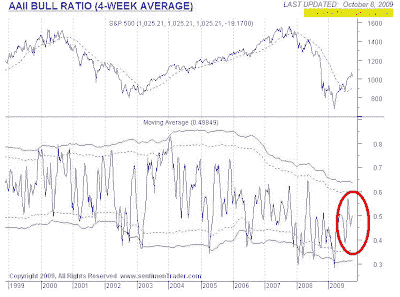

<!--yml
category: 未分类
date: 2024-05-18 00:45:03
-->

# Humble Student of the Markets: Where are the bulls?

> 来源：[https://humblestudentofthemarkets.blogspot.com/2009/10/where-are-bulls.html#0001-01-01](https://humblestudentofthemarkets.blogspot.com/2009/10/where-are-bulls.html#0001-01-01)

I have expressed my concern about the state of the equity market

[before](http://humblestudentofthemarkets.blogspot.com/2009/09/possible-market-crash-but-not-yet.html)

, but indicated that the bulls appear to remain in control despite the poor fundamentals. In a post entitled

[the most hated rally in Wall Street history](http://www.ritholtz.com/blog/2009/10/the-most-hated-rally-in-wall-street-history/)

, Barry Ritholz wrote last week that:

> Most bull moves do not end when they are hated, they come to a halt and reverse when they become over-owned and over-loved.
> 
> We are not there yet.

The latest data from the

[AAII survey](http://www.sentimentrader.com/subscriber/charts/WEEKLY/SURVEY_AAII_BULLRATIO_4WK.htm)

shows that, despite the equity rally, individual investors are not super bullish yet.

[Mark Hulbert’s survey](http://www.marketwatch.com:80/story/contrarian-analysis-of-stock-market-2009-09-29?link=kiosk)

of newsletter writers as of the end of September also tells the same story - there is no sign of bullish extremes. Morningstar also concluded that

[fund investors are still not buying into the stock market rally](http://www.bloomberg.com/apps/news?pid=20601087&sid=aEMeIGVXfVFc)

, based on their analysis of mutual fund flows data.

**Another market bubble?**

Is a bubble forming in the stock market?

I believe that the term “bubble” is over-used. Current readings from sentiment models suggests that the lack of investor bullishness may serve to put a floor on any near-term market weakness. While there are big risks from the fundamentals, it may be too early for traders to contemplate shorting the market here.

Bubble? No.

A frothy market? Definitely.