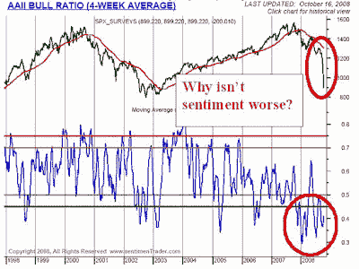

<!--yml
category: 未分类
date: 2024-05-18 01:03:45
-->

# Humble Student of the Markets: Where are the equity bears?

> 来源：[https://humblestudentofthemarkets.blogspot.com/2008/10/where-are-equity-bears.html#0001-01-01](https://humblestudentofthemarkets.blogspot.com/2008/10/where-are-equity-bears.html#0001-01-01)

After one of the biggest equity market declines we’ve seen in recent memory and a looming worldwide recession, investors should be worried and bearish, right?

It seems not. Maybe this all stems from

[Warren Buffett's clarion call to buy US equities](http://www.nytimes.com/2008/10/17/opinion/17buffett.html?_r=1&oref=slogin)

last week. Readings from sentiment models indicate that either investors are not bearish enough or plain outright bullish on the market, which makes me concerned that there is more downside to come.

**AAII survey not bearish enough**

The chart below shows the

[AAII sentiment survey](http://www.sentimentrader.com/subscriber/charts/WEEKLY/SURVEY_AAII_BULLRATIO_4WK.htm)

. After the recent freefall in the stock market, it is amazing to me that sentiment readings are less bearish than they were at the last short term market bottom:

**Hulbert indicators confirm lack of bearishness**

We also have several confirmations of this lack of bearishness. Mark Hulbert recently

[wrote](http://www.marketwatch.com/news/story/bottom-still-come-says-one/story.aspx?guid=%7BB344F30B%2D1D0E%2D4874%2D98ED%2D96602A1B4EC7%7D)

that the newsletter writers who advise buy-and-hold strategies haven’t thrown in the towel yet and moved to market timing:

> Historically, buy-and-hold tends to reach its peak of popularity at market tops, just as market timing becomes most out of favor. The inverse tends to be the case at market bottoms.

On Thursday October 16, Peter Brimelow also confirmed that

[newsletter writers’ sentiment wasn’t bearish enough](http://www.marketwatch.com/news/story/wipeout-wednesday/story.aspx?guid=%7BA9D7111F%2DC4CA%2D4D61%2DA628%2D8FD081144886%7D&dist=msr_2)

:

> The Hulbert Stock Newsletter Sentiment Index, which reflects the average recommended stock-market exposure among a subset of short-term stock market-timing newsletters tracked by the Hulbert Financial Digest, stood on Wednesday night at negative 12.8%. That's sharply higher than last week, when it was at negative 33.5%, although the Dow was 1,400 points higher and Mark Hulbert was already worried for contrary opinion reasons.

**Bloggers are wildly bullish, individuals not panicked**
What’s more, I was shocked to learn that there isn’t a single bear in the recent [TickerSense’s blogger sentiment survey](http://tickersense.typepad.com/ticker_sense/2008/10/october-13th-bl.html).

My own private conversations with individual investment advisors indicate that their clients are not panicked and some have even been buying. While these advisors mostly advocate asset allocation and buy-and-hold strategies, the lack of panic among individual investors is a huge concern for bulls.

On the other hand, there is a pervasive sense of doom on the economic front. The lack of doom among equity investors, however, point to more downside for the stock market.