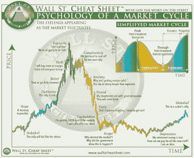

<!--yml
category: 未分类
date: 2024-05-18 01:53:24
-->

# Humble Student of the Markets: Where are we in the market cycle?

> 来源：[https://humblestudentofthemarkets.blogspot.com/2021/10/where-are-we-in-market-cycle.html#0001-01-01](https://humblestudentofthemarkets.blogspot.com/2021/10/where-are-we-in-market-cycle.html#0001-01-01)

Where are we in the market cycle? The accompanying chart shows a stylized market cycle and changes in sector leadership.

*   **Bear markets** are characterized by the leadership of defensive sectors such as healthcare, consumer staples and utilities.
*   **Early-cycle markets** are sparked by the monetary stimulus or the promise of monetary stimulus. The market leaders in this phase are the interest-sensitive sectors such as financials and real estate.
*   **Mid-cycle markets** are characterized by economic expansion. Expect rotation into consumer discretionary stocks, followed by capital-intensive industrials and technology.
*   **Late-cycle markets** will find investors become increasingly concerned about inflation. Inflation hedge sectors such as energy and materials lead during this phase.
*   In response to rising inflation expectations, either the central bank or the market tightens monetary policy, which resolves in a **market top and a bear market**.

Please be aware that while the psychology of a market cycle parallels an economic cycle, they are not the same. Since Wall Street's attention span approximates that of a 16-year-old, it is not unusual at all to find several market cycles compressed within a single economic cycle.

What I have described is an idealized market cycle. This economic and market cycle is very different from others. The last bear market was not sparked by monetary tightening, but the exogenous effect of a pandemic. The market leaders of the 2020 bear were not the usual defensive names. Instead, investors piled into work-from-home beneficiaries consisting mostly of Big Tech stocks.

With that preface in mind, where are we in the psychology of the market cycle?

The full post can be found

[here](https://humblestudentofthemarkets.com/2021/10/23/where-are-we-in-the-market-cycle/)

.