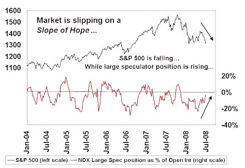
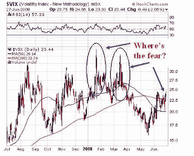

<!--yml
category: 未分类
date: 2024-05-18 01:08:17
-->

# Humble Student of the Markets: Where is the fear?

> 来源：[https://humblestudentofthemarkets.blogspot.com/2008/06/where-is-fear.html#0001-01-01](https://humblestudentofthemarkets.blogspot.com/2008/06/where-is-fear.html#0001-01-01)

The S&P 500 has been on a downward trajectory since mid-May and the index is now probing the lows reached in March. However, sentiment readings are much too sanguine indicating that further lows are ahead for US equities in the near term.

First of all, while

[AAII sentiment](http://www.sentimentrader.com/subscriber/charts/WEEKLY/SURVEY_AAII_BULLRATIO_4WK.htm)

is bearish, it is not at the bearish extremes seen last March.

Large speculators’ net positioning in the NASDAQ 100 futures and options has been a good contrarian indicator. As the chart below shows, the latest

[CFTC Commitment of Traders data](http://www.cftc.gov/marketreports/commitmentsoftraders/index.htm)

shows that not only have NASDAQ 100 large speculators not thrown in the towel on this market, they are buying this dip.

 ****Large Speculator net position in NASDAQ 100 future & options**

Other [commentators](http://www.bloomberg.com/apps/news?pid=20601213&sid=ahHs.UEaziG8&) have also pointed out that the VIX index, known as the “fear indicator”, hasn’t spiked like it has at the March and other intermediate term bottoms:

**