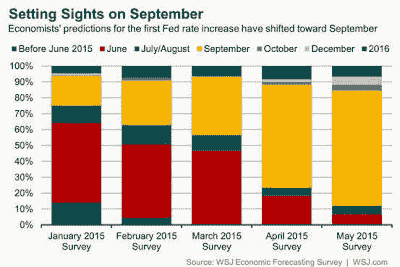

<!--yml
category: 未分类
date: 2024-05-18 03:21:21
-->

# Humble Student of the Markets: Where's the new high celebration?

> 来源：[https://humblestudentofthemarkets.blogspot.com/2015/05/wheres-new-high-celebration.html#0001-01-01](https://humblestudentofthemarkets.blogspot.com/2015/05/wheres-new-high-celebration.html#0001-01-01)

**Trend Model signal summary**

Trend Model signal: Neutral

Trading model: Bearish

The Trend Model is an asset allocation model which applies trend following principles based on the inputs of global stock and commodity price. In essence, it seeks to answer the question, "Is the trend in the global economy expansion (bullish) or contraction (bearish)?"

My inner trader uses the trading model component of the Trend Model seeks to answer the question, "Is the trend getting better (bullish) or worse (bearish)?" The history of actual (not backtested) signals of the trading model are shown by the arrows in the chart below. In addition, I have a trading account which uses the signals of the Trend Model. The last report card of that account can be found 

[here](http://humblestudentofthemarkets.blogspot.com/2015/05/trend-model-april-report-card-playing.html)

.

**Update schedule**

: I generally update Trend Model readings on 

[my blog](http://humblestudentofthemarkets.blogspot.com/)

on weekends and tweet any changes during the week at @humblestudent.

**An odd all-time high**

Imagine going to a wedding where virtually no one is celebrating. The guests are whispering in hushed tones. What could be wrong? Is the groom flirting with the bridesmaids? Did the bride run off with an old boyfriend (much like the

[final scene in *The Graduate*](https://www.youtube.com/watch?v=ahFARm2j38c)

)? That what the stock market felt like last week.

[https://www.youtube.com/embed/ahFARm2j38c?feature=player_detailpage](https://www.youtube.com/embed/ahFARm2j38c?feature=player_detailpage)

VIDEO

The SPX and OEX reached all-time highs, but market internals were unenthusiastic with exhibitions of positive momentum. As the chart below shows, RSI(14) remained in a tight range and behaved much like it had in the past few weeks when the market oscillated in a tight band. The % bullish metric flashed a negative divergence and % above the 50 day moving average was also range bound.

Other US stock market indices were not confirming the new highs either. The NASDAQ Composite, Russell 2000, the DJIA and DJTA were all below their highs, though the Dow was very close (see my post

[How worried should you be about the weak DJ Transports?](http://humblestudentofthemarkets.blogspot.com/2015/05/how-worried-should-you-be-about-weak-dj.html)

). Moreover, all of the averages shown in the chart below are exhibiting a disturbing sign of having breached an uptrend indicating a loss of momentum. I was informed by another technical analyst that I had turned bearish too early, as such formations often resolve themselves with a sideways consolidation and sometimes a rally to a marginal new high before rolling over.

Looking abroad, SPX strength hasn't been confirmed by the European averages either. Both European averages also display the same characteristic breach of uptrend lines seen in the US averages.

To be sure, not all inter-market analysis is painting a bearish picture. Despite the weakness in Europe, the technical conditions of the Greater China stock markets are mostly healthy. But then if US equities have to depend on Chinese stimulus as a source of global growth, we would be indeed be scraping the bottom of the barrel.

Score breadth, momentum and inter-market analysis as bearish.

**Sentiment model readings mixed**

I saw a number of bulls get very excited when

[NAAIM exposure](http://www.naaim.org/newsresources/naaim-exposure-index/)

showed a crowded short reading, which is contrarian bullish, and AAII sentiment survey showed that the percentage of AAII bulls had fallen to a two-year low (see analysis from

[Bespoke](https://www.bespokepremium.com/think-big-blog/bullish-sentiment-drops-to-lowest-level-in-more-than-two-years/)

).

There is no doubt that the NAAIM exposure index is a bullish sign, but the AAII results have to seen in context as the high level of neutral opinions pushed the AAII bull to bear spread to an overall neutral reading. While I am not a big fan of opinion surveys as opinions can move on a dime, surveys where people put real money on the line are better indications of investor opinion. My own interpretation of the AAII sample and Rydex data are pointing to neutral sentiment readings.

Other indirect indicators of sentiment from option data indicate that the market is complacent and showing no fear. The chart below of the term structure of the VIX, the equity-only put-call ratio and the VIX Index itself, where high readings indicate fear and low readings indicate greed, are all showing complacent readings.

Moreover, the all three versions of ISE call-put ratio (total, equity-only and index and ETF) moved above the 200% level on Thursday, which is a rare occurrence.  Though the sample size is small and there was one important exception at the 2009 market low, such occasions have not been bullish signs in the past.

[Dana Lyons](http://jlfmi.tumblr.com/post/119043103985/one-gauge-of-investor-sentiment-just-hit-a-6-year)

looked at the ISE index and ETF data and came to a similar conclusion:

Score sentiment models as mixed to slightly bearish.

**The growth scare continue**

The US macro outlook is shaping up to be the "mild industrial recession" postulated by

[New Deal democrat](http://community.xe.com/blog/xe-market-analysis/weekly-indicators-overly-strong-killing-us-expansion-edition)

based on his review of high frequency economic data:

> The bottom line is, the US economy is in a shallow industrial recession. It is not due to the weather, nor to the West Coast ports strike. Rather, it is driven by a 16% appreciation of the US$ globally, and secondarily by the effects of the collapse of commodity prices on raw materials producers. At the moment, weakness in consumer spending in the Oil patch is outweighing consumer strength elsewhere.

With the exception of initial claims, all of last week's major macro releases missed expectations, such as retail sales, industrial production, consumer sentiment. The latest update of Doug Short's

[Big Four Recession Indicators](http://www.advisorperspectives.com/dshort/updates/Big-Four-Economic-Indicators.php)

is looking a little shaky. Of the four, Employment has consistently been positive< Industrial production was negative. Retail sales came in flat, but we have to wait for the inflation adjustment to see how negative it is. The last, real income, was negative last month.

The latest update from the Atlanta Fed's

[GDPNow](https://www.frbatlanta.org/cqer/researchcq/gdpnow.cfm)

nowcast of GDP growth is an anemic 0.7%, which is getting close to stall speed:

> The GDPNow model forecast for real GDP growth (seasonally adjusted annual rate) in the second quarter of 2015 was 0.7 percent on May 13, down slightly from 0.8 percent on May 5\. The nowcast for second-quarter real consumer spending growth ticked down 0.1 percentage point to 2.6 percent following this morning's retail sales report from the U.S. Census Bureau.

Incidentally, Deutsche Bank took a look at the forecast record of this simple mechanical model and it's been pretty good (via

[Barry Ritholz](http://www.ritholtz.com/blog/2015/05/now-tracking-gdp/?utm_source=dlvr.it&utm_medium=twitter)

):

We may be seeing the worst of all worlds. We have a sputtering US economy and a Fed preparing to raise rates (see

[Bulls shouldn't expect help from the Fed](http://humblestudentofthemarkets.blogspot.com/2015/05/bulls-shouldnt-expect-help-from-fed.html)

), which would not only dampen growth but push the USD up and create earnings headwinds for companies.

The US shouldn't expect much help from overseas. Even though the latest data shows that European growth is recovering, US growth is faltering and Chinese growth is decelerating.

[Gavekal](http://gavekal.blogspot.com/2015/05/has-sales-growth-peaked-for-cycle.html)

has suggested that global sales growth may have peaked for this cycle.

Commodity prices, which have been good indicators of global growth, may be confirming that conclusion. While commodity prices appear to have bottomed in the last few weeks, much of the strength is attributable to USD weakness. A glance at industrial metals, a key input to the global growth engine, in EUR and CAD leads to a different conclusion.

Score the macro conditions as being a bit on the weak side.

**The weight of the evidence**

To be sure, not all indicators are pointing down. Here are a number of signs that can be interpreted bullishly:

*   **Great China stock markets are supportive of growth.** While I tend to discount the gyrations of the Chinese equity market because of its retail orientation and casino mentality, the message from HK, Korea and Taiwan is more stimulus from Beijing (see previous comment above).
*   **NAAIM exposure came in at a historically low level, which is contrarian bullish.** The NAAIM exposure index shows what RIA managers are doing with their assets and it has been a terrific contrarian indicator.
*   **Retail sales may not be that bad.** [David Rosenberg](http://www.financialpost.com/m/wp/blog.html?b=business.financialpost.com//investing/look-beyond-retail-sales-for-whats-really-happening-with-the-u-s-economy) pointed out that some components of personal expenditures no accounted for in retail sales are growing strongly, such as air travel,theme park spending and car leasing.
*   **NFIB small business optimism rose and beat expectations.** This is a contrary sign of a tanking economy.
*   **Forward EPS revisions have become more constructive.** The latest update from Ed Yardeni shows that forward 12-month estimates are rising for large caps and small caps, but falling for mid caps, compared with falling estimates for small and mid caps in the previous week. EPS estimates for the large cap SP 500 have risen for two consecutive weeks. Could the growth scare be over?
*   **The economic weakness may prompt the Fed to delay the interest rate normalization process.** A recent Jon Hilsenrath [WSJ](http://www.wsj.com/articles/why-the-economyand-the-fedkeeps-getting-knocked-off-track-1431716782) article indicates that the Fed would like to raise rates and begin the interest rate normalization process, but the soft patch in the economy is likely to push out the date of the first liftoff. According to the [WSJ](http://blogs.wsj.com/economics/2015/05/14/wsj-survey-most-economists-see-fed-raising-rates-in-september/?utm_content=buffer52407&utm_medium=social&utm_source=twitter.com&utm_campaign=buffer&mg=blogs-wsj&url=http%253A%252F%252Fblogs.wsj.com%252Feconomics%252F2015%252F05%252F14%252Fwsj-survey-most-economists-see-fed-raising-rates-in-september%253Futm_content%253Dbuffer52407%2526utm_medium%253Dsocial%2526utm_source%253Dtwitter.com%2526utm_campaign%253Dbuffer), the current consensus is for the Fed to first raise rates in September, but we are likely to get greater clarity on this issue when FOMC minutes are released on Wednesday.

Despite the smattering of bullish indicators, the weight of the evidence is intermediate term bearish. Technically, breadth, momentum and sentiment models are tilted bearishly. The economy remains weak and the Fed is about to begin a tightening cycle. When it does, rising rates will be USD bullish, which will create headwinds for corporate earnings.

**The week ahead**

This review is much too long and it`s time to wrap up. In summary, the new high shown by the SPX last week is unconvincing. Market action continues to be suggestive of a wimpy bull-wimpy bear range bound market. Short-term indicators like this one from

[IndexIndicators.com](http://www.indexindicators.com/indicators/breadth/)

show that readings are nearing levels where the market has sputtered in the past few weeks. Indeed, this chart of net 20-day highs - lows rolled over on Friday, even as the index made a marginal high.

My inner investor remains cautious, but not overly panicked. My inner trader remains short, Should a decline materialize next week, he will be watching for signs of negative momentum of prolonged oversold conditions. Otherwise, his base case is a brief market swoon, to be followed by the usual short rally - until the real bear episode begins.

**Disclosure:**

Long SPXU,SQQQ