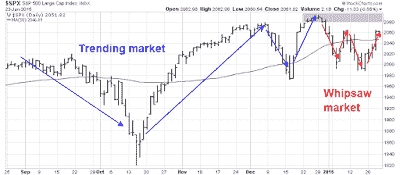

<!--yml
category: 未分类
date: 2024-05-18 03:21:13
-->

# Humble Student of the Markets: Why I am bearish (and what would change my mind)

> 来源：[https://humblestudentofthemarkets.blogspot.com/2015/05/why-i-am-bearish-and-what-would-change.html#0001-01-01](https://humblestudentofthemarkets.blogspot.com/2015/05/why-i-am-bearish-and-what-would-change.html#0001-01-01)

Now that SPX has reached further all-time highs, I received a number of comments to my latest weekly market outlook post (see

[Where's the new high celebration?](http://humblestudentofthemarkets.blogspot.com/2015/05/wheres-new-high-celebration.html)

) which amounted to "you've been bearish and wrong for the past few weeks and now it seems that you are stubbornly making up reasons to stay that way". Under the circumstances, I feel compelled to respond and explain.

**How I got bearish**

To explain how I became bearish, follow me on my market research journey in the last few months. In January, I observed that the market environment was becoming difficult for trend following models like mine (see

[All washed up!](http://humblestudentofthemarkets.blogspot.com/2015/01/all-washed-up.html)

). The market had become choppy, which was problematical for identifying a short-term trend:

> The chart below of the SPX in the last six months shows how the market environment has changed. Early in this period, the price trend of the market were long-lived. Starting about mid-December, the price swings got shorter and the magnitude of the moves were lower, which change the character of the market from a trending market (shown by the blue lines) to a choppy, whipsaw market (shown by the red lines).

> This is an especially challenging environment for trend following models and my inner trader has had to rely more on short-term sentiment and overbought-oversold models for his trading. The markets are experiencing powerful cross-currents, which can be highly treacherous if someone is positioned in the wrong way.
> 
> Current conditions are suggestive of a range-bound stock market - at least we start to get more clarity on how fundamentals are developing. ***Until macro trends start to stabilize, I urge my readers to pay minimal attention to Trend Model readings.*** This model is "all washed up", at least for the moment.

Since I wrote those words, the US equity market averages continued to do the stutter step above and below the 50 dma and behave in a choppy fashion.

In April, a

[comprehensive study](http://ig.cdn.responsys.net/i4/responsysimages/str2/__RS_CP__/20150406_EMP.pdf)

by James Paulsen of Wells Capital Management identified the current environment as market adherence to the long-term trend as overbought (my words, not his). Paulsen did the rolling 36-month regressions of stock prices and charted the R-squared of the regressions (the higher the R-squared, the tighter the fit). He found that current levels of R-squared is in the top decile of fit, which is consistent with the straight up stock market without a 10% correction that has been observed.

Paulsen then hypothesized that current market conditions had created excessive investor complacency and such periods have tended to not ended well. Consider the return statistics when R-squared is in the top decile (leftmost bar) in the charts below:

At about the same time, 

[Brett Steenbarger](http://traderfeed.blogspot.com/2015/03/new-highs-and-lows-in-stock-market-and.html)

 had another take on the current market environment. He observed that while the long-term trend remained intact, short-term trends, which he called momentum, was misbehaving:

> Overall, chasing new highs and stopping out of long positions on expansions of new lows has brought subnormal returns. We have had a trending environment since 2012, but not a momentum environment. Understanding that distinction has been crucial to stock market returns.

Using Paulsen study methodological framework, I did some more research and compared the 36-month R-squared, or trend, with a shorter 6-month R-squared, or trend. I found that the two had diverged considerably, which confirms the Steenbarger comment (see

[How to make your first loss your best loss](http://humblestudentofthemarkets.blogspot.com/2015/04/how-to-make-your-first-loss-be-your.html)

).

Such episodes have tended to resolve themselves in a bear phase, largely because a weakening short-term trend combined with a strong long-term trend is indicative of weakening momentum. In fact, current readings are similar to conditions observed just before the Crashes of 1929 and 1987, though I am not forecasting a market crash as this model is better at forecasting direction than magnitude.

> Nevertheless, based on the current 36-month to 6-month R-squared spread of 0.844, I looked at what the return pattern of the DJIA was during past episodes with similar characteristics. The sample size was a more reasonable 16, compared to the minuscule N=4 in the SP 500 study that went back to 1950\. The market outperformed initially, but rolled over at between 3-6 months after the first time the spread went above 0.8 (which was March 2015).

> And if the trend got even more extended and the 36 to 6 month spread went to 0.9? The results were more dramatic, as the market declined almost immediately.

*My research showed that, based on monthly data going back to 1900, such episodes of trend divergence have tended to resolve themselves in market downturns. That is how I came to the opinion that the next major move in stock prices is likely to be down.*

As the study was based on monthly data, recent market action amounts to mere squiggles.

Another way of depicting the long and short term trend divergence is through the use of MACD. As the monthly chart of the SPX below shows, the MACD histogram has gone negative, indicating a loss of price momentum. Every past instance in the last 20 years has either seen stock prices either be in a bear phase, as measured by the 12 month moving average, when MACD turned negative, or resolved itself into a bear move soon afterwards.

**A downturn every time on when MACD turned negative**

**What would make me bullish?**

Like every investor, I've been wrong before. In order to change my assessment of the intermediate term trend for stock prices, I need to see definitive signs of improvement in the short-term trend. I am watching for improvement several of the following signs in order to turn more bullish:

Technical

*   **MACD divergence improvement:** It doesn't necessarily have to go positive, but some signs that it is flattening out and starting to rise would help.
*   **Stop the chop with better momentum:** Now that the SPX has broken out to new highs, I would like to see some follow-through indicating that positive momentum has re-asserted itself. One useful sign would be a series of "good" overbought readings where the market gets overbought on indicators like RSI and stays overbought.

Macro and fundamental

*   **An improvement in macro outlook**: The Citigroup US Economic Surprise Index has been mired in highly negative territory, indicating a preponderance of economic misses compared to beats. Doug Short's [Big Four Recession Indicators](http://www.advisorperspectives.com/dshort/updates/Big-Four-Economic-Indicators.php) are looking a little wobbly and [New Deal democrat](http://community.xe.com/blog/xe-market-analysis/weekly-indicators-overly-strong-killing-us-expansion-edition) has been calling for a mild industrial recession, though the consumer sector remains healthy. So is it too much to ask for some signs of improvement in Citigroup ESI?

*   **A consistent record of positive EPS estimate revisions**. If the economy starts to improve, then the Fed is likely to raise rates, which would hold back stock market gains from PE expansion. The negative effects of a flat to falling PE can be offset by robust EPS growth. From a valuation viewpoint, it will be up to EPS growth that does most of the heavy lifting in pushing stock prices upward at this point of the economic cycle.

Like all investors, I have been wrong before. Admittedly, such periods of negative performance creates valuable "scar tissue" that makes us all better investors - as long as we are willing to learn from our mistakes. For now,  I remain cautious on stocks, but "data dependent".