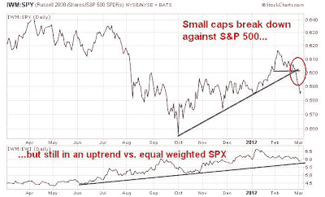

<!--yml
category: 未分类
date: 2024-05-18 04:08:16
-->

# Humble Student of the Markets: Why I am still bullish (II)

> 来源：[https://humblestudentofthemarkets.blogspot.com/2012/03/why-i-am-still-bullish-ii.html#0001-01-01](https://humblestudentofthemarkets.blogspot.com/2012/03/why-i-am-still-bullish-ii.html#0001-01-01)

I got a fair amount of feedback and pushback on my last post (see

[Why I am still bullish](http://humblestudentofthemarkets.blogspot.com/2012/03/why-i-am-still-bullish.html)

). Most have pointed to contrarian sentiment indicators, such as the Rydex Bull/Bear ratio, showing that traders are excessively bullish on stocks.

**The Do's and Don'ts of sentiment models**

Let's go back to first principles on sentiment models. The basic assumption behind sentiment models is that if a certain group is in a crowded long position, then there is little or no buying power to push the market up further. I said in my

[last post](http://humblestudentofthemarkets.blogspot.com/2012/03/why-i-am-still-bullish.html)

that both individuals and institutions are in no way overweight equities relative to historical experience. Institutional fund flows into stocks have barely begun, which provides sustainable buying power. Individual investors have been selling out of equity mutual funds and funds flows barely turned positive. Are those signs for you to run for the hills?

Such conditions set up the possibility that we can experience a series of readings that show too many bulls in sentiment models, which are shown in red in the chart above, during a rally where the market advances steadily such as the QE2 stock market rally that began in late 2010\. At the same time, technicians could see a series of "good overbought conditions" as the market grinds higher.

For traders, sentiment models can be notoriously fickle. Since the Dow first kissed the 13K level and pulled back, some measures of sentiment have seen bullishness drop significantly. In fact, the latest

[Bespoke survey](http://www.bespokeinvest.com/thinkbig/2012/3/5/still-more-bears-than-bulls.html)

, which is admittedly unscientific, shows more bears than bulls and we have seen similar levels of waning bullishness amongst the respondents of other surveys.

**A case of bad breadth? Or just a "good" Apple?**

Another knock against the bullish outlook are the negative divergences seen in the markets. The Dow Jones Transportation Average has lagged. But as

[Mark Hulbert](http://articles.marketwatch.com/2012-02-07/commentary/31040759_1_dow-jones-transportation-average-dow-theorists-stock-market)

pointed out, there has been disagreement among Dow Theorists about the significance of that divergence.

Other technical analysts have pointed to the poor relative performance of small cap stocks. It is said that when large caps lead the market, it is a sign of faltering leadership, i.e. the generals are leading but the troops aren't following.

Are small caps truly faltering, or is is just the case of a large cap rocketship - in this case Apple?

The chart below shows the relative performance of the small cap IWM against the large cap SPY. The relative performance of small caps against large caps broke down in late February by violating a relative uptrend that began in October (shown in green) and at the same time broke down against a relative support level (shown in blue). Now consider the relative performance of IWM against EWI, which represents an equal-weighted S+P 500 and largely neutralizes the effects of Apple's rally, shown on the bottom panel. Note that small caps remain in a relative uptrend against large caps. How much of the relative breakdown is due to the capitalization effect of Apple?

You can see the same effect more dramatically when we compare the relative performance of the NASDAQ Composite against the NASDAQ 100\. Similarly, the small cap NASDAQ Composite broke down in late February against the mega-cap NASDAQ 100\. However, the bottom panel shows that the NASDAQ Composite remains in a relative uptrend against the equal-weighted NASDAQ 100.

**A correction is possible but not inevitable**

So where does that leave us? If you are an investor, the intermediate term trend is still up (note that

[Warren Buffett](http://www.marketwatch.com/story/warren-buffett-vs-the-profiteers-of-doom-2012-03-05)

recently expressed his bullishness). I would be inclined to stay long and ride out any short-term choppiness.

If you are a trader, you have to be prepared for a correction, which may or may not occur. In some ways a correction is overdue because stocks have been rising steadily this year without a single day where the market has fallen 1%. On the other hand, you also have to be prepared for the possibility that there is no correction and the market grinds upwards while undergoing a series of "good overbought conditions" until individual and institutions have fully loaded up on equities.

Even if a correction were to appear, it would likely be mild. The first support level for the S+P 500 would be the 50-day moving average, which is 3-4% below current levels. In this video,

[Jeffrey Hirsch](http://www.ritholtz.com/blog/2012/03/traders-almanacs-hirsh-on-outlook-for-stocks/)

, of the Stock Traders Almanac, believes that the market is likely to see a mild correction in the second half of March but would view that as a opportunity to deploy more cash. He then expects the markets to continue to rally until year-end.

*Cam Hui is a portfolio manager at [Qwest Investment Fund Management Ltd](http://www.qwestfunds.com/). ("Qwest"). This article is prepared by Mr. Hui as an outside business activity. As such, Qwest does not review or approve materials presented herein. The opinions and any recommendations expressed in this blog are those of the author and do not reflect the opinions or recommendations of Qwest.* *None of the information or opinions expressed in this blog constitutes a solicitation for the purchase or sale of any security or other instrument. Nothing in this article constitutes investment advice and any recommendations that may be contained herein have not been based upon a consideration of the investment objectives, financial situation or particular needs of any specific recipient. Any purchase or sale activity in any securities or other instrument should be based upon your own analysis and conclusions. Past performance is not indicative of future results. Either Qwest or Mr. Hui may hold or control long or short positions in the securities or instruments mentioned.*