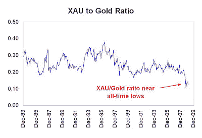
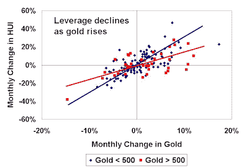
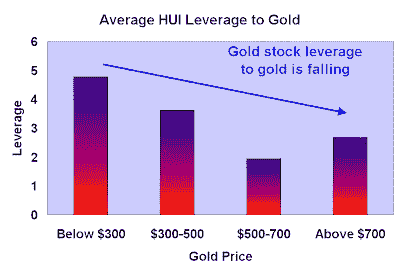

<!--yml
category: 未分类
date: 2024-05-18 00:56:40
-->

# Humble Student of the Markets: Why gold bulls shouldn't buy gold stocks

> 来源：[https://humblestudentofthemarkets.blogspot.com/2009/03/why-gold-bulls-shouldnt-buy-gold-stocks.html#0001-01-01](https://humblestudentofthemarkets.blogspot.com/2009/03/why-gold-bulls-shouldnt-buy-gold-stocks.html#0001-01-01)

In light of the recent stories of hedge funds piling into gold and gold related plays (see

[this](http://www.ft.com/cms/s/0/37fcba70-0c0a-11de-b87d-0000779fd2ac.html?nclick_check=1)

and

[this](http://ftalphaville.ft.com/blog/2009/03/17/53682/paulson-goes-for-gold/)

), I am still shaking my head over the fact that investors were buying gold stocks instead of gold and other inflation hedge vehicles.

Maybe the purchase of gold stocks was justified by the analysis of the history of the PHLX Gold & Silver Index (XAU) to gold ratio, which is near all-time lows:

Perhaps it was bullish calls on gold stocks like [this](http://globaleconomicanalysis.blogspot.com/2009/03/bullish-hui-count.html). Maybe it was the [Fed's bombshell announcement](http://www.federalreserve.gov/newsevents/press/monetary/20090318a.htm) last week, which whacked the USD and sent gold and other commodities soaring.

Maybe it was [analysis](http://www.caseyresearch.com/crpmkt/crpSolo.php?id=137&ppref=GLD137ED0309A) like this, which recalled the degree of leverage that gold stocks have enjoyed over bullion.

**Gold stock leverage to bullion is falling**
The trouble is, gold stocks aren’t just a simple leveraged play on the gold price.

As I pointed out [before](http://humblestudentofthemarkets.blogspot.com/2008/03/how-cheap-are-gold-stocks-relative-to.html), a gold company could be simplistically thought of as a call option on the price of gold, with the strike price being the cost of production. My analysis also [showed](http://humblestudentofthemarkets.blogspot.com/2009/03/market-valuing-gold-stocks-on-cash-flow.html) that most senior gold producers were raising production costs by mining lower grades of ore. Gold mining shares consequently did not perform as expected because of earnings disappointment.

Moreover, as the gold price has risen from about $260/oz. in 2000 to over $1,000/oz. seen this year, the leverage of gold stocks to gold has diminished as a result of the rise. The scatterplot below, which charts the monthly change in the Gold Bugs Index (HUI) against the monthly change in gold, illustrates my point. I split the sample in two: when gold was below $500 and when it was above $500\. As you can see, the degree of leverage shown by the period when gold was above $500 is lower than the period when gold was below $500.

(click on chart for larger picture)

The chart below also tells the same story by showing leverage of HUI to gold in a different way, where

> Leverage = % monthly change in HUI / % monthly change in gold

The average leverage of HUI to gold has been falling more or less steadily as gold prices has risen.

It’s all rather simple once you think about it. If you hold an at-the-money call on gold, which is roughly what an investor did with gold stocks in 2000, the option's leverage to gold is relatively high. As the gold price advanced, the call option got deeper and deeper in the money and the degree of leverage declined.

**Gold stocks are not a good alternative to gold**
Once you throw in other considerations such as political risk (e.g. wars, etc.), operational risk (fires, floods, strikes) and developmental risk (such as the [Galore Creek fiasco](http://www.novagold.com/section.asp?pageid=5414)), are gold stocks really worthwhile investment vehicles? More importantly, if commodity inflation does surface with a vengeance, then we will likely see negative surprises in the form of increased mining costs stemming from rising material and energy prices, which will squeeze gold mining margins.

Of course, it depends on why you are buying gold. If the gold holding is a hedge against disaster, then some physical gold in the form of coins and bullion may be better choices.

If you are looking for a pure inflation hedge, then perhaps inflation-linked bonds, gold ETFs like GLD, or a closed end fund like Central Fund of Canada (CEF), could be your vehicle.

If you are looking for a leveraged play on gold, then you may want to look at silver (the metal, not the silver stocks), which is traditionally thought of as a leveraged play on gold. Another alternative could be the purchase long-dated options on gold bullion for investors.

Buy gold stocks? The fact is, they are overly erratic and unpredictable vehicles as to be effective leveraged plays on gold bullion.