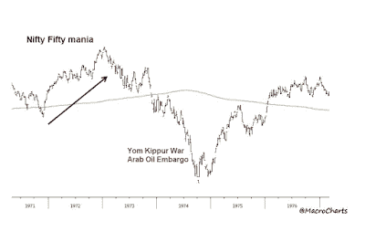

<!--yml
category: 未分类
date: 2024-05-18 01:38:31
-->

# Humble Student of the Markets: Why you should financial model the Yom Kippur War

> 来源：[https://humblestudentofthemarkets.blogspot.com/2022/10/why-you-should-financial-model-yom.html#0001-01-01](https://humblestudentofthemarkets.blogspot.com/2022/10/why-you-should-financial-model-yom.html#0001-01-01)

The recent OPEC+ decision to cut oil output by 2 million barrels per day is giving me a case of PTSD from a Yom Kippur long ago. In October 1973, the stock market was just getting over a case of Nifty Fifty growth stock mania. Arab armies, led by Egypt and Syria, made a surprise attack on Israel on Yom Kippur and overwhelmed the surprised defenders. The Israelis eventually prevailed in the conflict with US help. Arab oil-exporting countries responded with an oil embargo that spiked energy prices and caused a deep recession. The stock market fell roughly -50% on a peak-to-trough basis before recovering.

Fast forward to 2022\. Instead of the Nifty Fifty, we have the FANG+ mania, which may be show signs of fading. Instead of a Middle East war, we have the Russo-Ukraine war. Instead of an Arab Oil Embargo, Russia has weaponized energy, mostly against the EU. Despite much lobbying by Washington, this year's Yom Kippur brought an OPEC+ surprise. The organization made a decision to cut oil output by 2 mbpd. While the cut isn't as bad as it sounds because a number of OPEC members aren't producing at capacity, the decision nevertheless shows that the US and Europe have no allies within OPEC. As a consequence, Street analysts are scrambling to raise their oil price forecasts, and higher energy prices are likely to put pressure on the Fed to stay hawkish.

Will investors see a repeat of the 1973-1974 bear market in 2022-2023?

The full post can be found

[here](https://humblestudentofthemarkets.com/2022/10/08/why-you-should-financial-model-the-yom-kippur-war/)

.