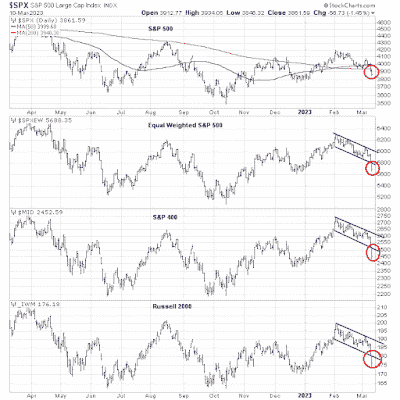

<!--yml
category: 未分类
date: 2024-05-18 01:32:19
-->

# Humble Student of the Markets: Will the Fed crash the stock market?

> 来源：[https://humblestudentofthemarkets.blogspot.com/2023/03/will-fed-crash-stock-market.html#0001-01-01](https://humblestudentofthemarkets.blogspot.com/2023/03/will-fed-crash-stock-market.html#0001-01-01)

**Preface: Explaining our market timing models** 

We maintain several market timing models, each with differing time horizons. The "

**Ultimate Market Timing Model**

" is a long-term market timing model based on the research outlined in our post, 

[Building the ultimate market timing model](https://humblestudentofthemarkets.com/2016/01/26/building-the-ultimate-market-timing-model/)

. This model tends to generate only a handful of signals each decade.

The 

**Trend Asset Allocation Model**

 is an asset allocation model that applies trend-following principles based on the inputs of global stock and commodity prices. This model has a shorter time horizon and tends to turn over about 4-6 times a year. The performance and full details of a model portfolio based on the out-of-sample signals of the Trend Model can be found

[here](https://humblestudentofthemarkets.com/trend-model-report-card/)

.

My inner trader uses a 

**trading model**

, which is a blend of price momentum (is the Trend Model becoming more bullish, or bearish?) and overbought/oversold extremes (don't buy if the trend is overbought, and vice versa). Subscribers receive real-time alerts of model changes, and a hypothetical trading record of the email alerts is updated weekly 

[here](https://humblestudentofthemarkets.com/trading-track-record/)

. The hypothetical trading record of the trading model of the real-time alerts that began in March 2016 is shown below.

The latest signals of each model are as follows:

*   Ultimate market timing model: Buy equities*
*   Trend Model signal: Bullish*
*   Trading model: Neutral*

** The performance chart and model readings have been delayed by a week out of respect to our paying subscribers.***Update schedule**

: I generally update model readings on my 

[site](https://humblestudentofthemarkets.com/)

 on weekends. I am also on Twitter at @humblestudent and on Mastodon at @humblestudent@toot.community. Subscribers receive real-time alerts of trading model changes, and a hypothetical trading record of those email alerts is shown 

[here](https://humblestudentofthemarkets.com/trading-track-record/)

.

Subscribers can access the latest signal in real time 

[here](https://humblestudentofthemarkets.com/my-inner-trader/)

.

**Breaks at key support** 

A week ago, I wrote that I was bullish on the equity outlook, but the S&P 500 appeared to be extended short-term and the Powell testimony and Jobs Report could be sources of volatility (see China:

[Global bullish catalyst?](https://humblestudentofthemarkets.com/2023/03/05/china-global-bullish-catalyst/)

). I was right on the volatility as Powell sounded a hawkish tone and the SVB crisis didn't help matters. The S&P 500 violated its key support levels at the 50 dma and 200 dma. In addition, the equal-weighted S&P 500, the mid-cap S&P 400, and the small-cap Russell 2000 all blew through the bottom of descending channels.

Is this the End? Here are the bull and bear cases.

The full post can be found

[here](https://humblestudentofthemarkets.com/2023/03/12/will-the-fed-crash-the-stock-market/)

.