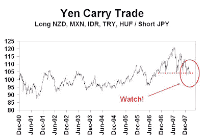

<!--yml
category: 未分类
date: 2024-05-18 01:12:51
-->

# Humble Student of the Markets: Yen carry trade at a critical juncture

> 来源：[https://humblestudentofthemarkets.blogspot.com/2008/03/yen-carry-trade-at-critical-juncture.html#0001-01-01](https://humblestudentofthemarkets.blogspot.com/2008/03/yen-carry-trade-at-critical-juncture.html#0001-01-01)

In the last few days much has been made about the Euro going through 1.50 against the US Dollar. I am more concerned about the systemic risks posed by the recent strength of the Japanese Yen as it may lead to a rush for the exits on the Yen carry trade.

The accompanying chart is an index (31 Dec 2000 = 100) of a equal weighted basket of high yielding currencies (New Zealand Dollar, Mexican Peso, Indonesian Rupiah, Turkish Lira and Hungarian Forint) against the Japanese Yen as an pedal-to-the-metal version of the Yen carry trade. The index hit all-time highs in the July 2007 but have fallen about 14% since then and is reaching a critical technical support.

Hedge funds and currency traders who put on such trades tend to be highly levered and they are not well capitalized enough to withstand large losses. In such instances everyone becomes a technician and chart reader. I am sure that there are many stop loss orders placed just below the support line. Should the Yen strengthen further against these high-yielding currencies and these stops are hit, it would be pandemonium as everyone rushes for the exits, leading to a highly disorderly re-pricing of risk by the markets .

If that happens, this risk-avoidance contagion could very likely spread to other markets. Watch out below!