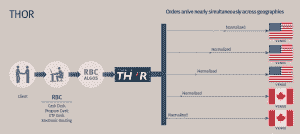

<!--yml
category: 未分类
date: 2024-05-18 14:22:16
-->

# IEX: De Contractibus – Sniper In Mahwah & friends

> 来源：[https://sniperinmahwah.wordpress.com/2014/03/30/iex-de-contractibus/#0001-01-01](https://sniperinmahwah.wordpress.com/2014/03/30/iex-de-contractibus/#0001-01-01)

**Fairness & contracts**

In the next few days I will post a text untitled “Working on High-Frequency Trading”, where I will summarize what I have learnt during a two-year immersion in the oceanic world of HFT and the new microstructures of recent electronic markets. According to Joel Hasbrouck’s classic *Empirical Market Microstructure*, the term “market microstructure” first appeared in a [paper](http://econpapers.repec.org/article/eeejfinec/v_3a3_3ay_3a1976_3ai_3a3_3ap_3a257-275.htm) by Mark Garman in 1976: “*We depart from the usual approaches of the theory of exchange by (1) making the assumption of asynchronous, temporally discrete market activities on the part of market agents […]*” (Garman). But one of the fascinating things I have discovered is that the very first to study the “microstructure” of exchanges were medieval scholastics philosophers in the 13th century – the word “risk”, “value” and “arbitrage” were all coined at this time by these theologians, in the same area (South of France & Italy). Sociologist of markets Juan Pardo-Guerra (LSE, London) recently asked on Twitter: “*I wonder: are HFTs working with a neo-Aristotelian conception of money and liquidity?*” This is a really good question I also had in mind, and I think some answers can be found by reading these scholastics who composed thousands of books about various Aristotelian concepts — those of “money” and “exchange” included.

I won’t detail how important are the theologians (and God) in the history of (the study of) markets/exchanges. Let’s just keep in mind that they have studied exchanges of goods between people by working closely with merchants (agents) and (above all) by reading and analyzing very carefully the contracts used by the merchants. They have provided deep analyses of the contracts (from which they tried to understand the “macrostructure of markets”, beyond the technical features of specific contracts). One very interesting treatise is the *Tractatus De Contractibus* (*Treatise of contracts*), probably composed around 1293 by the great Peter Olivi (Petrus Joannis Olivi, 1248-1298). Any academic working on the essence of exchanges should read this book, a very important piece of knowledge which can help to understand some issues of the electronic microstructure of market (take that example: scholastics worked on the *pretium iustum mathematicum*, the « true mathematical price » of things, which is divisible *ad infinitum* because you can « divide » money *ad infinitum* – think about the tick size issue).

In the *Tractatus De Contractibus*, you can read this (I, 3, 46): “… *quia huiusmodi communis proclamacio seu incantatio habet vim communis taxacionis rerum venalium, nec ex ignorancia parcium potest ibi sic fraus intervenire, sicut in contractibus occultis*“. No English edition of the text exists (a very good [French edition](http://www.lesbelleslettres.com/livre/?GCOI=22510100840450) was released in 2012), but, in short, Olivi says that a price of a good need to be estimated via open out-cry (*communis proclamacio*) by equally informed agents; the common and public estimate of a price limits the risk of frauds because all the agents are aware of true prices. That’s why Olivi makes a distinction between what we now call a “lit market”, where an order book (and prices) are available to everyone, and the “secret contracts” negociated between two people only — what we would call “over-the-counter” today. The “*contractibus occultis*” Olivi talks about is, in fact, a time-space where price formation is obscure, not public. In other words, to be brief, a “*contractibus occultis*” is a dark pool.

**IEX**

Five or six months ago, when I was reading Olivi’s treatise — where fairness is an important issue –, I found via Twitter this [document](https://s3.amazonaws.com/iextrading/docs/Form+ATS-Redacted.pdf). It was surprising because this kind of official paper is unusual. Form ATS is a legal document required by the Securities and Exchanges Commission (SEC) when a new *alternative trading system* is launched : “*Form ATS is the form an alternative trading system must file to notify the Securities and Exchange Commission of its activities”*. The owner(s) of the ATS have to detail how the platform works, which kind of orders are proposed, how routing to other venues operates, etc. In other words, it is a kind of contract.

The Form ATS document was released by a new dark pool called IEX – a dark pool which is a little transparent, as they decided to disclose the form on their own website. I had never heard about IEX before, but the fact is I have been able to read the form from A to Z and, above all, as a non-professionnal trader (I work on HFT since early 2012 only), I understood nearly every word.The market microstructure being really complex these days (once I tried to read Regulations NMS, but at some point I wondered if the regulators really understood themselves what they have written), I have thought that it was notable to read such a clear document and to see that a dark pool tried to simplify a messy & technical microstructure increased with Reg NMS.

I got in touch with IEX at the end of 2013 to learn a little more about their model. Some days ago, the platform just hit the headlines when Goldman Sachs’s Gary Cohn [publicly endorsed](http://www.bloomberg.com/news/2014-03-22/goldman-sachs-endorses-iex-stock-market-built-to-fight-predators.html) the new dark pool (even if they have their own DP called Sigma-X). One of the reasons IEX is breaking the news is that the new dark pool seems to have been designed as an answer to the new paradgim of High-Frequency Trading. HFT is a very very discussed issue since 2007\. I won’t discuss whether HFT in its entirety is good or bad *per se*, but it goes without saying that HFT as a practice has raised some questions about fairness, and IEX decided to fix some of them. Here are some key points.

**Space**

In the new HFT world, time and space are crucial. Exchanges are now located in different data centers, and transport time is important in an ecosystem where an order can be filled in a millisecond. So (some) traders are now co-located in these data centers in order to be closer to the matching engine; with co-location algorithms have a « direct market access » (DMA) so they can receive the latest prices from the exchange/matching engine. But a trader not colocated with exchanges and living in California will receive on his screen prices which no longer exist in the New Jersey/Chicago data centers. Even if the SEC have created the NBBO (via the SIP), where national prices are reported to millions of users, everybody knows that the NBBO does not work very well (cf. my [post](https://sniperinmahwah.wordpress.com/2013/08/26/nasdark-2-de-lespace-et-du-temps/) about the crash of the SIP and the Nasdaq in August 2013). So shares could have two different prices (that is not new, the scholastics worked a lot on that), and prices depend on the proximity with the exchanges (that is also not new, in the old pits it was all about proximity – for hearing and seeing).

But fragmentation of markets, technical complexity, a deficient NBBO and other parameters allow (HF) traders to play some game between NBBO prices and DMA prices. So the IEX platform was designed to provide an equal access to all the traders: IEX does not offer co-location; all algorithms are in the same Point of Presence (in the Equinix data center, in Secaucus – where Bats-DE will move in 2015), and the matching engine is the Savvis data center, in Weehawken. They are separated by 350 microseconds of latency as defined by the length of cable between the two buildings. It’s all about fairness. What’s more, IEX computes its own NBBO in the fastest way possible: “*Some venues including exchanges and broker dark pools, will use the SIP, which is milliseconds behind the direct feeds. As a result, those venues may execute orders at stale prices relative to the direct feeds. This can allow faster market participants who recognize such a difference in price between a venue pricing off the SIP versus the direct feed NBBO, to generate a riskless profit”*, says John Schwall, the Chief Operating Officer at IEX. “*I would add, by allowing co-location and using slower market data than HFT*,” says Brad Kastuyama, the CEO of IEX, “*an exchange or dark pool loses their ability to fairly price trades between any two participants, most notably a fast one and a slower one*.”

IEX does not offer co-location, but to ensure IEX executes its orders at the true NBBO based on the latest available market data from the exchanges, the dark pool subscribes to all of the direct market data feeds from all US exchanges, so it can compute a “*true NBBO”*. Even though they are characterized as a “slower exchange” by some in the industry, they are actually very fast at calculating the NBBO. Katsuyama says: “*All of our participants are relying on us to provide them with the fair price. The slower participants, the long-term investors, are the most reliant on us to fairly price their trades. So in order to be fair to all participants, this is something we spent a lot of time and money ensuring we were fast.*” All HFT firms are eligible to trade on IEX (they can provide beneficial arbitrage) but most of these firms seem to have declined to join the new platform – is it because their (arb) strategies can no longer work? Or because the technical microstructure of IEX does not allow them to be “faster” than IEX in terms of pricing ? In spite of this, it seems that HFT firms like Virtu are doing HFT market making in IEX.

Says Katsuyama: “*When people ask me about ‘Good‘ vs. ‘Bad‘ HFT, for ‘Good HFT‘ I always use an example of making markets in ETF’s versus the underlying stocks, or arbitraging the price differences between the same company listed in two different countries (this is called an inter-listed stock). As you can see from our website, Virtu trades on IEX. They are a small percentage of our overall volume (recent press has shown Goldman Sachs to be IEX’s top trader), but they are #2 in ETF’s and #1 in Interlisted stocks. The data is proving out that Virtu is serving a positive role in providing liquidity in legitimate arbitrage opportunities on IEX. The other HFT firms who have declined our invitation to trade on IEX – you can draw whatever conclusion that you want about that. I can’t comment for what Virtu does on other exchanges, but on IEX, they provide a service to our eco-system of participants and should get credit for that*”.

**Time**

Co-location is about space but also (& of course) time. There has been much discussion recently on Twitter between people like @[scottavdiros](https://twitter.com/ScottAvdiros) (an anonymous executive of a HFT firm), [@RemcoLenterman](https://twitter.com/RemcoLenterman) (from IMC & FIAEPTA), [@JaffrayW](https://twitter.com/JaffrayW), [@DaveLauer](https://twitter.com/DLauer), [@marascio](https://twitter.com/marascio) and others, about “latency arbitrage”. Some said that lat arb does not really exist, this is only a name used to talk about different types of arbitrage. But one of the first to think about latency arbitrage was Cicero, around… 80 BC (the technology was: boats). The scholastics worked a lot on arbitrage on commodities (the technology was : faster horses). The words *flash trading* can be found in the Chicago newspapers around 1870 (the technolgy was: faster telegraphs/stock tickers). In 2014, you have HFT and microseconds (the technologies are : good lines of codes, powerful computers, neural networks, micro-waves transmissions – I stop here, the list is too long).

“Latency arbitrage” is as old as human exchanges and – in other words, all arb is lat arb, *e.g.* space arb. That’s why, in a world where each microsecond counts, IEX decided to slow down a little bit the flow of time : traders have to wait. “*The delay is between the IEX inbound Point of Presence (POP) gateway and the matching engine / smart router. Hence, each broker order, cancel, and execution travels 350 microseconds between the POP and the core matching engine/router. This delay ensures (1) IEX can update its order book from direct feeds before any participant has an opportunity to “pick off” a stale quote and (2) no participant is able to pick up executions on IEX and race routable orders to other venues. Hence, we execute with near 100% fill rates across all venues”, *says John Schwall. Routing orders from a place to another place is a key issue in the new electronic market microstructure – here, IEX platform protects against arbitrage by preventing “lat arb” when the platform is used for outbound routing.

In a world where exchanges are disseminated in different venues, the routing of orders (as definined by Reg NMS) is important, and platforms need to have good Smart order routing (SOR). Many of IEX employees – including CEO Brad Kastuyama – were previously working at RBC Capital Markets where they have developed a SOR called Thor. “*Thor was designed for simultaneous arrival across all venues to eliminate latency arbitrage. The realization that Thor only solved the arbitrage problem for clients of RBC led to the realization that the team could have much greater success if we built a trading venue that would allow for elimination of unnecessary arbitrage when a client was trading through ANY broker*“. Some of the team that designed Thor then left RBC and 18 months later IEX was launched.

**Order types**

The fragmentation and the demutualization of markets has led to a proliferation of order types. Each exchange can propose different types or orders, and some were designed to be coherent with the new HFT world – cf. DirectEdge. There is a lot to say about the complexity of orders (Haim “Whistleblower” Bodek has written some very interesting [papers](http://haimbodek.com/research.html) about that) – it seems that some orders are considered to be unfair regarding the equal access to the prices of the order books. What’s more, the role of rebates is also disputed. IEX decided to simplify things: four order types only, and no maker taker model.

“*The fact that we don’t pay rebates (flat fee pricing) makes our order type **suite much simpler. There are no order types designed to generate a rebate. **We have a Market, Limit, Fill or Kill, and Mid Point Peg. The most popular **order type is Mid Point Peg…roughly 80% of our orders go off at the **mid…providing both parties .005 improvement”. *More stats can be found [there](http://iextrading.com/insight/stats/)*,* and the [Form ATS](https://s3.amazonaws.com/iextrading/docs/Form+ATS-Redacted.pdf) document details the order types. Also check [http://iamaninvestor.org](http://iamaninvestor.org).

**Reg arb & fairness**

“*The future is exciting but the historical perspective is important too. IEX brings the trading process back to where it was maybe meant to be before the unintended consequences of regulatory change over the last 10 years*” [says](http://www.wallstreetandtech.com/electronic-trading/exclusive-iex-hires-jay-fraser-to-expand/240166847) Jay Fraser, the new head of business development at IEX. The “unintended consequences” of Reg NMS have created different types of arbitrage – some called them “reg arb”, or “technical arb”, etc. They are collateral damages increased by the new regulations. Some people argued that IEX want to remove all kind of “arbitrages” but that is not really true – IEX just wants to avoid unnecessary latency arbitrages and to simplify price formation.

Without co-location, with no rebates but with the help of their SOR and their own NBBO, IEX is an interesting attempt to circumvent the collateral damages of the new HFT paradigm – even if HFT firms are welcome on IEX: they could provide beneficial arbitrage on correlated instruments (stock futures, ETF’s, inter listed stock, etc.). Arbitrage is probably one of the most interesting issue for an anthropologist working on the market microstructure – a trader can do arbitrage with nearly everything. As I wrote below, it seems that the roots of arbitrage go back to these scholastics who where the first to talk about “risk” in the 13th century. I’ll try to work deeper in the next few months on the link between “risk”, “arbitrage” and “fairness”.

**Flash Boy**

Everyone in the HFT world is aware that a new book by Michael Lewis, [*Flash Boys*](http://www.amazon.com/Flash-Boys-Wall-Street-Revolt/dp/0393244660), will be released in a few hours. As a book publisher first, I contacted some colleagues at W.W. Norton in order to get the proofs of the book (I have made translated and published in French several books from Norton), but the answer was negative: the book is “locked down”. But some rumors say that Brad Katsuyama, the CEO of IEX, appears in the book as a “star”, and that IEX would be presented as a new exchange that could level the playing field (the platform will probably intend to move into a “lit market”). What’s more, Michael Lewis will appear later today in [*60 minutes*](http://www.cbsnews.com/news/stock-market-rigged-says-michael-lewis-in-new-book/). So we should learn more about IEX in the next few hours. No doubt that the Twitter discussions about market microstructure (which were very interesting in the last few days) will be intense from tonight. Attention must be paid.

###### This post is dedicated to Marius Laumonier, born on 29.03.2014 at 00:23 and a few milliseconds.