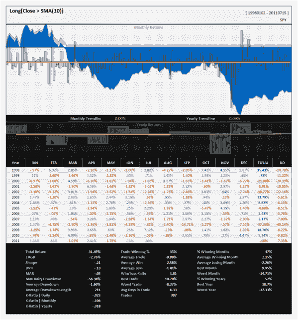
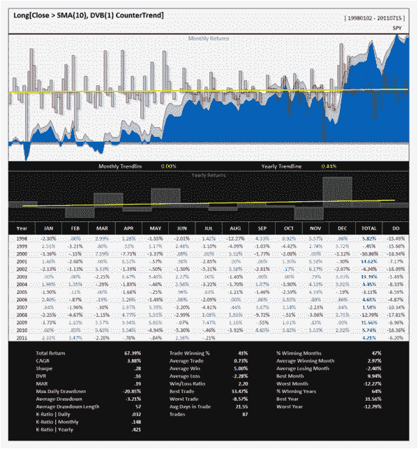
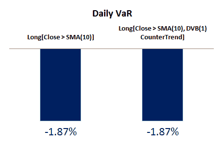

<!--yml
category: 未分类
date: 2024-05-12 18:09:09
-->

# Improving Trend-Following Strategies With Counter-Trend Entries | CSSA

> 来源：[https://cssanalytics.wordpress.com/2011/07/29/improving-trend-following-strategies-with-counter-trend-entries/#0001-01-01](https://cssanalytics.wordpress.com/2011/07/29/improving-trend-following-strategies-with-counter-trend-entries/#0001-01-01)

It is possible to make minor adjustments to strategies that can both improve their backtest performance, but also reduce the real costs of trading. The trend-follower  will always pay more to enter a trade due to the increased slippage and market impact costs. A further “tax” in the modern era across all markets is the effect of short-term mean-reversion– as markets tend to follow through less often, a trend trade will often be triggered at a short-term high or low. This leads to poor entries that constrain the potential for the trade to make a profit. The obvious solution to this problem is to incorporate a short-term counter-trend/mean-reversion entry and exit within a given trend-following strategy. The key is to use an entry that occurs frequently enough to avoid missing trades and gets in as quickly as possible. For exits, it is important to have a quick and timely signal, and it is also critical to preserve the  nature of trend-following strategies which is to reduce tail risk. In other words, we do not want to create an exit into strength that may never be filled and leaving the trader faced with a significant drawdown.

The most significant impact of a counter-trend entry exit is typically found when combining it with a short-term moving average. The value of improving the performance of a short-term trend signal cannot be overstated because it allows you to better track the trend of the underlying with substantially less lag. As the SPY/S&P500 has become fundamentally mean-reverting since 1998, most traders have resorted to using longer-term moving averages and trend filters such as the 200sma or a golden crossover. The problem is that in today’s market– that is rife with shocks and unpredictable rallies– the tail risk above the long-term moving average has gotten higher.  The cost of lag can mean a nasty drawdown, as has been experienced by most trend-followers this year.  If you can more accurately follow the short-term trend, you can reduce this risk substantially. Let’s take a look at the performance of a short-term trend strategy— buying when the close is above the 10-day simple moving average and selling when the close is below the sma. The “mean-reversion tax” is quite evident, and the actual trading costs with slippage and commission are not even factored in:

Now lets look at a counter-trend overlay on the same strategy. In this case, we will look at a short-term range mean-reversion indicator– the DVB, and set it to the shortest period for maximum response which is one period. The indicator is normalized so that the frequency of entry/exits is stable, and the DVB in contrast to say an RSI requires far less true mean- reversion to change values. In this case, we will use the bottom quartile for entry and the top quartile for exit. Thus the strategy would be to enter when both the close>10sma but only when DVB1<25, and the exit would occur when the close is <10sma but only when DVB1>75\.  Effectively we are buying into the first available weakness following a new short-term trend and selling into the first available strength once that trend has ended. Remarkably, this makes the losing strategy of following the 10sma into a winning proposition:Clearly a substantial improvement– not sexy, but it gets the job done. What is most beneficial about this strategy is that it is very quick to catch rallies and exit into weakness while boosting the % winning trades to 41% from 33%, and boosting the average trade from -.09% to .73%. The difference in the two backtests would be even more extreme with real-world trading costs. But what about tail risk?  Lets take a closer look to see if that has increased:

It seems like there is virtually no difference in terms of value at risk (the 5th percentile of daily returns), and the worst trade for counter-trend is marginally higher. Looking at the drawdowns, we see a much clearer difference– trend following is really risky when you get chopped around. The drawdown is almost 3x higher for the conventional strategy. This method is robust to moving average length, and appears to improve performance universally. While not shown here, even a 200sma strategy is substantially improved by such a minor change in entry and exit.