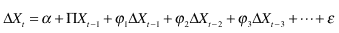
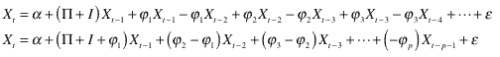
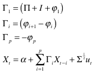
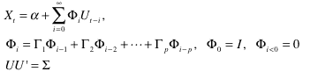
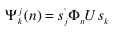

<!--yml
category: 未分类
date: 2024-05-18 15:33:50
-->

# Impulse Response | Tr8dr

> 来源：[https://tr8dr.wordpress.com/2010/02/20/impulse-response/#0001-01-01](https://tr8dr.wordpress.com/2010/02/20/impulse-response/#0001-01-01)

February 20, 2010 · 12:10 pm

This is just a quick note on deriving an impulse response function for a VECM system.   Basically we want to get the system into a form where we can take the partial derivatives at various lags.   Starting with a simplified VECM:

Convert this into a form expressing in terms of X instead of ΔX:

We change variable to simplify the form:

Via Pesaran and Shin (1996) we transform this into the following recursive expression:

We determine the partial derivative of ∂vj / ∂vk  (i.e. the impact of a change in the kth variable on the ith) after n time periods (t+n) to be:

where Si is a selection vector with 1 at the ith position and 0 elsewhere.

Normally the cholesky decomposition is used to orthogonalize the covariance (U U’ = Σ), however other decompositions can be used, providing different measures of  response such as the Bernanke-Sims approach.