<!--yml
category: 未分类
date: 2024-05-18 13:50:11
-->

# In R: Cross Sectional Volatility | Quantivity

> 来源：[https://quantivity.wordpress.com/2011/03/07/code-r-cross-sectional-volatility/#0001-01-01](https://quantivity.wordpress.com/2011/03/07/code-r-cross-sectional-volatility/#0001-01-01)

Readers of [Cross Sectional Volatility](https://quantivity.wordpress.com/2011/03/02/cross-sectional-volatility/) raised numerous questions on implementing the trading signal derived from *cross sectional volatility*. Towards exploring and visualizing these questions, an implementation in R is considered here.

Begin by assuming a frame exists named `ret` which contains a sequence of log returns (columns are stocks, rows are seconds), measured at second intervals, with 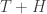 observations. Define values for the key model constants:

```

N <- 5		# number of stocks
T <- 50		# number of seconds in &quot;past&quot;
H <- 60		# number of seconds in &quot;future&quot;
k <- 4		# number of PCA eigenvectors to use

```

For simulation sake, suitable values drawn from a *normal distribution* can be constructed as:

```

ret <- data.frame(replicate(N, log(1 + rnorm(T + H)/100)))

```

Given returns in `ret`, construct 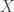, 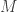, 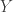, per p. 26; `X` is the “past” returns over which principal components are calculated, with length `T` (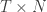); `future` are the “future” returns over which prediction is generated, with length `H` (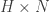); `M` is the average return for each stock (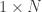), and `Y` is the de-meaned “past” ():

```

N <- length(ret)
X <- as.matrix(ret[1:T,])
future <- ret[(T+1):(T+H),]
M <- colMeans(X)
Y <- scale(X, scale=FALSE)

```

Visualize log returns and cumulative log returns via plotting the following:

```

plot.ts(X)
par(mfrow=c(3,2))
for (i in c(1:N)) { 
  lab <- paste('X', i);
  plot(cumsum(X[,i]), type='l', main=lab, ylab='', xlab='') 
}

```

Providing charts which look like familiar medium-frequency equities:

Next, perform PCA and construct  from the top 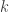 eigenvectors in 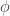 projected onto , via [SVD](http://en.wikipedia.org/wiki/Singular_value_decomposition) (as proposed on p. 58). Recall the eigenvectors are *columns* in `rotation`, thus `[,c(1:k)]` selects the top-:

```

phi <- prcomp(X)$rotation[,c(1:k)]
D <- Y %*% phi

```

A `summary` on `prcomp(X)` reveals:

```
Importance of components:
                           PC1      PC2      PC3      PC4      PC5
Standard deviation     0.01137 0.009963 0.009274 0.008849 0.008132
Proportion of Variance 0.28177 0.216240 0.187370 0.170580 0.144040
Cumulative Proportion  0.28177 0.498010 0.685380 0.855960 1.000000 
```

Thus, the top  principal components explain 85.6% of variance, leaving the remaining 14.4% to denoise.

Given 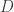, calculate the matrix of 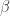 (which is 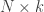) from the long-horizon regressions for each stock, iterating the summation from 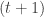 to 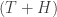, per p. 28 (which due to lacking rigor, has several possible interpretations):

```

B <- c()
for (i in c(1:N))    # iterate over stocks
{
  hsum <- future[1,i]
  Dsum <- D[T,]
  for (j in c(2:H))&nbsp;&nbsp;&nbsp;# generate rows by walking up the horizon
  {
    hsum <- rbind(hsum, sapply(data.frame(future[c(1:j),i]), sum))
    Dsum <- rbind(Dsum, sapply(data.frame(D[c((T-j+1):T),]), sum))
  }
  B <- cbind(B, lm(hsum ~ Dsum)$coefficient[c(1:k+1)])
}

```

Plot `hsum` and `Dsum` for a given stock:

[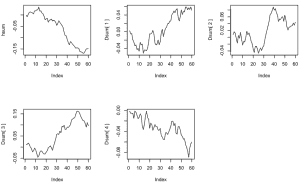](https://quantivity.wordpress.com/wp-content/uploads/2011/03/sums.png)

via:

```

par(mfrow=c(3,3))
plot(hsum, type='l')
for (i in c(1:k)) {
  lab=paste("Dsum[",i,"]");
  plot(Dsum[,i], type='l', ylab=lab)
}

```

And, OLS residuals for all N stocks (which exhibit serial correlation, but do look mostly stationary):

[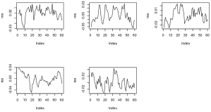](https://quantivity.wordpress.com/wp-content/uploads/2011/03/residuals.png)

Generate accumulated estimated 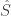 and actual returns 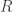, using  and  (p. 29):

```

Dhat <- colSums(D[c((T-H):T),])
S <- Dhat %*% B
Shat <- as.vector(S + M)
R <- as.vector(colSums(future))

```

Where each is a vector, with *one accumulated horizon estimate per stock*. Inequality comparison of estimated and actual generates the trading signal:

```

signal <- R > Shat
cat('Shat:',  Shat, "\n")
cat('R:', R, "\n")
cat(ifelse(signal==TRUE, 'SELL', 'BUY'))

```

With results:

`Shat: 0.02340865 -0.00604718 -0.03142925 0.02960236 0.04318216
R: 0.04080749 -0.002699089 -0.05541317 0.02654577 0.04163165
Signal: SELL SELL BUY BUY BUY`

Thus, signal for the *current second*: sell short stocks 1 and 2; buy stocks 3, 4, and 5.