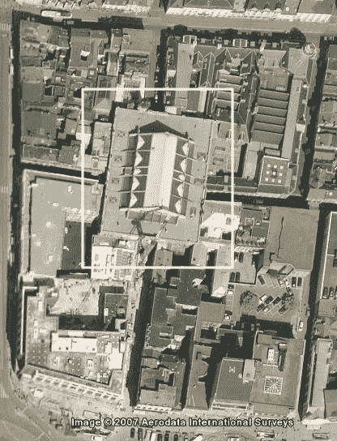
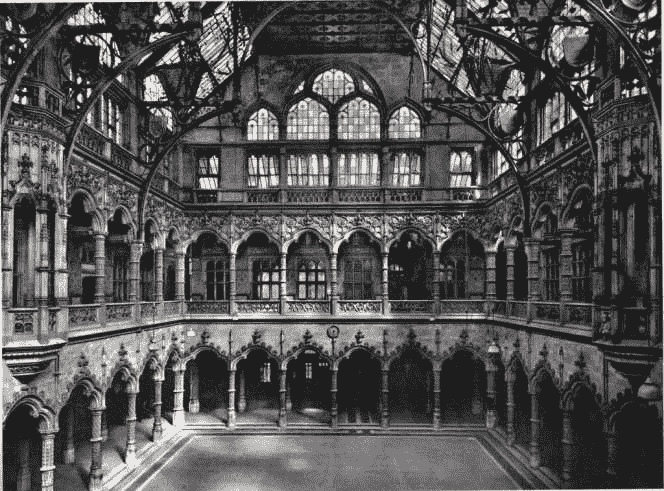
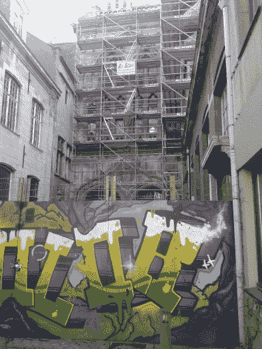
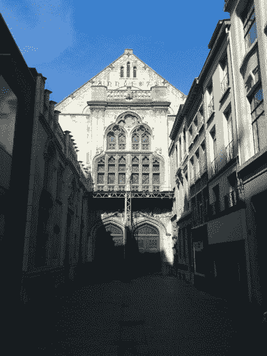
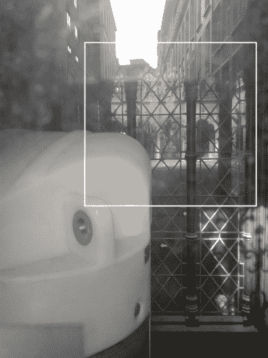
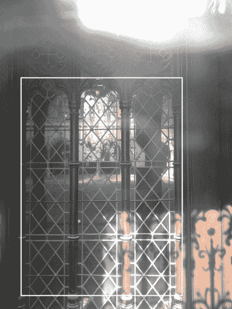
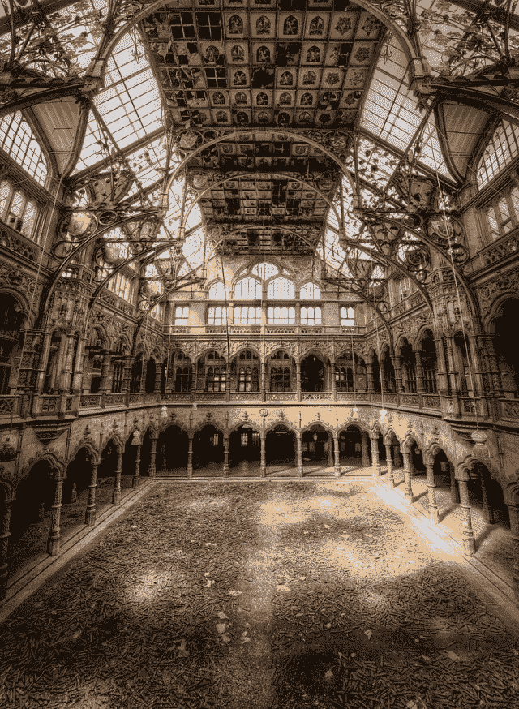

<!--yml
category: 未分类
date: 2024-05-18 14:22:56
-->

# In search of the old Antwerp’s Stock Exchange – Sniper In Mahwah & friends

> 来源：[https://sniperinmahwah.wordpress.com/2014/03/08/in-search-of-the-old-antwerps-stock-exchange/#0001-01-01](https://sniperinmahwah.wordpress.com/2014/03/08/in-search-of-the-old-antwerps-stock-exchange/#0001-01-01)

The first building in the world designed as stock exchange and trade exchange was in Antwerp (Belgium). It was built in 1531, near the Meir (a shopping borough in the center of Antwerp).

The building burned down in 1858, but was reconstructed at the end of the 19th century. Here is an old photography of the place:

Even if it was definitely closed 15 years ago, the building is still there but all the legal entrances are sealed. That is a shame because it is (sorry, *was*) probably one of the most beautiful buildings of Antwerp. One photographer (*urban explorer*) told me one day that he was obliged to go through the sewers in order to get into the old building.

I was in Antwerp today, and I tried to reach the old exchange through one of the four entrances, but this is impossible:

All the doors are blocked and plugged, but I found a hole in one of the doors, and even if the hole was too high (I did not see what my smartphone saw when I shoot), I successfully took two photographies where we can perceive the inside of the old *beurs*:

Unfortunately, I know that the building is now nearly destroyed (it will probably be turned into a 5 star hotel). And I probably won’t be able to admire what it was possible to see some years ago:

