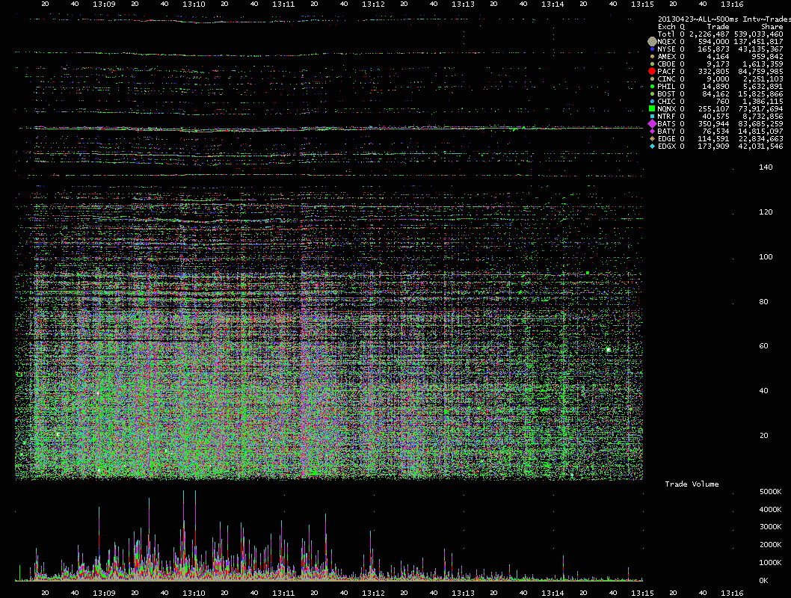
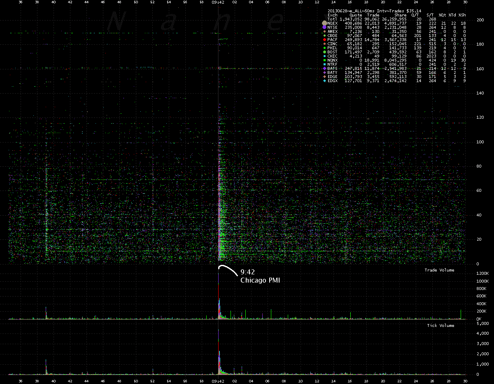
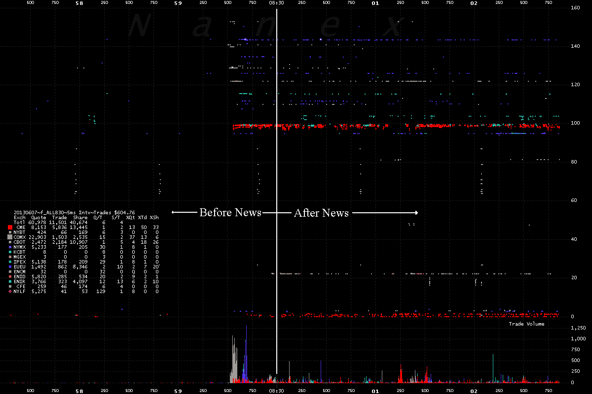
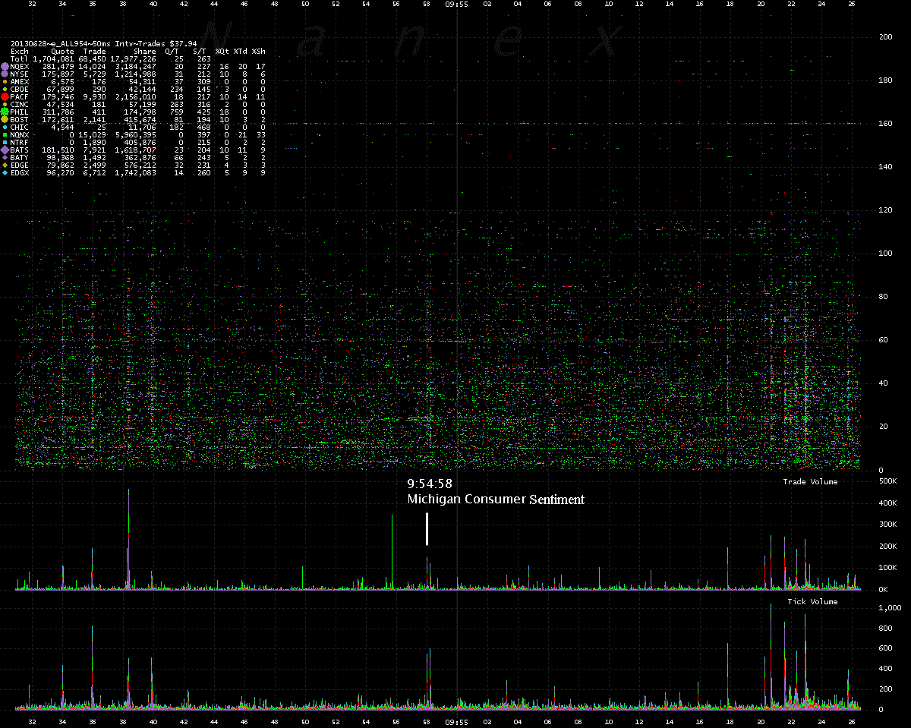

<!--yml
category: 未分类
date: 2024-05-18 14:26:19
-->

# Information, délit d’initié et hautes fréquences – Sniper In Mahwah & friends

> 来源：[https://sniperinmahwah.wordpress.com/2013/08/03/information-delit-dinitie-et-hautes-frequences/#0001-01-01](https://sniperinmahwah.wordpress.com/2013/08/03/information-delit-dinitie-et-hautes-frequences/#0001-01-01)

Il n’est pas peut-être pas inutile, afin de faire revivre ce blog pour de bon, de revenir sur quelques affaires récentes concernant la manière dont les marchés financier réagissent à certaines informations, et d’en profiter pour lever quelques ambiguïtés et asséner quelques contre-vérités.

La presse a fait ses choux gras de l’affaire du compte d’Associated Press piraté par des pseudo rebelles syriens, annonçant, le 24 avril 2013, que la Maison blanche avait subi une attaque terroriste et que le président Barack Obama était blessé. Selon la légende, les traders à haute fréquence (des algorithmes, donc) auraient réagi instantanément et fait perdre aux marchés américains 136 milliards de dollars… avant que la situation ne revienne à la normale (il est toujours étonnant qu’à chaque affaire de ce genre tout le monde s’effraie du fait qu’une telle somme puisse disparaître des marchés alors que le plus intéressant est la manière dont les cours remontent, mais passons là-dessus). Donc, des algorithmes auraient interprétés *seuls* un tweet, plongeant les marchés dans une boucle de rétroaction où tout le monde s’est mis à vendre rapidement, d’où les 136 milliards évaporés en quelques minutes.

Cette légende est fausse. Le tweet est arrivé sur les terminaux des opérateurs de marché à 13 h 07 mn 50 secondes. Observons le graphique qu’a livré [Nanex](http://www.nanex.net/aqck2/4177.html) suite à cet événement :

24 avril 2013, 13 h 08 mn et 07 s, les marchés réagissent au faux tweet d’Associated Press

Ce visuel représente toutes les transactions concernant plus de 8 000 actions répertoriées par le National Market System (NMS) américain. Le plus intéressant n’est pas la partie haute du graphique mais celle du bas, qui montre le volume des transactions effectuées. Si Nanex prend bien soin de montrer les effets du faux tweet à partir de 13 h 08 mn, c’est tout simplement parce qu’il ne s’est rien passé auparavant. D’après nos sources, il aura fallu pas moins de 17 secondes aux algorithmes à haute fréquence pour décider de vendre en masse certains titres. 17 secondes, dans l’archipel des marchés financiers mondiaux, c’est une éternité. Le visuel de Nanex montre bien que les algorithmes ont commencé à s’emballer à 13 h 08 mn et 07 s, ce qui correspond aux 17 secondes de latence entre le moment où l’information a été rendue publique et le moment de son incorporation dans les prix (supposés) des actifs décidée par les traders.

La presse américaine et française, dans les minutes et les heures et les jours suivants, ont pointé du doigt ces fameux algorithmes de trading à haute fréquence qui seraient censés interpréter seuls des tweets (ce qui supposerait une analyse grammaticale poussée de leur part, sans évidemment parler de l’origine défectueuse de la source de l’information), puis prendre des décisions (acheter ou vendre) en fonction de leur analyse. Or, quand bien même certains algorithmes d’opérateurs de marché “scannent” des informations provenant des réseaux sociaux (Facebook, Twitter, etc.), et en admettant (mais c’est difficile) que ces algorithmes soient à 100% opérationnels et fiables (ce qu’ils ne sont pas – encore, voir [ici](http://www.wallstreetandtech.com/trading-technology/decision-making-automation-the-next-fina/240159010)), le fait qu’il aura fallu attendre 17 secondes avant que les marchés ne réagissent à une information ne démontre qu’une seule chose (confirmée par nos sources) : le “mini flash crash” du 24 avril 2013 lié à un faux tweet d’une agence d’information **n’est pas le fait d’algorithmes mais le résultat de décisions purement humaines.** Si, dans un tel contexte, un algorithme prend 17 secondes pour décider de telle ou telle action à mener, c’est tout simplement qu’il n’a… rien décidé mais uniquement exécuté. Ce sont des êtres humains qui, en leur âme et conscience (car ils étaient probablement dans l’impossibilité de vérifier la véracité de l’information en 17 secondes) ont activé des algorithmes qui ont ensuite très vite travaillé pour liquider leurs positions. Imputer aux machines la disparition de 136 milliards de dollars de capitalisation aux machines alors que ce sont des humains en chair et en os qui ont pris des décisions (en tant qu’agents économiques rationnels *ou* *irrationnels*, cela peut se discuter), c’est se tromper de cible – un trader est aujourd’hui un assemblage complexe de rationalité humains et de stratégies algorithmiques, condamner l’un et relaxer l’autre n’a aucun sens.

Une autre et meilleure preuve de l’importance des agents humains est à trouver du côté des annonces officielles concernant certaines données “macro-économiques” comme l’indice de confiance des consommateurs, le taux de chômage ou les données officielles concernant la bonne (ou mauvaise) santé des industriels, autant d’informations à même de faire “bouger“ les marchés, dans un sens ou dans l’autre. Voilà quelques exemples, provenant de Nanex :

Réaction des marchés à la publication de l’indice des directeurs d’achats (PMI) de Chicago, qui rend compte de la santé du secteur industriel, 28 juin 2013

Lorsqu’à 9 h 42 les données de cet indice sont rendues “publics”, les algorithmes se mettent à travailler rapidement, d’où un pic d’activité important. En réalité, comme on peut le lire dans ce [document](http://www.alphaflash.com/sites/alphaflash.com/files/downloads/AlphaFlash_Chicago_2013%2002_e.pdf) de la Deutsche Börse AG, l’indice n’est révélé au “grand public” (et aux médias) qu’à 9 h 45 mais grâce au service [Alpha Flash](http://www.alphaflash.com) , les traders à hautes fréquences abonné à ce service (payant évidemment) reçoivent les données trois minutes plus tôt, ce qui leur permet d’anticiper les mouvements qui apparaîtront à 9 h 45 (non seulement ils les anticipent, mais cela leur permet également de changer la donne pour ceux qui n’ont les informations qu’à 9 h 45). Il n’y a ici aucun délit d’initié, puisque les traders à hautes fréquences ont acheté le droit d’obtenir les données avant les autres. Autre exemple, le taux de chômage américain :

La réaction des marchés à l’annonce du taux de chômage aux Etats-Unis (7 juin 2013)

Ce visuel montre l’explosion des ventes de *futures* liés aux bons du Trésor américain 482 millisecondes avant l’annonce officielle des chiffres du chômage, révélés au “grand public” à 8 h 30\. Contrairement au visuel précédant concernant la santé du secteur industriel, les traders à hautes fréquences n’ont ici aucune information avant les autres, il s’agit simplement de “secouer le cocotier” avant que tout le monde ne réagisse 482 millisecondes plus tard. “Secouer le cocotier”” veut dire tenter des mouvements de ventes ou d’achats (ou les deux) de manière à tâter le terrain, ce qui oblige les algorithmes concurrents à chercher de nouvelles positions, ce qui créé plus de “bruit” pour tout le monde une demie-seconde avant 8 h 30. Autre exemple, qui a fait couler beaucoup d’encres ces dernières semaines : l’indice de confiance des ménages américains.

L’indice de confiance des ménages américains, annoncé à 9 h 55 pour les opérateurs de marché

Les données relatives à l’état d’esprit des consommateurs américains sont rendues publiques à 10 h, mais dès 9 h 55 ces données sont accessibles aux opérateurs de marché – jusqu’ici tout va bien. Or Nanex a montré que certaines algorithmes à hautes fréquences réagissent à 9 h 54 mn 58 s, soit deux secondes auparavant. Et ce de manière systématique. Les choses se sont alors emballées : l’indice de confiance des ménages américains est calculé par des chercheurs de l’[Université du Michigan](http://www.sca.isr.umich.edu), puis ces données passent par les canaux de transmission de Thomson Reuters avant d’arriver sur les terminaux des opérateurs de marché (directement aux algorithmes, donc). Face aux découvertes de Nanex, Thomson Reuters a bien été obligé d’avouer que l’agence d’informations financières livraient les données à des clients *premium* (les traders à hautes fréquences) deux secondes avant 9 h 55\. Certains clients de ce service *premium* paient 6 000 dollars par mois pour obtenir ces informations avant ceux qui ne paient pas (de son coté, Thomson Reuters paie 1 million de dollars par an à l’Université du Michigan pour avoir la possibilité de livrer les données à ses clients – les opérateurs de marché – à 9 h 55… et non à 9 h 54 mn et 58 s). Il n’y a donc *a priori* aucun délit d’initié mais comme Thomson était resté discret sur ces fameuses deux secondes, la [justice s’y est intéressé](http://www.nytimes.com/glogin?URI=http://dealbook.nytimes.com/2013/07/07/thomson-reuters-to-suspend-early-peeks-at-key-index/&OQ=_rQ3D0&OP=9aebc8f3Q2FYsplYQ3A0rYQ24Q24Q24YgrQ5BQ51YZQ20Q25q) et finalement le 7 juillet 2013 l’agence a décidé de renoncer à cet accès *premium*. On apprit à la faveur de cette affaire que Thomson avait par ailleurs eu quelques problèmes d’horloge lors de l’annonce d’un autre indice provenant de l’Institute of Supply Management et qui concerne les commandes des industriels américains : suite à une erreur de synchronisation, certains traders à hautes fréquences reçurent les données quelques millisecondes avant les autres, ce qui poussa la Securities and Exchange Commission (SEC) à ouvrir une enquête préliminaire sur ces dysfonctionnements (ou ces délits d’initié organisés ?).

Le cas des données relatives à l’indice de confiance des ménages américains est une occasion rêvée pour revenir à la question des implications respectives des agents humains et des agents algorithmiques, mais aussi sur le temps de réaction entre les marchés de Chicago et de New York, dont je parle dans le dernier chapitre de *[6](http://www.zones-sensibles.org/index.php?mod=auteurs&a=06) *(et dont il sera beaucoup question dans *5*) .Pour faire simple : depuis que la cotation des contrats à terme (*futures*) influe sur celle des actions liées à ces *futures,* il est habituel de constater que les informations relatives aux prix des *futures* (négociés à Chicago) ont une conséquence sur le prix des actifs sous-jacents (cotées à New York). Rien de nouveau : le New York Stock Exchange (NYSE) réagit en fonction des informations du Chicago Mercantile Exchange (CME), comme cela se passe depuis la fin du XIXe siècle. En revanche, ce qui est très étrange (et très instructif) est le fait que certaines algorithmes semblent réagir à New York 1 milliseconde après ceux de Chicago, ce qui est rigoureusement impossible.

D’après nos sources (confirmées par Nanex [ici](http://www.nanex.net/aqck2/4302.html)), le serveur délivrant cet indice est localisé à New York. Il est synchronisé à l’aide d’une horloge atomique et d’après nos informations, aucune donnée n’est délivrée avant l’heure dite. Or, il faut **3,93 millisecondes** de temps de latence pour qu’une information passe de New York à Chicago **à la vitesse de la lumière**, comme le rappelle cet article de [Laughlin, Aguirre & Grundfest (2012)](http://papers.ssrn.com/sol3/papers.cfm?abstract_id=2227519) (article très intéressant, au passage, lorsqu’on s’intéresse aux algorithmes prédictifs). A notre connaissance, le fournisseur de transmissions à micro-ondes [McKay Brothers](http://www.mckay-brothers.com) (analogiques, les micro-ondes permettent une transmission plus rapide que les câbles en fibre optique dernier cri) est aujourd’hui le plus rapide pour faire transiter une donnée entre Chicago et New York : **4,25 millisecondes** pour un aller simple, 8,27 millisecondes pour un aller-retour entre Aurora (là où se trouve le *data center* du CME, en banlieue de Chicago) et Secaucus, Halsey & Carteret (les villes du New Jersey où se trouvent les *data centers* des bourses new-yorkaises). Il faut donc 4,25 millisecondes pour qu’un algorithme co-locataire du NYSE ne puisse recevoir une information venant de Chicago, et 4,25 millisecondes pour qu’un algorithme co-locataire du CME ne puisse recevoir une information délivrée à New York.

Donc : quand un algorithme du CME de Chicago réagit en 1 milliseconde à une annonce officielle (comme c’est le cas pour l’indice de confiance des ménages), **il ne réagit à rien du tout** puisque cette information prend 4,25 millieconde pour quitter New York, parcourir plus de 1 000 kilomètres et arriver à Chicago. Cela remet les agents humaines sur le devant de la scène. Au-dessus de 4,25 millisecondes, il est possible d’attribuer un mouvement d’achat ou de vente à un algorithme qui fait de l’arbitrage entre plusieurs marchés ; en-deça, les lois de la physique amènent à une très simple conclusion : puisque l’algorithme ne peut réagir à une information qu’il n’a pas, la seule solution est qu’il a été programmé pour remplir un travail que lui ont confié des humains qui eux, bien avant 10 h 00 (ou 09 h 59 mn 59 s 999 ms) avaient obtenu les informations concernant l’indice de confiance des ménages (il semblerait que ces humains aient pu avoir les informations… une heure avant !). La meilleure preuve est que ces humains bien informés ont pu programmer des algorithmes à Chicago et à New York en jouant sur une milliseconde de temps de latence entre les deux villes.

L’information, quelle qu’elle soit, est le fluide vital de n’importe quel marché. Mais n’imputer qu’aux seuls algorithmes l’incorporation d’une information dans le prix d’un actif est une erreur, et les derniers événements liés à la publication d’informations “sensibles” le prouve : l’irrationalité des agents économiques humains n’a bel et bien pas disparue des marchés, quand bien même ceux-ci seraient devenus des plateformes électroniques où une bonne partie du travail est réalisé par des algorithmes. Il s’agit-là d’une nouvelle preuve  de l’inefficience des marchés (que l’on utilise des algorithmes ou non). L’affaire du compte Twitter d’Associated Press le montre : l’irrationalité des êtres humains a conduit à une boucle de rétroaction, comme ce fut le cas dans bon nombre de krachs (y compris le *flash crash*) ; par mimétisme les traders humano-algorithmiques ont paniqué et 136 milliards de dollars ont momentanément disparu. Rien de très nouveau, si ce n’est que cela ne va plus vite.

Ce qui est gênant est que 99,99% de la presse s’est empressée de désigner ces méchants algorithmes de trading à haute fréquence comme étant responsable de la débâcle, alors qu’elle fut purement humaine. Comme me le confiait le responsable technique d’une bourse européen récemment, les marchés ont en fin de compte plutôt intérêt à ce que les médias soient à côté de la plaque lorsqu’ils évoquent ce genre d’événements car cela leur permet de continuer leurs activités sans que l’on observe de trop près les microstructures de marché. Il est paradoxal que l’information, si importante dans les marchés, soit parfois complètement négligée lorsque les médias écrivent sur ces marchés.