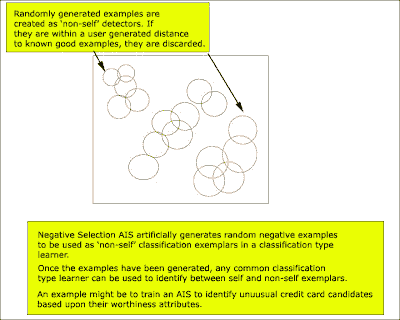

<!--yml
category: 未分类
date: 2024-05-18 04:47:02
-->

# Intelligent Trading: Artificial Immune Systems and Financial Applications?

> 来源：[http://intelligenttradingtech.blogspot.com/2010/02/artificial-immune-systems-and-financial.html#0001-01-01](http://intelligenttradingtech.blogspot.com/2010/02/artificial-immune-systems-and-financial.html#0001-01-01)

One of the buzzwords that seems to be common these days is AIS or Artificial Immune Systems. It is a biologically inspired classification type system that essentially tries to replicate some of our own natural immune system algorithms. Our bodies have various defense mechanisms for recognizing foreign invaders. One such defense mechanism is utilizing pathogen-associated molecular patterns built into our genome so that we can identify foreign pathogens and respond to them. This concept of being able to distinguish between self and non-self is essentially one of the main themes that is borrowed from our natural biological defense.

The idea is that we can learn to recognize objects that are not normal and respond to them. A good example where this has been put to use is in SPAM detection. We want to be able to recognize good (known) mail from the (unknown) bad, and utilize AIS to avoid parasitic SPAM.

The most common AIS system that has been adopted is the Negative Selection Algorithm. It essentially works by training a classifier to generate negative examples randomly and if the negative example (imagine a coordinate on a 2D grid) happens to be located (using some distance metric, such as euclidean or mahanalobis distance) near enough to a known good example, then it is rejected. Essentially, we are randomly generating negative examples for the classifier to identify.

Fig 1\. Basic concept of AIS type classification

Although it has been used in some cases for applications like credit detection, one of the things you'll notice in AI based algorithms is that there are many other algorithms that might do the same job or better. In the case of trading systems, we might want to identify abnormal time series behavior and make a decision based upon this information, however, it is might be simpler to use statistical control methods to better ascertain the information.

In conclusion, although the idea sounds promising, I haven't seen many practical superior examples that would benefit a trading system that cannot be employed by existing AI algorithms.

[artificial immmune systems](http://www.artificial-immune-systems.org/)

There is a wealth of good reading in the linked site, as well as a Weka plugin that can be used to access this algorithm for readers following the Weka tutorials.