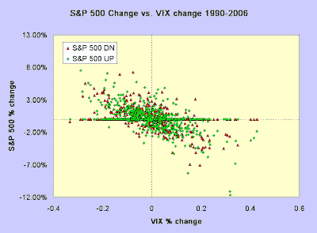
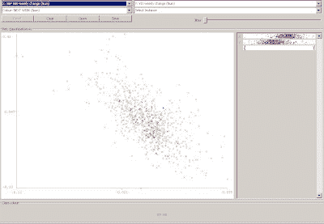
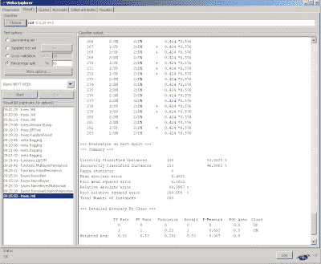

<!--yml
category: 未分类
date: 2024-05-18 04:47:17
-->

# Intelligent Trading: Classification for stock directional prediction

> 来源：[http://intelligenttradingtech.blogspot.com/2010/02/classification-for-prediction.html#0001-01-01](http://intelligenttradingtech.blogspot.com/2010/02/classification-for-prediction.html#0001-01-01)

The neural network tutorial focused on a type of method known as regression. The other common method utilized in machine learning is called classification. The two approaches are somewhat similar in that they identify the best possible curve to learn from a set of data. The difference lies in how they use the curve to learn from the data. In the case of regression, we are often minimizing the distance between each exemplar and the average, whereas in classification, we are trying to discriminate between separate classes by region.

Although the following example is if anything an example of market efficiency (i.e. not much edge in terms of prediction), it serves to illustrate the basic idea of classification with application towards market prediction.

Fig 1\. S&P 500 weekly change vs. VIX

In the figure above, we see a common scatterplot depiction of the S&P 500 weekly return vs the VIX (which is a proxy for volatility). One common observation utilizing regression shows that the S&P 500 is negatively correlated to the VIX. Or qualitatively, large positive changes in the VIX imply negative changes in the S&P index; this is one reason it's often known as the fear index (since a rise in the VIX is associated with negative returns in the S&P 500). If we were to run a regression, we would quantitatively describe this correlation by the R^2 value of the slope, which as can be seen here visually, is a negative value.

But the regression observation says nothing about prediction into the future, it only says that there is a negative relationship between the two values at any given sample instant (in this case, weekly samples). One way to set up the prediction problem for illustration would be to use the current changes in both the S&P 500 index as well as the VIX to predict the next weeks change using a classification method.

The plot shows both UP and DN changes one week later, depicted by green and red labels. Notice that the outcome of the prediction here is nominal and not numerical, which is another common distinguishing feature between classification and regression schemes. Common methods used to deploy classification schemes are learning trees, support vector machines, and most of the tools that are also used in regression. Ideally if the classification scheme was able to discriminate classes well, it would separate classes by a curve or some type of function that would isolate both in sample as well as out of sample classes with a good separation.

Unfortunately, when data is very random, it is not able to separate classes very well.

Fig 2\. Plot of classification values for S&P 500 UP and DN against VIX

We can see that there is so much overlap in the UP and DN regions that it would be hard to find a curve that would classify the regions with good separation.

We use a common learning decision tree scheme called J.48 to attempt to predict out of sample results for the classifier.

Fig 3\. Out of sample classification results

Using the 66% In sample (training) scheme as in the NN example, we see that the predictive learner had a 53% success rate out of sample. If we compare this result to a simple naive learner (often used as a benchmark) using the last result as the prediction, we get identical results. The upshot is that using the information we have, the markets have proved efficient against this simple prediction method.

The classification concept may be extended to other applications (such as regime detection, system selection, artificial immune systems, or using multivariate input attributes) with some creativity, but the goal here was to give a simple introduction to the concept as it is the one of the most important learning concepts in machine learning. Classification may also employ supervised or unsupervised methods-- in this case it was using supervised learning (training by examples).