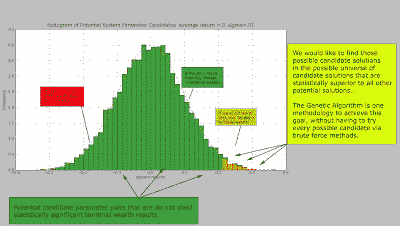

<!--yml
category: 未分类
date: 2024-05-18 04:46:54
-->

# Intelligent Trading: Genetic Algorithm Systematic Trading Development -- Part 1

> 来源：[http://intelligenttradingtech.blogspot.com/2010/02/genetic-algorithm-systematic-trading.html#0001-01-01](http://intelligenttradingtech.blogspot.com/2010/02/genetic-algorithm-systematic-trading.html#0001-01-01)

I want to start with a brief introduction to what I consider one of the most powerful learning methodologies to come out of Artificial Intelligence in the last several decades-- the Genetic Algorithm. Although it was originally developed to model evolutionary biology in the late 50s, most give credit to John Holland for his detailed contributions to the development of the field. A professor of adaptive systems at the University of Michigan, he wrote a text, titled "Adaptation in Natural and Artificial Systems" in 1975, that is considered a landmark book in the field.

Although GAs are designed to borrow from our Genetic Biology, I want to quickly describe why they are powerful with respect to trading systems development. As a trader, you might often develop systems using creative ideas borrowed from Technical Analysis books you may have read. One of the problems with earlier TA books in general, IMO, is that they often have "cherry picked" examples of parameter sets, without much explanation as to how they arrived at the parameters, nor how well they might perform against other parameters. In statistics, we are often interested in gathering many different samples to build a distribution profile of the outcomes as an estimate of the true population of all possible candidate solutions. We often look at these distributions of models to gather a quantitative deduction about whether our particular system (with the parameters we selected) has performed better than any other potential system in the universe of all possible candidate solutions.

If the system performed better than some designated percentage of the sample distribution area of 100% (often set at 1% or 5% in common literature), then we can say that the result compared to the universe of candidates is "statistically significant". Using different parameters for the same set of systematic rules will give different sample outcomes that make up that distribution. For instance, using moving average crossovers, we might end up selecting one pair of moving average values to determine entry and exit with a resulting profit of .1%, while another combination over the same period yielded 2.3%. Ultimately we want to find the set of pairs that performs the best, or at least significantly better than Buy and Hold, otherwise there's typically not much incentive to trade in and out as commission costs and other negative effects make it prohibitive. We could try to run various parameters by guessing or enumerating over the search space of potential solutions, but at a certain point, the number of combinations becomes unwieldy and is not computationally efficient. The first step might be to evaluate the parameters of our system and look for those parameters that yield statistically significant results, the next might be to compare that candidate to buy and hold or other potential system candidates using a t-test of the separate distributions.

Let's take an example of a potential set of rules to illustrate this idea. Suppose we sat down one day and decided upon a rule that said to buy if the m period moving average was greater or less than the n period moving average. First, we need to decide upon what range of values to use for the averages. If we discretize the range of values to integer values, i.e. 1 to 512 steps each, we would have 512X512x2 (where 2 represents greater or less than)= 542,288 different parameters to enumerate through (or try). Although that doesn't seem too large of a number of combinations to try with today's computational power, as we begin to make the rules more complex, the number of combinations will begin to run into the millions. It's just not feasible to try all of them, so we want to find some method to reduce the number of potential candidates, while at the same time finding the best possible results. What we are trying to do is find an 'optimal' algorithm to converge to the best solutions quickly. There are numerous algorithms employed in the field of machine learning, under the category of optimization algorithms that exist to achieve this goal. The genetic algorithm is one such optimization algorithm that borrows directly from our own evolutionary genetic system to find the best potential candidate, without having to literally try out every single possible combination.

Fig1\. Example of searching for statistically superior parameters.

Above, we see an example distribution of possible candidate solutions in the population of potential parameter pairs with the x-axis representing binned ranges of potential gain for the system, and y representing the frequency of parameter pair outcomes corresponding to that gain. Our Genetic Algorithm will help us to find those solutions that are statistically significant compared to potential solutions.

Next: Genetic Algorithm Systematic Trading Development -- Part 2