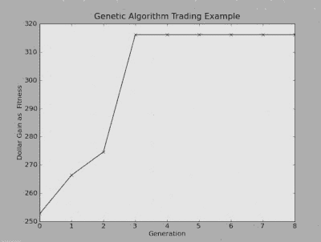
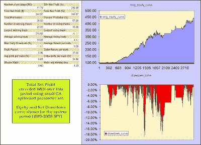
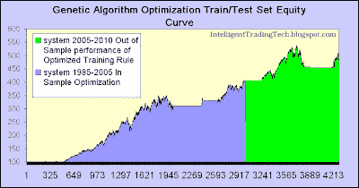
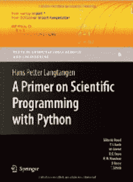

<!--yml
category: 未分类
date: 2024-05-18 04:46:39
-->

# Intelligent Trading: Genetic Algorithm Systematic Trading Development -- Part 3 (Python/VBA)

> 来源：[http://intelligenttradingtech.blogspot.com/2010/02/genetic-algorithm-systematic-trading_20.html#0001-01-01](http://intelligenttradingtech.blogspot.com/2010/02/genetic-algorithm-systematic-trading_20.html#0001-01-01)

As mentioned in prior posts, it is not possible to use the standard Weka GUI to instantiate a Genetic Algorithm, other than for feature selection. Part of the reason is that there is no generic algorithm to instantiate a fitness function. The same flexibility that allows an infinite possible range of fitnesses also requires custom scripting. Although it is possible to write a custom class for Weka/JAVA, I chose to utilize Python for this example, along with an older VBA tool I developed for the back-end results summary. Hopefully, you'll see that there are many tools that may be utilized to prototype various systems and augment the development process.

The essential GA uses a 17 bit string length to encode the following rule:

{if ma(m) binop ma(n) then buy}

The first 8 bits are used to encode the 1st ma value. Note there are 2^n = 2^8 = 256 potential decimal values that can be used for the parameter argument. The 9th bit is a 2 bit encoded value of the > or < binary operator as discussed in prior posts. The last 8 bits are used for the 2nd moving average parameter value. A simple fitness of the net dollar return was used for this example (Note Sharpe ratio, and other fitness metrics could have been used). The input series is SPY, using the range from 1993-2005 daily to optimize.

The python script was essentially set up to run 40 generations of a population of size 20 using elitism and tournament selection. Although this is by no means optimal (it is quite small), it was set up using these values for illustrative purposes. When you watch the video, what you'll see is the initial population in binary encoded strings each time a generation is passed. In addition, the decoded moving average rule is shown for each selection change. Although the video has been truncated for brevity, you should notice that the fitness number is improving each generation. The final solution was designed to halt after a fitness did not improve over five generations. In addition, you can see the final encoded result and a plot of the fitness convergence.

<param name="movie" value="http://www.youtube.com/v/Fw8TFDKk92Q&amp;hl=en&amp;fs=1"><param name="allowFullScreen" value="true"><param name="allowscriptaccess" value="always"><embed src="http://www.youtube.com/v/Fw8TFDKk92Q&amp;hl=en&amp;fs=1" type="application/x-shockwave-flash" allowscriptaccess="always" allowfullscreen="true">

Video 1\. Optimization of MA parameters using Python GA

Fig 1\. Final Fitness result output to console

In fig 1\. we see that the final rule converged to {if ma(220) > ma(221)) then Buy.

In addition, the final binary string is shown along with the final fitness value.

We can decode the binary string with relative ease.

[110110111110111100] is the 17 bit string representing the optimal fitness.

ma1 is 1st 8 bits = 11011011 = 219 decimal a +1 offset was used (so as not to have 0 day moving average) to get a resulting parameter argument of 220.

The next bit is = 1 corresponding to >

The final 8 bits represent the 221 argument by similar reasoning as the first.

So the resulting rule with parameters is:

if ma(220) > ma(221) then Buy

fitness = net$gain = $316.12

fig 2\. Fitness Convergence

In fig 2\. We see how the fitness continued to climb over successive generations until early convergence caused a halt at the fitness value that did not change over the prior 5 generations.

In order to verify the results, we will also show how other tools may be used. In this case, I used an older VBA simulator that I wrote a few years back.

<param name="movie" value="http://www.youtube.com/v/Q6SRTE-m13s&amp;hl=en&amp;fs=1"><param name="allowFullScreen" value="true"><param name="allowscriptaccess" value="always"><embed src="http://www.youtube.com/v/Q6SRTE-m13s&amp;hl=en&amp;fs=1" type="application/x-shockwave-flash" allowscriptaccess="always" allowfullscreen="true">

Video 2\. Summary of optimized parameters using VBA/Excel

Fig 3\. Summary of Back Test Results

Above is a capture of the summary statistics using the back test program. Total net profit is slightly higher than the python results. This is due to the fact that the python simulation truncated the series length of the moving average data, so as to avoid zero front padded values, while the excel program did not. However, they are still in close agreement. It's often useful to use several different programs to force yourself to double check results.

Now, as an astute commenter already pointed out... this method is indeed curve fitting. What we found was the best possible pair of parameters(or at least one of the best; there are superior parameters, but I didn't run the example generation set too long) for our particular rule set we set out to investigate. Or as I mentioned in the first thread, we zeroed in on the region of the distribution curve with the most profitable candidates. Now, for those of you not familiar with curve fitting, it is not a happy concept amongst developers. In fact, it suffers from almost the same egregious problems as cherry picking examples, as I mentioned earlier on.

That being said, however, it is not done in vain. Our goal here is to quantitatively augment common development (the part where you create and verify) tools beyond mere guessing, intuition, and cherry picking. Firstly, it is possible that this particular rule set will not fare as well out of sample, which is true. However, in the same sense that we can not just take one cherry picked example for granted, we must also evaluate how things actually do perform out of sample. I say this because I've used similar techniques that looked very good, and did indeed perform very well out of sample for several periods out into the future. By honing in on the best candidates, we help to narrow down the set of candidates that are worthy of out of sample investigation. There are other additional techniques (some mentioned earlier, such as ensemble methods, different objective/fitness functions, and even different optimization criteria) that can be used to enhance this method, and in addition, verify robustness out of sample.

edit: Just for giggles, I decided to actually run the Out of Sample performance on this optimized in sample trained rule. The following chart illustrates how it performed 'out of sample' for the years 2005-today(2010).

Fig 4\. Out of Sample Test Performance on optimized training rule parameters.

Not all that shabby for that curve fitted simple system during the worst meltdown in recent history, eh (much easier on the gut)?

To be frank, I have run so many evaluations on simple SMA systems, that I would say that they are not the most superior parameters to optimize around. Obviously, however, it really depends on what your objective is. There are some long term studies that have shown using the fitness objective of reduced volatility as the goal is quite beneficial with this simple rule set (you can verify that this simple system had far less volatility over the down periods, than the actual market-- in and out of sample) . It is up to you to find those parameters that are worthy of optimizing further. See

[commentary on A Quantitative Approach to Tactical Asset Allocation](http://blog.fosstrading.com/2010/02/updated-tactical-asset-allocation.html)

for a related example.

As always, please do your own due diligence before making any trading decisions.

And please continue to give your feedback on what you like or don't like and areas you want to explore.

---------------------------------------------------------------------------------

If you are new to Python and would like to order a fantastic textbook, I highly recommend the following (applications geared a bit towards science and engineering):

[A Primer on Scientific Programming with Python](http://www.amazon.com/Scientific-Programming-Computational-Science-Engineering/dp/3642024742/ref=sr_1_26?ie=UTF8&s=books&qid=1266694073&sr=8-26) 

In addition, users who are interested in learning a bit more about VBA with a Financial Oriented slant will find great practical examples in the text:

[Financial Modeling, 3rd Edition](http://www.amazon.com/Financial-Modeling-3rd-Simon-Benninga/dp/0262026287/ref=sr_1_1?ie=UTF8&s=books&qid=1266694665&sr=1-1) 