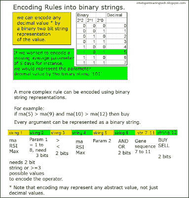
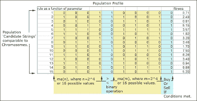
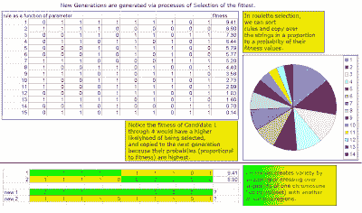

<!--yml
category: 未分类
date: 2024-05-18 04:46:47
-->

# Intelligent Trading: Genetic Algorithm Systematic Trading Development-- Part 2

> 来源：[http://intelligenttradingtech.blogspot.com/2010/02/genetic-algorithm-systematic-trading_17.html#0001-01-01](http://intelligenttradingtech.blogspot.com/2010/02/genetic-algorithm-systematic-trading_17.html#0001-01-01)

We started by discussing the goal of a genetic algorithm, which is to optimally find the candidate pool of rules that are superior to other potential rules. In our example of moving averages, we are seeking the values of parameters of the rule :

if ma(m) binop ma(n) then action.

*Note: binop is short for binary operator; in this case the binary operator is > or

<./>

The GA (genetic algorithm) works by encoding the rule set into a string of binary valued variables. For instance if we wanted to encode the moving average parameter

to 4 real decimal values, we could simply use a 2 bit string, where 00 = 0 decimal, 01= 1 decimal, 10 = 2 decimal and 11 = 3 decimal. We can encode up to 2^n values per bits contained in each string. If we wanted to encode 512 values, we would need a 9 bit string to encode this value (2^9=512).

Also, we can encode values other than decimal values as binary bits, for instance,

action = buy or sell, can be represented by 0 or 1\. Greater or Less than (> or

Fig 1\. Examples of Boolean Encoding

Once we encode our rule set into a boolen representation or string, we then want to generate a population of strings to select from. Typically, we start out by assigning random values to the parameters. For instance, we may start a population of 100 strings; each string representing a set of rules with different parameters.

One string could be if ma(10)<ma(50) then buy, another might be if ma(20)>ma(200) then sell. Once a population has initially been created, we need to create diversity and additionally successfully improve fitness in the offspring over successive generations.

The concept of fitness is perhaps one of the most elegant and flexible options that makes the GA such a powerful optimizer. In the decision tree learners and Neural Network learners we discussed, there are only one or two simple goals to train on (decision tree for instance trains towards goal of reducing information entropy, neural net trains on reducing fitted variance errors). The GA can use any goal you can imagine, which gives it unlimited flexibility compared to others. You could use

total gain as a goal, or sharpe ratio, or profit factor as goals. You could even combine goals. The fitness or goal is what you are trying to optimize. Keep in mind that a genetic algorithm, like any other learner does not guarantee you will find the absolute best, it may get caught in local maxima of the fitness landscape.

However, you can get more sophisticated and add other sub methods to try to avoid this.

Fig 2\. Example of population of rules to be processed.

Once our initial population of parameter based rules has been created (randomly), we then want to think about how we achieve the goal of optimizing or finding the set of rule parameters that best optimizes our fitness. Note that each time we create a new population of offspring, we call this a new generation run or epoch. The first set of offspring or parents, commonly attempts to select some sample of the fittest members to be passed along to the next population. We could use a greedy method that just sorts or ranks the members and selects only from the best 50% to be passed to the next generation (known as truncation selection) or an alternate method is to use something called roulette selection. In roulette selection, we sample members of the original population based upon their normalized fitness. So if the best fitness was 20% of the value of the sum of all the finesses, we would copy over that string or rule with a 20% probability into the next generation. The same would be applied to the other fitness/string combinations. Ultimately, we end up with more of the offspring selected from the most fit candidates in the prior generation. Next, we want to assure some diversity in the offspring. Crossover operation achieves this by crossing over or swapping genes from one candidate and another. This is performed over the entire population to ensure diversity. Lastly, we use mutation to randomly select some number of string elements and flip them. It adds a bit more random diversity to the offspring, so that possibly some candidate may show up unexpectedly that has great performance (think unusual height in basketball for instance).

More bells and whistles can be added to improve performance. Tournament selection is another method that improves offspring selection by running a tournament between string candidates. The winning candidate gets passed along to the next generation.

Fig 3\. Selection process.

We essentially run the optimization and diversity routines through each generation, and the best candidates get passed down through to the next generation until our number of generations has run out, or we specify an early stopping criterion.

In the case of our rule set, we expect it to converge to the best set of parameters

(moving average arguments, and binary greater or equal than operator), based upon the fitness goal we assign to it.

Next. Genetic Algorithm Systematic Trading Development-- Part 3