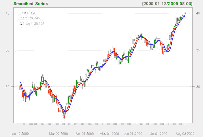
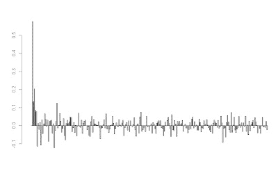

<!--yml
category: 未分类
date: 2024-05-18 04:45:35
-->

# Intelligent Trading: Is it possible to get a causal smoothed filter ?

> 来源：[http://intelligenttradingtech.blogspot.com/2010/05/is-it-possible-to-get-causal-smoothed.html#0001-01-01](http://intelligenttradingtech.blogspot.com/2010/05/is-it-possible-to-get-causal-smoothed.html#0001-01-01)

Although I haven't been all that much of a fan of moving average based methods, I've observed some discussions and made some attempts to determine if it's possible to get an actual smoothed filter with a causal model. Anyone who's worked on financial time series filters knows that the bane of filtering is getting a smooth response with very low delay. Ironically, one would think that you need a very small moving average length to accomplish a causal filter with decent lag properties; often a sacrifice is made between choosing a large parameter to obtain decent smoothing at the cost of lag.

I put together the following FIR based filter using QQQQ daily data for about 1 year worth of data. It is completely causal and described by .. gasp.. 250 coefficients.

Does it appear smooth? You decide.

Fig 1\. FIR 250 tap feed forward filter

Fig 2\. 250 weight impulse response determining coefficients

The impulse response is approximately a sinc function, which is the discrete inverse transform for an ideal 'brick wall' low pass filter.

I haven't actually verified much out of sample at the moment, so it's quite possible that the model may not fare as well; it remains to be investigated. However, thought I would share this work to give some ideas about potential of causal filtering methods.