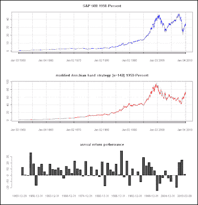

<!--yml
category: 未分类
date: 2024-05-18 04:46:05
-->

# Intelligent Trading: Modified Donchian Band Trend Follower using R, Quantmod, TTR -Part 2: Parameter Sweep Sensitivity over long run

> 来源：[http://intelligenttradingtech.blogspot.com/2010/03/modified-donchian-band-trend-follower.html#0001-01-01](http://intelligenttradingtech.blogspot.com/2010/03/modified-donchian-band-trend-follower.html#0001-01-01)

Here is a small update to the Donchian Channel type system I displayed in the last post.

Fig 1\. Sensitivity of Net Combined L/S Gain to parameter n.

Using the S&P500 index as a proxy for the market, a simulation was run over the lifetime of the index. Notice the system excels in both the very short run, and much longer periods. The short system did very poorly overall and did not perform nowhere near the long side in any of the overall periods (except maybe very short term). A possible explanation is that short side systems do not do very well in the long run due to upward drift of markets. In addition, short side runs do not have the inherent compounding power of long sides as they are asymmetrical. The most you gain on a short run is double your original value, where the long side is unlimited (one way around this limitation is using inverse ETFs). I believe many common simulators err in the effects and method of this computation.

Fig 2\. Some long term results of strategy with parameter n=140

The above figure shows the results of choosing a parameter near the optimal region. In light of commissions and limited short strategy performance over longer periods, it might pay to use the long only portion of the strategy. Another observation is to possibly step aside during highly volatile regions in order to capture the beneficial areas of the long strategy. Some of the methods to approach this type of regime switching have been mentioned in earlier posts.

One last comment to think about when hearing detractors regarding 'curve fitting' and optimization, is that as evidenced in the above simulation, you will often find the the local optimal parameter value turns out to be the most robust, as it will perform best over a wide range of sensitivity to parametrization.