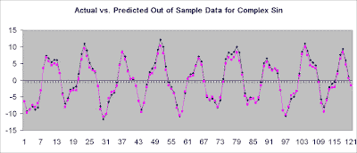
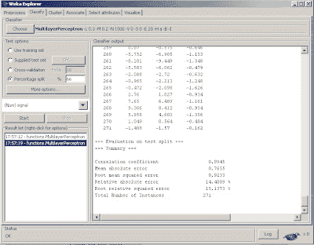
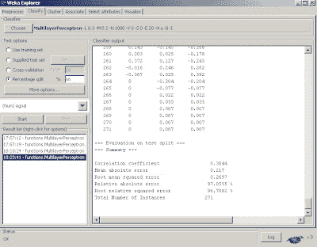
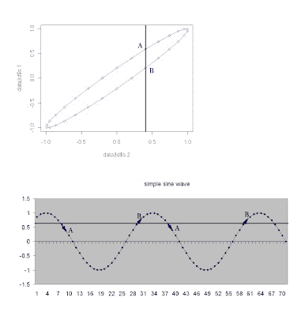
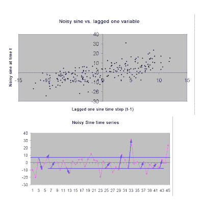
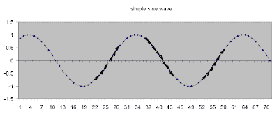

<!--yml
category: 未分类
date: 2024-05-18 04:47:47
-->

# Intelligent Trading: Practical Implementation of Neural Network based Time Series (Stock) Prediction - PART 3

> 来源：[http://intelligenttradingtech.blogspot.com/2010/02/practical-implementation-of-neural.html#0001-01-01](http://intelligenttradingtech.blogspot.com/2010/02/practical-implementation-of-neural.html#0001-01-01)

Ok, now that we have seen how well the perfect sine wave signal was learned, let's turn it up a notch and see how well the complex sine wave was learned.

Fig 1\. Summary of Actual Vs. Predicted out of sample complex sine waveform

Uh Oh. What happened, the out of sample data does not look quite as good. But, let's take a look at the summary statistics.

Fig 2\. Weka Summary for Actual vs Predicted OOS complex sine waveform

We see that the rmse went way up from 0 to about .92, even though the correlation coefficient is still pretty good looking. What's happening is that even though the signal is still perfectly deterministic, the NN needs more training data or more work on the architecture to approximate the new function properly.

Lastly, let's add some random noise to the signal.

fig 3\. complex sin with noise added.

And let's try to train on the random signal.

fig 4\. Actual vs prediction complex sin with noise added

We see that the predictions are starting to look downright bad.

The rmse went to .3, but it can be a bit misleading as the signal magnitude of the predicted waveform has dropped considerably. More importantly the correlation coefficient dropped from .9 down to .3.

fig 5\. Weka summary of Results.

Although the rmse doesn't look too bad, the correlation coefficient dropped from .9 all the way to .3 and relative error jumped from 15% to 97%.

Conclusion, the more noisy or high frequency the signal we train, the worse the results. Let's try to understand this from a different perspective.

Let's think about why the first simple complex predictions were so nice.

What does a neural network really do? You might have heard that it is a universal function approximator. This is essentially true. Just as a line fit, y=mx+b is a universal linear function estimate, a neural network thrives on learning any non-linear unknown general function. But, let's have a look at the scatterplot of only the original sine vs it's previous lagged value.

fig 6\. Scatterplot of perfect sine vs. lagged one value and time series plot.

What we notice is that when we lag the sine against itself, we see a nice deterministic pattern as we expect. This pattern is also sometimes called a lissajou pattern. But, what happens when we try to predict a value from only the previous lagged value? There are two possible outputs, pt A and pt B. If you recall way back in algebra, a function is a mapping of a set of point(s) in a range to one and only one unique output, but here we see there are two. Therefore, even if the model was perfect, it could never properly predict the next value as there are two possible outcomes; it's about as good as a coin toss. So the actual predict result would be the average of the two possible output states. But, remember we added lagged values as inputs to be trained on. Well, what happens when we do a scatterplot of the perfect sine against the prior two lagged values?

fig 7\. 3D Scatterplot of perfect sine wave against two lagged values and ts plot.

What we see is that by conditioning the function on the prior two lagged value pair, there is only one and only one unique corresponding output point! There is no more ambiguity, therefore there exists a perfect function that can fit this conditional prediction. This is why the first perfect sine with embedded variables had such a perfect fit on the neural network regression. It is another way to think about how a neural network learns patterns and why using embedded dimensions or lagged variables to train on is useful.

What happens though when we corrupt the sin with noise?

Here is the scatterplot.

fig8\. Noisy Sine Scatterplot against lagged values.

Look at all the possible ambiguous outputs each prior input predicts! It's no wonder the poor neural network has a hard time learning. It will either give some average output, or depending on the embedded dimension structure (lagged values), a very different prediction than we would expect.

In conclusion, I hope I've given you some food for thought about what a neural net likes and how it learns well.

It may need more than one lagged dimension to learn well and it does NOT like noisy inputs! This is a problem I have found with a lot of the literature that uses neural networks to predict and gives it a bad rap. They summarize using metrics like hit rate as an objective function. Yet, this is like trying to track a coin toss, it's just not always the most useful objective.

I want you to also think about it another way, as it might apply to stock prediction. Look at the following signal.

fig 9\. Momentum tracking with smooth sine

Take a look at what we are doing by tracking the 'smoothed' version of the sine.

We are simply tracking the momentum-- up or down (and possibly sideways)-- that's it. Or another way to think about it is we are tracking the trend, but not each little wiggle. We can also see that there is strong serial or auto-correlation in the momentum, unlike a high frequency raw time series.

By using a 'smoothed' version of a signal, we can focus on tracking the signal and not the noise. So things like hit rate are not that important. What's important is that we captured most of the meat of the trend. A secondary benefit is that we do not get bucked around and churned like a bronco as much. In communications, we use something called a phase locked loop to track clock signals embedded in time domain noise (jitter), here we are focusing on tracking the financial 'signal' embedded in the noise and not so much on each little fluctuation. It is true there will be residual fluctuations, but these drawdowns can be monitored through something like a statistical control chart, while allowing the neural net to focus on and track the signal while not getting bogged down in trying to track noise, which can be counterproductive.

Another way to think about this issue is as follows. If you are familiar with econometrics, there are no shortage of models that try to predict all of the sharp turns and high frequency components (AR, ARMA family, etc.). Normally they will tell you that if the residuals still have some serial correlation, that you have not modeled it well and it needs additional fine tuning. That is all great if you are trying to perfectly back fit a model (deductively), but it works pretty bad out of sample (inductively), because you are essentially over-fitting the model. One of the very interesting successful concepts that has come out of machine learning in recent years, is the idea of ensemble averaging methods. There are several tools like bagging, boosting, stacking, and committee voting that try to take an average prediction rather than a precise one. Predicting the averages has found much success, including the well known NETFLIX prize, where they stack learners.

If this is starting to sound foreign to you, just think about the point of this post, which is to try to smooth the signal and follow the average, rather than predict the high frequency fluctuations.

NEXT. Part 4\. The Stock Prediction example.