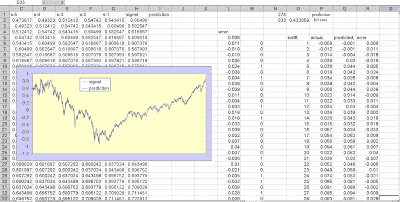

<!--yml
category: 未分类
date: 2024-05-18 04:47:25
-->

# Intelligent Trading: Practical Implementation of Neural Network based time series (stock) prediction -PART 5

> 来源：[http://intelligenttradingtech.blogspot.com/2010/02/practical-implementation-of-neual.html#0001-01-01](http://intelligenttradingtech.blogspot.com/2010/02/practical-implementation-of-neual.html#0001-01-01)

Following is an example of what it looks like to predict an actual univariate price series. The period of the signal that was sampled was already in stationary form, so not much massaging was needed other than normalization (described earlier).

What's important to notice when you see these kinds of neural network predictions (particularly in marketing snapshots for software vendors or trading book examples) is that they look fantastic out of sample from a bird's eye view. Unfortunately, the devil is always in the details. If you zoom way in, the predictions are not as accurate as the larger picture portrays. A more accurate method to asses how well the prediction performed is to look at the percentage change of each predicted value. We can simply compare the sign of the actual percentage change to the predicted change. In this case, the out of sample test results had a 43% hit rate, which is worse than a naive predictor would predict. The good news is you can flip those results, and just predict the opposite direction to get a 57% hit rate. However, you always have to be careful to do due diligence to verify the robustness of these types of predictions over many conditions. Another thing to be careful about is that hit rate only gives you number of correct predictions, but tells you nothing about the magnitude of the predictions, which are important to have a positive net expectation. The type of result you see here, however, is common for predicting specific univariate time series data values.

Fig 1\. Stock Prediction with out of sample region highlighted

You now have a practical example to get you started with building your own prediction system with free tools (except excel, which you likely have), and some ideas and methods to build your own prediction system. Any professional software you purchase will not differ much other than using different attributes to train on or modifying the internal architecture of the neural network. I have not shown more detailed examples on advanced techniques, but might incorporate some later if there is demand.