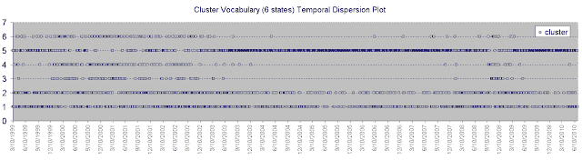

<!--yml
category: 未分类
date: 2024-05-18 04:45:12
-->

# Intelligent Trading: Quantitative Candlestick Pattern Recognition (Part 2 -- What's this Natural Language Processing stuff?)

> 来源：[http://intelligenttradingtech.blogspot.com/2010/08/quantitative-candlestick-pattern.html#0001-01-01](http://intelligenttradingtech.blogspot.com/2010/08/quantitative-candlestick-pattern.html#0001-01-01)

 **I wanted to briefly add one more thought regarding the temporal nature of probabilities as was alluded to in my correspondence with Adam, as well as the prior closing comments on the Chaos post (structure coalescing and dispersing).

I will borrow from the field of Natural Language Processing and introduce one common visual description of how the states evolve over time using something called a Lexical Dispersion Plot.

Fig 1\. Lexical (cluster state vocabulary) Dispersion Plot of Clustered Candlestick States over time

In studies of language, we are often interested in observing how statistical patterns and relationships of sounds, characters, and words, evolve over time.  Natural Language Processing is an entire field that has been dedicated to finding proper tools and vernacular to describe such statistics.  The idea of using a lexical dispersion plot, is to observe how the lexicon itself evolves over time.  To give a simple example, we might take a corpus of common pop culture texts borrowed from some library, and look at the occurrence of the following three word states; "spider", "man", and "spider man".  The first two terms are isolated words, and the third term is called a bigram, which is a joint occurrence of two states in sequential order. 

Now, although I haven't created the proposed lexical dispersion plot for the above scenario, one could reasonably expect for the number of occurrences of the single words, spider and man, to be relatively frequent and uniform from about 1900 to say 1960, while the joint pair (spider,man), might occur relatively sparsely. However, beyond the 60s, we would notice an increase in the joint pair (spider,man) as the popularity of the fictional character began to grow in popularity in the collective pop consciousness.  We might also expect a large frequency of the bigram to occur with recent popularity in the films. However, it's possible that a few hundred years later, that the joint term and character popularity might just wane and eventually die off, even though the two unimodal terms (spider and man) are still frequently observed.

Ok, so what's the point to this? Well, we are commonly taught in statistics that there is a population that exists to describe the ultimate best statistical model of any observational set that lies somewhat beyond the notion of time (much like Plato's ideas of forms existing behind the scenes to describe all nature over all time, for philosophy fans).

But one of the things that disturbed me earlier on is exactly what I described in the prior paragraph on the joint bigram of spider man, which is that sometimes we have to pragmatically shed some of our beliefs about 'ideal' populations and just try to observe statistical phenomena as it occurs temporally.  As mentioned in the Chaos quote, some patterns just spontaneously occur (spider man) for a while, then disappear over time. So, that the notion of a larger population existing behind the scenes (and all the statistical rigor associated with it), might be either overkill or even misleading towards our goal of trying to capture the essence of fleeting patterns. From a statistical viewpoint, I suppose I would lean more on the side of the Bayesian inference camp (constantly updating beliefs online, rather than the frequentist approach).

It's common knowledge in markets that financial time series are not IID (independent and independently distributed) over time. Rather, we accept that there are clusters of regions of behavior that tend to occur frequently together, and likewise, disappear over time (often reappearing again, though not always).  This body of knowledge, specifically related to volatility, is sensibly labeled as heteroscedasticity (differing variance) as opposed to homoscedasticity (constant variance) of observations. We might also notice such behavior being binned and quantified into certain 'regimes' of local stability.

Now, if any of the above meandering made any sense, I will describe how it relates to the Quantitative Candlestick Pattern Recognition article. Recall that using clustering, we were attempting to identify a vocabulary of states that best describe a limited set of features (in the example, six states were identified) that best partition related candlestick symbols by state in an unsupervised manner. However, the dispersion plot in Fig 1\. shows that viewed from a perspective of a central population, these states are not uniformly distributed (IID) over time, rather, some tend to occur frequently over relatively long periods of time, while others appear and disappear for reasonable windows of time.  States one and two in the set tend to occur rather frequently, because they are very small moves (dojis and such), which tend to occur often over time. However, some of the larger moves captured in states 3 and 4, tend to persist for some periods, then disappear over other intervals.  The likely explanation, is that larger moves tend to be associated with volatility, which as we know, exhibits heteroscedasticity (clustering together in time). Keep in mind, the dispersion example is not only limited to single symbols over time, but can be extended to any number of n-gram pairs or symbols (such as the two word bigram state for spider man).

With that knowledge in mind, it doesn't always make a whole lot of sense to try to develop and require a central fixed body of pattern statistics and related models over long periods of time, or even require many related statistical tests as neccessary (things like n-fold cross validation over very large time series, bootstrap re-sampling methods with shuffling, and requiring decades of backtesting training data to obtain confidence that we found the best pattern vocabulary to describe data for all time). For instance, in one of the better books on statistics for traders, "Evidence based TA," by Aronson, many of the tests were conducted using t-tests of entire bodies of financial series and rules over a long period of time, while rejecting many potential pockets of temporal success since they were thrown in and bootstrapped with much longer periods of data to draw conclusions about statistical significance of hypotheses related to better than chance success.

This is not to say that common trading statistics should be thrown out; not at all. Instead, it is hopefully to try to look at how the information being evaluated is processed over time (for instance, we may look at long term statistics of trade results, but focus more on short term statistics and modelling of the underlying patterns they are dependent upon).

Additionally, we might be interested in breaking up the pattern information stream into smaller segments and observing and adapting to how the segments of data streams evolve and change over time. The key savior or benefit to us, is that these patterns in the data streams do tend to persist together for quite some time (often reasonably long), before dispersing and moving on to new forms of patterns.  There are several different machine learning concepts on the horizon that work with evolving (such as adding and pruning pattern model parameters) data streams over time and space. I have been spending some time evaluating one of them recently (although, I'm not saying which at the moment) which looks promising.**