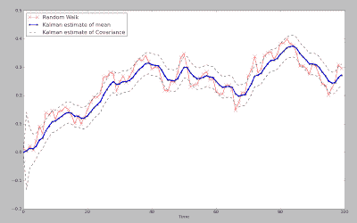

<!--yml
category: 未分类
date: 2024-05-18 04:45:27
-->

# Intelligent Trading: The Kalman Filter For Financial Time Series

> 来源：[http://intelligenttradingtech.blogspot.com/2010/05/kalman-filter-for-financial-time-series.html#0001-01-01](http://intelligenttradingtech.blogspot.com/2010/05/kalman-filter-for-financial-time-series.html#0001-01-01)

Every now and then I come across a tool that is so bogged down in pages of esoteric mathematical calculations, it becomes difficult to get even a simple grasp of how or why they might be useful. Even worse, you exhaustively search the internet to find a simple picture that might express a thousand equations, but find nothing. The kalman filter is one of those tools. Extremely useful, yet, very difficult to understand conceptually because of the complex mathematical jargon. Below is a simple plot of a kalman filtered version of a random walk (for now, we will use that as an estimate of a financial time series).

Fig 1\. Kalman Filter estimates of mean and covariance of Random Walk

The kf is a fantastic example of an adaptive model, more specifically, a dynamic linear model, that is able to adapt to an ever changing environment. Unlike a simple moving average or FIR that has a fixed set of windowing parameters, the kalman filter constantly updates the information to produce adaptive filtering on the fly. Although there are a few TA based adaptive filters, such as Kaufman Adaptive Moving Average and variations of the exponential moving average; neither captures the optimal estimation of the series in the way that the KF does. In the plot in Fig 1\. We have a blue line which represents the estimated dynamic 'average' of the underlying time series, where the red line represents the time series itself, and lastly, the dotted lines represent a scaled covariance estimate of the time series against the estimated average. Notice that unlike many other filters, the estimated average is a very good measure of the 'true' moving center of the time series.

Without diving into too much math, the following is the well known 'state space equation' of the kf:

xt=A*xt-1 + w

zt=H*xt + v

Although these equations are often expressed in state space or matrix representation, making them somewhat complicated to the layman, if you are familiar with simple linear regression it might make more sense.

Let's define the variables:

xt is the hidden variable that is estimated, in this case it represents the best estimate of the dynamic mean or dynamic center of the time series

A is the state transition matrix, or I often think of it as similar to the autoregressive coefficient in an AR model; think of it as Beta in a linear regression here.

w is the noise of the model.

So, we can think of the equation of x=Ax-1 + w as being very similar to the basic linear regression model, which it is. The main difference being that the kf constantly updates the estimates at each iteration in an online fashion. Those familiar with control systems might understand it as a feedback mechanism, that adjusts for error. Since we can not actually 'see' the true dynamic center in the future, only estimate it, we think of x as a 'hidden' variable.

The other equation is linked directly to the first.

zt=H*xt+v

zt is the measured noisy state variable that has a probabilistic relationship to x.

xt we recognize as the estimate of the dynamic center of the time series.

v is the noise of the model.

Again, it is a linear model, but this time the equation contains something we can observe: zt is the value of the time series we are trying to capture and model with respect to xt. More specifically, it is an estimate of the covariance, or co-movement between the observed variable, the time series value, and the estimate of the dynamic variable x. You can also think of the scaled envelope it creates as similar to a standard deviation band that predicts the future variance of the signal with respect to x.

Those familiar with hidden markov models, might recognize the concept of hidden and observed state variables displayed here.

Basically, we start out estimating our guess of the the average and covariance of the hidden series based upon measurements of the observable series, which in this case are simply the normal parameters N(mean, std) used to generate the random walk. From there, the linear matrix equations are used to estimate the values of cov x and x, using linear matrix operations. The key is that once an estimate is made, the value of the covariance of x is then checked against the actual observable time series value, y, and a parameter called K is adjusted to update the prior estimates. Each time K is updated, the value of the estimate of x is updated via:

xt_new_est=xt_est + K*(zt - H*x_est). The value of K generally converges to a stable value, when the underlying series is truly gaussian (as seen in fig 1\. during the start of the series, it learns). After a few iterations, the optimal value of K is pretty stable, so the model has learned or adapted to the underlying series.

Some advantages to the kalman filter are that is is predictive and adaptive, as it looks forward with an estimate of the covariance and mean of the time series one step into the future and unlike a Neural Network, it does NOT require stationary data.

Those working on the Neural Network tutorials, hopefully see a big advantage here.

It has a very close to smooth representation of the series, while not requiring peeking into the future.

Disadvantages are that the filter model assumes linear dependencies, and is based upon noise terms that are gaussian generated. As we know, financial markets are not exactly gaussian, since they tend to have fat tails more often than we would expect, non-normal higher moments, and the series exhibit heteroskedasticity clustering. Another more advanced filter that addresses these issues is the particle filter, which uses sampling methods to generate the underlying distribution parameters.

--------------------------------------------------------------------------------

Here are some references which may further help in understanding of the kalman filter.

In addition, there is a kalman smoother in the R package, DLM.

http://www.swarthmore.edu/NatSci/echeeve1/Ref/Kalman/ScalarKalman.html

If you are interested in a Python based approach, I highly recommend the following book...Machine Learning An Algorithmic Perspective

Not only is there a fantastic writeup on hidden markov models and kalman filters, but there is real code you can replicate. It is one of the best practical books on Machine Learning I have come across-- period.