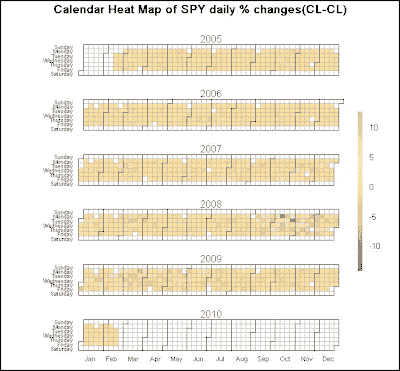

<!--yml
category: 未分类
date: 2024-05-18 04:46:28
-->

# Intelligent Trading: Time Series Calendar Heat Maps Using R

> 来源：[http://intelligenttradingtech.blogspot.com/2010/02/time-series-calendar-heat-maps-using-r.html#0001-01-01](http://intelligenttradingtech.blogspot.com/2010/02/time-series-calendar-heat-maps-using-r.html#0001-01-01)

I came across an interesting blog that showcased

[Charting time series as calendar heat maps in R](http://blog.revolution-computing.com/2009/11/charting-time-series-as-calendar-heat-maps-in-r.html)

. It is based upon a great algorithm created by Paul Bleicher,CMO of Humedica. I'll let you link to the other blog to see more details on the background and original source code.

I made a very small modification to allow %daily changes, rather than price values.

 `stock.dailychangecalendarHeat(stock.data$Date[1:length(stock.data$Date)-1], stock.dailychange, varname="SPY daily % changes(CL-CL)")` 

Fig 1\. Calendar Heat Map for SPY time series 2005-Present

What's interesting is you can see how unusual events tend to Cluster (heteroscedasticity) , and a preponderance of low change days (as would be expected in close to Gaussian distributions). Using the regions of clustering might help warn of impeding catastrophic regimes (as seen in late 08), similar to using VIX as a proxy. In addition, the 10,000 foot bird's eye view, might allow you to spot pockets of order for further evaluation.