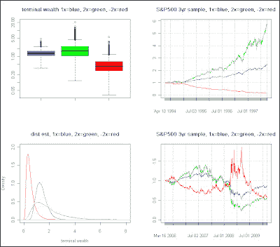

<!--yml
category: 未分类
date: 2024-05-18 04:45:50
-->

# Intelligent Trading: Why isn't my 2X Ultra ETF keeping pace with the market and what is path asymmetry (R ex)? Part 2

> 来源：[http://intelligenttradingtech.blogspot.com/2010/04/why-isnt-my-2x-ultra-etf-keeping-pace.html#0001-01-01](http://intelligenttradingtech.blogspot.com/2010/04/why-isnt-my-2x-ultra-etf-keeping-pace.html#0001-01-01)

I created an example to show how the theory from part 1 might be applied using S&P500 as a proxy for performance. Just in case anyone viewing is not familiar with terminal wealth, it is the final (usually compounded) ending value (hence, terminal) of the account.

Fig 1\. Example of S&P 500 and using GBM monte carlo simulations for terminal wealth

A monte carlo simulation of GBM, using historical daily%change parameters(mean,std), was run for 10,000 iterations of a time series length=1000\. The length was chosen to approximate slices of about 3yrs for summary statistics of terminal wealth (a good approximation for market timing). I also used the long term historical mu and std of the series, although it might be a bit biased towards longer horizons. Possibly, I could generate more of a 3yr sampling distribution of N(u,std), for more relevance, but for now we'll assume the long run parameters are a good approximation.

Graphical summary statistics using boxplots and density estimates are shown for the monte carlo simulations. What strikes me at first glance, is that the -2x instrument performs absolutely horrible in most cases, adding to the common knowledge that markets have upwards drift. If you are ever stuck holding a position, just hope it isn't short (we've all experienced the deer in the headlight phenomenon at one time or another); statistically, it is not the best side to be stuck on for any long period.

Another more interesting observation, however, is that the simple 1X underlying instrument mode is to the right of all the density estimates. In addition, you are clearly taking on wider variance/risk, by using the positive (and neg) leveraged 2x instrument. In essence, you are seeing some of kelly principles at work here. By taking on 2X risk, while you have a chance of larger gains, statistically, you are not likely to do too much better than 1x, while taking on far greater risk on the negative side.

Lastly, there are two sample slices shown of the actual results, using arbitrary periods of performance. It is clear, that during periods of long trends, we have much better growth in the 2X instrument, unfortunately, we don't know when those trends will occur, and secondly, according to the monte carlo sims, they are not that likely to occur.

The most recent performance, displayed, is a perfect example of a series where both 2X instruments performed worse than the underlying, as explained in part 1.

Below is a summary of the three series, ser(1X), ser2pos(+2X), ser2neg(-2X)

> summary(ser)

Min. 1st Qu. Median Mean 3rd Qu. Max.

0.3613 1.0800 1.3290 1.3870 1.6250 4.7460

> summary(ser2pos)

Min. 1st Qu. Median Mean 3rd Qu. Max.

0.1178 1.0630 1.6100 1.9180 2.4070 20.5700

> summary(ser2neg)

Min. 1st Qu. Median Mean 3rd Qu. Max.

0.0337 0.2859 0.4279 0.5173 0.6483 5.6480

Notice the Median of +2X is nowhere near 2 times the Median of the underlying. Although 2X has some fantastic outliers, you shouldn't expect them statistically.

It's sort of like tossing a coin with compounding the full amount, whereby, you get a fantastic result for the winning outcome, unfortunately, there is a 75% probability of going bankrupt (maybe I'll cover that one another time).

One final comment is that the monte carlo sims used GBM, whereas a more likely jump diffusion process would create much fatter tails, meaning even more neg tail risk against the potentially nice looking 2X instrument potential gains.