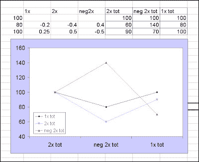

<!--yml
category: 未分类
date: 2024-05-18 04:45:57
-->

# Intelligent Trading: Why isn't my 2X Ultra ETF keeping pace with the market and what is path asymmetry (R ex)?

> 来源：[http://intelligenttradingtech.blogspot.com/2010/03/why-isnt-my-2x-etf-keeping-pace-with.html#0001-01-01](http://intelligenttradingtech.blogspot.com/2010/03/why-isnt-my-2x-etf-keeping-pace-with.html#0001-01-01)

I've been reading a few articles lately, lambasting ultra ETFs for not keeping up with markets and ascribing the problem to weird unexplainable reasons such as portfolio derivative re-balancing and negative drift. I thought it would be nice to revisit the concept of path asymmetry. Although there are many different definitions of price asymmetry (econometrics for example), in this case I'm simply referring to the asymmetrical nature of percentage price movements vs dollar movements and their final cumulative outcome given any arbitrary path.

Fig 1\. Example of ultra 2X ETFs and path asymmetry

Many people seem to find it incomprehensible (if not reprehensible) that an underlying series may move a certain direction, yet, both the ultra short and ultra long series both finish below the underlying over the long run. What exactly is path asymmetry? Some traders might be familiar with the notion that if you lose some percentage of your account, like 50%, that you need more than 50% to make up for the loss. That is an example of path asymmetry (I should note someone also mentioned it's an example of Seigel's paradox).

Let's look at a very simple example of how this might affect a stock and it's 2x counterparts. Suppose a stock moves from 100dollars to 80 and back to 100 again-- break-even. The move from 100 to 80 on a percentage basis, was a 20% loss. However, to recoup that amount, we need to solve for 80*(1+x)=100; the answer is 25%, not 20%. This means even though the dollar amount is identical for both moves (20dollars down and up), the %amount is not. That is an example of path asymmetry. How does this affect the 2X ultra Leveraged ETFs? Well, since each ETF is designed to track twice the daily move of the underlying, the the +2x ETF will move 40% down, then it will move 50% back up, for a net dollar ending value of 90 dollars. The -2x ETF will move up 2x or 40% to 140, and then retrace -50% leaving it at only 70 dollars. Notice in both cases, each ultra ETF ends up below the underlying price. It is the simple mechanics of path dependency and asymmetry that account for this, even with perfect 2x leveraging. It is important to take into account path dependencies when dealing with any leveraged product, including hedging.

Now keep in mind, there is additional drag on these products, due to fund expenses, which does add merit to the original question. More on this is explained succinctly in this article by

[Alpha's Tristan Yates and Lye Kok](http://seekingalpha.com/article/35789-the-case-against-leveraged-etfs)

.