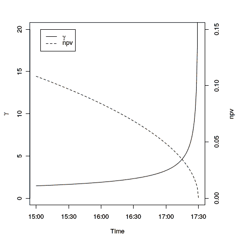

<!--yml
category: 未分类
date: 2024-05-17 23:30:38
-->

# Intraday, high Resolution Day Counters – HPC-QuantLib

> 来源：[https://hpcquantlib.wordpress.com/2015/01/04/intraday-high-resolution-day-counters/#0001-01-01](https://hpcquantlib.wordpress.com/2015/01/04/intraday-high-resolution-day-counters/#0001-01-01)

At the time being QuantLib’s smallest time resolution is a single day and QuantLib does not support “intraday pricing”. Close to an option’s maturity date this inaccuracy leads to wrong greeks. Especially at maturity date QuantLib gives back zero option npv and greeks. A temporary solution would be to shift the expiry date of the option one day forward but this still leads to wrong valuation of the price and the [pin risk](http://en.wikipedia.org/wiki/Pin_risk_%28options%29) of the option.

The root of the problem is DayCounter’s yearFraction method, which acts on dates and the Date class does not support any time resolution smaller than days. On the other hand the Date class is probably the most widely used QuantLib class and therefore any solution must be backwards compatible. One solution for this problem has recently been discussed [here](http://quantlib.10058.n7.nabble.com/Intraday-patch-td16122.html).

Instead of adding new derived Date classes another solution will be to change the Date class itself to cope with intraday time information. The advantage of this approach is that all overloaded operators remain consistent. The date time arithmetic has been implemented using the boost::posix_time::ptime class. If one is interested in the correct treatment of time zones and day light saving one should use boost::local_time::local_date_time but this comes with a performance penalty. In order to allow backwards compatibility all signatures and behavior of the existing Date and DayCounter classes should stay the same. Additional methods are inter alia a new high-resolution date constructor

```

Date::Date(Day d, Month m, Year y,
           Size hours, Size minutes, Size seconds,
           Size millisec = 0, Size microsec = 0);

```

and methods to get the differences in days between two points in time including the fractions of the days. The maximal resolution of the methods is either micro or nano seconds depending on the underlying boost installation.

```

   Time Date::fractionOfDay() const
   Time daysBetween(const Date&, const Date&);

```

Last bit missing now is to change the corresponding day counters, e.g. the yearFraction method of the Actual365Fixed day counter becomes

```

Time Actual365Fixed::Impl::yearFraction(
    const Date& d1, const Date& d2, 
    const Date&, const Date&) const {

        return daysBetween(d1, d2)/365.0;
}

```

The new Date and DayCounter implementation is available [here](http://hpc-quantlib.de/src/date.zip). It acts as a drop-in replacement for the existing classes, meaning the QuantLib test suite runs properly without any changes. Only the day counters Actual360, Actual365Fixed, ActualActual allow a strictly monotone definition of time and only these once have been adapted. The patch also contains an example of an intraday pricing of an ATM option during the last two and a half hours of the last trading day based on the Heston model and the finite difference pricing engine FDHestonVanillaEngine. The resulting Gamma and NPV of the option are shown in the diagram below.

[](https://hpcquantlib.wordpress.com/wp-content/uploads/2015/01/gamma.png)