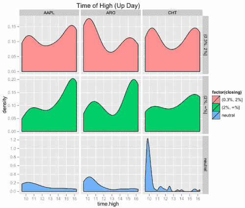
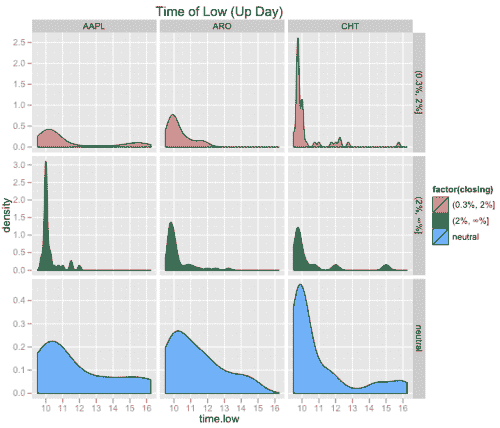

<!--yml
category: 未分类
date: 2024-05-18 15:31:42
-->

# Intraday Profiles: Individual Assets | Tr8dr

> 来源：[https://tr8dr.wordpress.com/2010/09/11/intraday-profiles-individual-assets/#0001-01-01](https://tr8dr.wordpress.com/2010/09/11/intraday-profiles-individual-assets/#0001-01-01)

September 11, 2010 · 4:39 pm

I was expecting some differences in the profiles for differing equities.  Some of the factors that may provide differences:

1.  Liquidity
2.  Domestic or Foreign
3.  Institutional vs Individual Investor Holdings
4.  Industry?

I chose Apple (AAPL) and 2 other stocks at random with liquidity / trading volume declining from left to right { AAPL, ARO, CHT }.  Here are the Up Day charts for the high and low:

Of course looking at just one asset may not give a good read.   We may want to run on pools of stocks for a given liquidity and industry to give a better overall read.