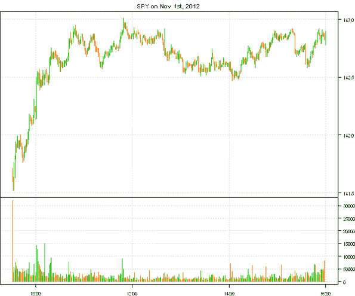
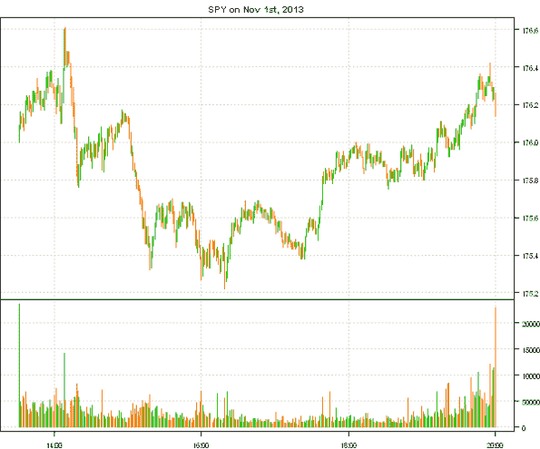
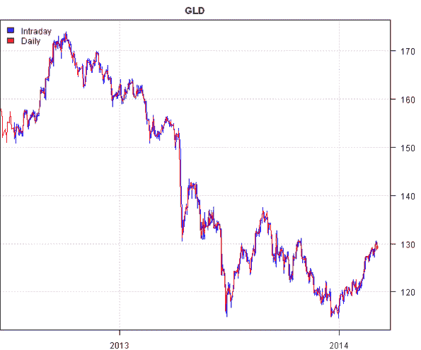
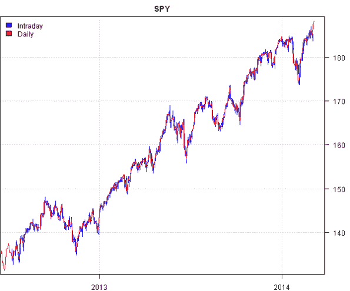
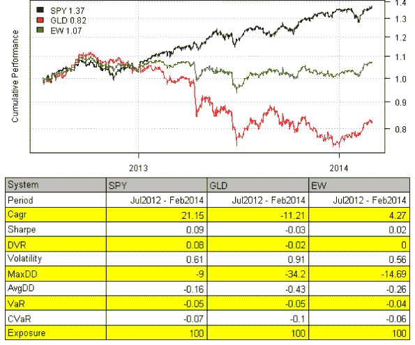

<!--yml
category: 未分类
date: 2024-05-18 14:30:48
-->

# Intraday data | Systematic Investor

> 来源：[https://systematicinvestor.wordpress.com/2014/03/10/intraday-data/#0001-01-01](https://systematicinvestor.wordpress.com/2014/03/10/intraday-data/#0001-01-01)

In the [Intraday Backtest](https://systematicinvestor.wordpress.com/2012/04/23/intraday-backtest/) post I showed an example of loading and working with Forex Intraday data from the [FXHISTORICALDATA.COM](http://www.fxhistoricaldata.com/). Recently, I came across another interesting source of Intraday data at the [Bonnot Gang](http://thebonnotgang.com/tbg/historical-data/) site. Please note that you will have to register to get access to the Intraday data; the registration is free.

Today, I want examine quality of the Intraday data from the [Bonnot Gang](http://thebonnotgang.com/tbg/historical-data/) and show how it can be integrated into Backtest using the [Systematic Investor Toolbox](https://systematicinvestor.wordpress.com/systematic-investor-toolbox/). For the example below, please first download and save 1 minute Intraday historical data for SPX and GLD. Next let’s load and plot time series for SPX.

```

###############################################################################
# Load Systematic Investor Toolbox (SIT)
# https://systematicinvestor.wordpress.com/systematic-investor-toolbox/
###############################################################################
con = gzcon(url('http://www.systematicportfolio.com/sit.gz', 'rb'))
    source(con)
close(con)

	#*****************************************************************
	# Load historical data
	#****************************************************************** 
	load.packages('quantmod')	

	# data from http://thebonnotgang.com/tbg/historical-data/
	spath = 'c:/Desktop/'
	# http://stackoverflow.com/questions/14440661/dec-argument-in-data-tablefread
		Sys.localeconv()["decimal_point"]
		Sys.setlocale("LC_NUMERIC", "French_France.1252")

	data <- new.env()
	data$SPY = read.xts(paste0(spath,'SPY_1m.csv'), 
		sep = ';', date.column = 3, format='%Y-%m-%d %H:%M:%S', index.class = c("POSIXlt", "POSIXt"))

	data$GLD = read.xts(paste0(spath,'GLD_1m.csv'), 
		sep = ';', date.column = 3, format='%Y-%m-%d %H:%M:%S', index.class = c("POSIXlt", "POSIXt"))

	#*****************************************************************
	# Create plot for Nov 1, 2012 and 2013
	#****************************************************************** 
	layout(c(1,1,2))		
	plota(data$SPY['2012:11:01'], type='candle', main='SPY on Nov 1st, 2012', plotX = F)
	plota(plota.scale.volume(data$SPY['2012:11:01']), type = 'volume')	

	layout(c(1,1,2))		
	plota(data$SPY['2013:11:01'], type='candle', main='SPY on Nov 1st, 2013', plotX = F)
	plota(plota.scale.volume(data$SPY['2013:11:01']), type = 'volume')	

```

[](https://systematicinvestor.wordpress.com/wp-content/uploads/2014/03/plot1.png)

[](https://systematicinvestor.wordpress.com/wp-content/uploads/2014/03/plot2.png)

It jumps right away that the data provider had changed the time scale, in 2012 data was recorded from 9:30 to 16:00 and in 2013 data was recorded from 13:30 to 20:00.

Next, let’s check if there are any big gaps in the series Intraday.

```

	#*****************************************************************
	# Data check for Gaps in the series Intraday
	#****************************************************************** 
	i = 'GLD'
	dates = index(data[[i]])
	factor = format(dates, '%Y%m%d')
	gap = tapply(dates, factor, function(x) max(diff(x)))

	gap[names(gap[gap > 4*60])]
	data[[i]]['2013:02:19']

	i = 'SPY'
	dates = index(data[[i]])
	factor = format(dates, '%Y%m%d')
	gap = tapply(dates, factor, function(x) max(diff(x)))

	gap[names(gap[gap > 4*60])]
	data[[i]]['2013:02:19']	

```

Please see below the dates for GLD with gaps over 4 minutes

```

20120801   12
20121226   22
20130219   48
20130417    6
20130531    6
20130705    8
20131105    4
20131112    4
20140124   14
20140210   22
20140303    6

```

A detailed look at the Feb 19th, 2013 shows a 48 minute gap between 14:54 and 15:42

```

> data[[i]]['2013:02:19 14:50::2013:02:19 15:45']
                        open    high      low   close volume
2013-02-19 14:50:54 155.3110 155.315 155.3001 155.315   8900
2013-02-19 14:51:56 155.3100 155.310 155.3100 155.310 119900
2013-02-19 14:52:52 155.3100 155.330 155.3000 155.305 354600
2013-02-19 14:53:55 155.2990 155.300 155.2800 155.280      0
2013-02-19 14:54:54 155.2900 155.290 155.2659 155.279  10500
2013-02-19 15:42:57 155.3400 155.360 155.3400 155.350 587900
2013-02-19 15:43:57 155.3501 155.355 155.3300 155.332   8300
2013-02-19 15:44:59 155.3395 155.340 155.3200 155.340  10700
2013-02-19 15:45:55 155.3300 155.340 155.3300 155.340   5100

```

So there is definitely something going on with data acquisition at that time.

Next, let’s compare Intrada data with daily data:

```

	#*****************************************************************
	# Data check : compare with daily
	#****************************************************************** 
	data.daily <- new.env()
		quantmod::getSymbols(spl('SPY,GLD'), src = 'yahoo', from = '1970-01-01', env = data.daily, auto.assign = T)   

	layout(1)		
	plota(data$GLD, type='l', col='blue', main='GLD')
		plota.lines(data.daily$GLD, type='l', col='red')
	plota.legend('Intraday,Daily', 'blue,red')	

	plota(data$SPY, type='l', col='blue', main='SPY')
		plota.lines(data.daily$SPY, type='l', col='red')
	plota.legend('Intraday,Daily', 'blue,red')		

```

[](https://systematicinvestor.wordpress.com/wp-content/uploads/2014/03/plot3.png)

[](https://systematicinvestor.wordpress.com/wp-content/uploads/2014/03/plot4.png)

The Intraday data matches Daily data very well.

Please note that the raw Intraday data comes with seconds time stamp, for back-testing purposes we will also want to round date time to the nearest minute, so that we can merge the Intraday data series without introducing multiple entries for the same minute. For example:

```

	#*****************************************************************
	# Round to the next minute
	#****************************************************************** 
	GLD.sample = data$GLD['2012:07:10::2012:07:10 09:35']
	SPY.sample= data$SPY['2012:07:10::2012:07:10 09:35']

	merge( Cl(GLD.sample), Cl(SPY.sample) )

	# round to the next minute
	index(GLD.sample) = as.POSIXct(format(index(GLD.sample) + 60, '%Y-%m-%d %H:%M'), format = '%Y-%m-%d %H:%M')
	index(SPY.sample) = as.POSIXct(format(index(SPY.sample) + 60, '%Y-%m-%d %H:%M'), format = '%Y-%m-%d %H:%M')

	merge( Cl(GLD.sample), Cl(SPY.sample) )

```

```

> merge( Cl(GLD.sample), Cl(SPY.sample) )
                       close close.1
2012-07-10 09:30:59 155.0900 136.030
2012-07-10 09:31:59 155.1200 136.139
2012-07-10 09:32:58 155.1100      NA
2012-07-10 09:32:59       NA 136.180
2012-07-10 09:33:56 155.1400      NA
2012-07-10 09:33:59       NA 136.100
2012-07-10 09:34:59 155.0999 136.110
2012-07-10 09:35:59 155.0200 136.180

> merge( Cl(GLD.sample), Cl(SPY.sample) )
                       close close.1
2012-07-10 09:31:00 155.0900 136.030
2012-07-10 09:32:00 155.1200 136.139
2012-07-10 09:33:00 155.1100 136.180
2012-07-10 09:34:00 155.1400 136.100
2012-07-10 09:35:00 155.0999 136.110
2012-07-10 09:36:00 155.0200 136.180

```

I got an impression that these Intraday data is not really authentic, but was collected by running Intraday snap shoots of the quotes and later on processed to create one minute bars. But I might be wrong.

Next, let’s clean the Intraday data, by removing any day with time gaps over 4 minutes and let’s round all times to the nearest minute:

```

	#*****************************************************************
	# Clean data
	#****************************************************************** 
	# remove dates with gaps over 4 min
	for(i in ls(data)) {
		dates = index(data[[i]])
		factor = format(dates, '%Y%m%d')
		gap = tapply(dates, factor, function(x) max(diff(x)))
		data[[i]] = data[[i]][ is.na(match(factor, names(gap[gap > 4*60]))) ]
	}		

	common = unique(format(index(data[[ls(data)[1]]]), '%Y%m%d'))
	for(i in ls(data)) {
		dates = index(data[[i]])
		factor = format(dates, '%Y%m%d')	
		common = intersect(common, unique(factor))
	}

	# remove days that are not present in both time series
	for(i in ls(data)) {
		dates = index(data[[i]])
		factor = format(dates, '%Y%m%d')
		data[[i]] = data[[i]][!is.na(match(factor, common)),]
	}

	#*****************************************************************
	# Round to the next minute
	#****************************************************************** 
	for(i in ls(data))
		index(data[[i]]) = as.POSIXct(format(index(data[[i]]) + 60, '%Y-%m-%d %H:%M'), tz = Sys.getenv('TZ'), format = '%Y-%m-%d %H:%M')

```

Once Intraday data is ready, we can test a simple equal weight strategy:

```

	#*****************************************************************
	# Load historical data
	#****************************************************************** 
	bt.prep(data, align='keep.all', fill.gaps = T)

	prices = data$prices   
	dates = data$dates
		nperiods = nrow(prices)

	models = list()

	#*****************************************************************
	# Benchmarks
	#****************************************************************** 							
	data$weight[] = NA
		data$weight$SPY = 1
	models$SPY = bt.run.share(data, clean.signal=F)

	data$weight[] = NA
		data$weight$GLD = 1
	models$GLD = bt.run.share(data, clean.signal=F)

	data$weight[] = NA
		data$weight$SPY = 0.5
		data$weight$GLD = 0.5
	models$EW = bt.run.share(data, clean.signal=F)

    #*****************************************************************
    # Create Report
    #******************************************************************    
    strategy.performance.snapshoot(models, T)	

```

[](https://systematicinvestor.wordpress.com/wp-content/uploads/2014/03/plot5.png)

In this post, I tried to outline the basic steps you need to take if you are planning to work with a new data source. Next, I plan to follow with more examples of testing Intraday strategies.

To view the complete source code for this example, please have a look at the [bt.intraday.thebonnotgang.test() function in bt.test.r at github](https://github.com/systematicinvestor/SIT/blob/master/R/bt.test.r).