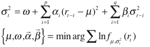
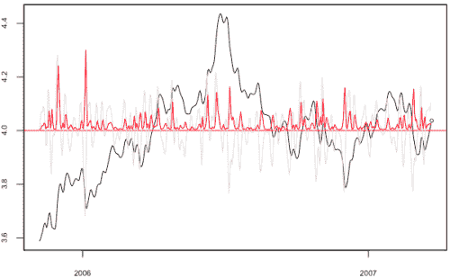

<!--yml
category: 未分类
date: 2024-05-18 15:39:06
-->

# Intraday volatility prediction and estimation | Tr8dr

> 来源：[https://tr8dr.wordpress.com/2009/10/30/intraday-volatility-prediction-and-estimation/#0001-01-01](https://tr8dr.wordpress.com/2009/10/30/intraday-volatility-prediction-and-estimation/#0001-01-01)

October 30, 2009 · 8:21 pm

GARCH has been shown to be a reasonable estimator of variance for daily or longer period returns. Some have adapted GARCH to use intraday returns to improve daily returns. GARCH does very poorly in estimating intra-day variance, however.

The GARCH model is based on the empirical observation that there is strong autocorrelation in the square of returns for lower frequencies (such as daily). This can be easily seen by observing clustering and “smooth” decay of squared returns on daily returns for many assets.

where the second equation is the ML optimization for the parameters.

Here is an example for daily Canadian 2Y CMT yield.  The red is the GARCH(1,1) variance, the black is the series, and the grey is the log return, and the green circle is the predicted variance for the next period:

Contact me if you would like to get the R source code for the above.

Intra-day squared returns, however, have many jumps, with little in the way of autocorrelated decay pattern. Looking at the EUR/USD series, the squared returns have jumps that reduce the ML to the point where GARCH parameterization does not converge.  There does appear to be a longer-term pattern, though, allowing for a model, though not GARCH.

With expanded processing power and general access to tick data, research has begun to focus on intra-day variance estimation. In particular, expressing variance in terms of price duration has become an emergent theme. Andersen, Dobrev, and Schaumburg are among a growing community developing this in a new direction.

At this point have disqualified GARCH as a useful measure for my intra-day strategies but am planning to use for a daily strategy. I am investigating a formulation of a duration based measure for intra-day volatility.