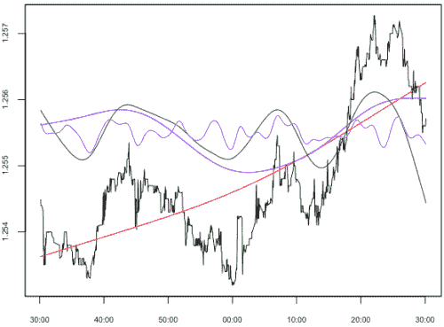
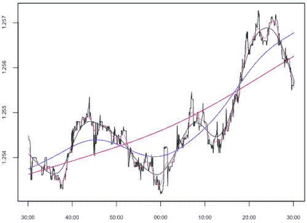
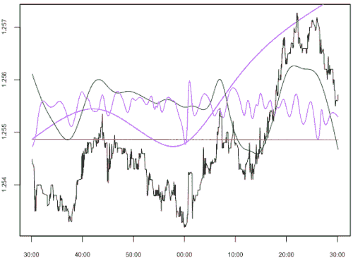
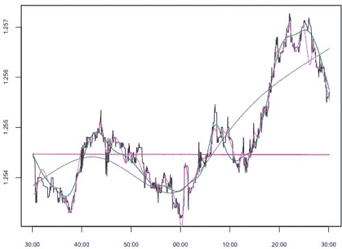

<!--yml
category: 未分类
date: 2024-05-18 15:38:54
-->

# Intrinsic Mode Function (Basis Decomposition) | Tr8dr

> 来源：[https://tr8dr.wordpress.com/2009/11/04/intrinsic-mode-function-basis-decomposition/#0001-01-01](https://tr8dr.wordpress.com/2009/11/04/intrinsic-mode-function-basis-decomposition/#0001-01-01)

Norden Huang did a very interesting talk at CERN a few months ago “[A New Method for Non-linear and Non-stationary Time Series Analysis: The Hilbert Spectral Analysis](http://videolectures.net/cern_huang_nmnntsa/)“.   I found this through Max Dama’s [blog](http://www.maxdama.com/) (thanks).

Huang proposes a new approach to signal decomposition for non-linear, non-stationary signals.   In the presentation he walks through the issues with Fourier, Wavelet, and Poincare analysis.   The issues with each of these approaches is that they either miss the dynamics in the time domain (fourier, poincare) or miss features in the frequency domain (wavelet).   He further goes on to show that, though Hilbert space analysis presents both the time and frequency domain, the results are skewed by non-stationarity.

**My Approach** Before I get into Huang’s approach, let me detail the approach I have been using.   I had explored wavelets a few years ago and realized their limitations.   Wavelets with orthogonal bases lose features in the timeseries due to the 2^n partitioning of the signal.   Features that are aligned at the center of the 2^n partitions are captured most accurately and those on the fringes with diminished accuracy (or not at all).   I designed an empirical basis in response to this:

```
let X <- <signal vector>
let residual <- X
for (n,rho) in <successive values approximating frequencies 2^n>
{
    # compute data derived basis function
    basis[n] <- <penalized least squares spline> (residual, rho)
    # compute residual
    residual <- residual - basis[n]
}
```

The above uses a penalized least squares spline as a (near-orthogonal) basis function, decomposing the signal at successive frequencies.   The decomposition has little cross-correlation so works out to be near orthogonal for the most part.

Basis functions in my approach:



Various stages of recomposition:



The basis functions are each optimal least-squares fits and have very little in the way of artifacts.   The downside of this basis function is that there is non-locality, in that earlier parts of the signal influence the basis function in later parts (usually in a non-intrusive way) and is expensive to compute at high frequency.

**HHT (Hilbert-Huang Transform)**
Huang’s approach is quite clever and importantly, parsimonious.   The approach was motivated by the issues one gets with the Hilbert tranform when dealing with a non-stationary timeseries.   What if we could create an empirical basis function that creates bases that are centered around the maxima/minima and represent the mode.   The algorithm is as follows:

```
let X <- <signal vector>
decomp[1] <- X
for (i in 2:<maximum bases for this signal>)
{
    # determine local maxima and minima in current component
    maxima <- <locate maxima> (decomp[i-1])
    minima <- <locate minima> (decomp[i-1])

    # compute splines through maxima & minima
    maxspline <- spline (maxima)
    minspline <- spline (minima)

    # compute basis function
    mean[i] <- (minspline + maxspline) / 2
    decomp[i] <- decomp[i-1] - mean
}
```

Basis functions in Huang’s approach:



Various stages of recomposition with Huang’s approach:



The resulting basis function has some interesting properties such as the functions are centered around the origin with a long term mean approaching zer0 and have locality.   HHT is especially good at capturing non-stationary high-frequency oscillations with fidelity.

There are, however, some noticable artifacts due to the natural-spline approach (notice exaggerated pertubations in the curve near abrupt price movements).   This approach fairs less well with abrupt shifts and at timeseries boundaries then the approach I have been using.

There are some aspects of this approach, though, that may make this useful in analysing the mean.  More on this later.