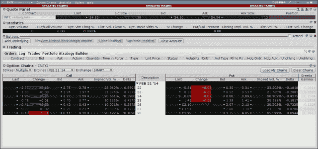

<!--yml
category: 未分类
date: 2024-05-18 06:45:36
-->

# Introducing QuantLib: American Option Pricing with Dividends | All things finance and technology…

> 来源：[https://mhittesdorf.wordpress.com/2013/11/17/introducing-quantlib-american-option-pricing-with-dividends/#0001-01-01](https://mhittesdorf.wordpress.com/2013/11/17/introducing-quantlib-american-option-pricing-with-dividends/#0001-01-01)

In this post, the last I’m planning to write on the subject of option pricing, I will cover the mechanics of valuing options subject to American exercise rules, taking into account dividend payments expected prior to option expiration.  Specifically, I will show how to calculate the value of a series of Intel (INTC) Calls expiring on Feb 21, 2014 where a dividend of .22 is expected to be paid on Feb 5, 2014.

An American option, unlike a European option, can be exercised anytime before the option expires. This privilege carries with it a premium, making American options generally more expensive than their European counterparts, all else being equal. A dividend represents an expected future cash flow which reduces the value of the underlying forward price, which in turn affects the value of the corresponding options. More specifically, dividends reduce the value of a call option and increase the value of a put option, again, all else being equal, compared to the same option without a dividend.

In previous posts, I’ve relied on Black-Scholes as my theoretical option pricing model. Black-Scholes, strictly speaking, does not support pricing American options with dividends without making an adjustment to the forward price to account for the drop in the underlying price on the ex-dividend date. As such, it is common practice to use lattice models, such as binomial trees or finite differences to price American options. Alternatively, if speed is a principal concern, one of the American analytic approximations, such as [Barone-Adesi-Whaley](http://www.investopedia.com/terms/b/barone-adesi-whaley-model.asp) might be a good choice. Fortunately, QuantLib provides support for many different types of American option pricing models, which tend to vary along dimensions of speed, numerical stability and complexity while producing very nearly the same option valuations.

In this post, I’ll utilize the Crank-Nicolson Finite Differences lattice model as the pricing engine, which is implemented by the [FDAmericanEngine<CrankNicolson>](http://quantlib.org/reference/class_quant_lib_1_1_f_d_american_engine.html) class. Also, rather than presenting an overly simplified example that assumes flat term structures for interest rates, dividends and volatility, I’ll bootstrap the required dividend, interest rate and volatility curves from Interactive Brokers market data (see screenshot below) and current LIBOR rates. This should give you a good feel for what’s required to value options in the ‘real world’.

[](https://mhittesdorf.wordpress.com/wp-content/uploads/2013/11/inteloptions-11-15-2013.png)

So let’s start by building the necessary market data curves. First, I’ll present a function that will be called to construct the INTC volatility smile for the Feb 2014 calls. (For an introduction to volatility smiles see my earlier post [here](https://mhittesdorf.wordpress.com/2013/08/29/introducing-quantlib-implied-volatility/).)  The function relies on the QuantLib [BlackVarianceSurface](http://quantlib.org/reference/class_quant_lib_1_1_black_variance_surface.html) class, which supports strike-level volatilities. Here is the code:

```
 #include <cstdlib>
#include <iostream>
#include <ql/quantlib.hpp>

using namespace QuantLib;

boost::shared_ptr<BlackVolTermStructure> bootstrapVolatilityCurve(const Date& 
evaluationDate, const std::vector<Real>& strikes, 
const std::vector<Volatility>& vols, const Date& expiration) {

    Calendar calendar = UnitedStates(UnitedStates::NYSE);

    std::vector<Date> expirations;
    expirations.push_back(expiration);

    Matrix volMatrix(strikes.size(), 1);

    //implied volatilities from Interactive Brokers
    for (int i=0; i< vols.size(); ++i) {
        volMatrix[i][0] = vols[i];
    }

    return boost::shared_ptr<BlackVolTermStructure>(new BlackVarianceSurface(evaluationDate, calendar,
expirations, strikes, volMatrix, Actual365Fixed()));		
} 
```

Next, let’s bootstrap the LIBOR zero rate curve, which supplies the necessary interest rates for discounting option payoffs.  The USD LIBOR rates were obtained from the Web site [globalrates.com](http://www.global-rates.com/interest-rates/libor/american-dollar/american-dollar.aspx). The code follows below:

```
 #include <cstdlib>
#include <iostream>
#include <ql/quantlib.hpp>
#include <boost/assign/std/vector.hpp>

using namespace QuantLib;

boost::shared_ptr<YieldTermStructure> bootstrapLiborZeroCurve(const Date& evaluationDate) {

    using namespace boost::assign;

    //bootstrap from USD LIBOR rates;
    IborIndex libor = USDLiborON();  
    const Calendar& calendar = libor.fixingCalendar();
    const Date& settlement = calendar.advance(evaluationDate, 2, Days);
    const DayCounter& dayCounter = libor.dayCounter();       
    Settings::instance().evaluationDate() = settlement;

    //rates obtained from http://www.global-rates.com/interest-rates/libor/libor.aspx 
    Rate overnight = .10490/100.0;
    Rate oneWeek = .12925/100.0;
    Rate oneMonth = .16750/100.0;
    Rate twoMonths = .20700/100.0;
    Rate threeMonths = .23810/100.0;
    Rate sixMonths = .35140/100.0;
    Rate twelveMonths = .58410/100.0;

    std::vector<boost::shared_ptr<RateHelper>> liborRates;
    liborRates += boost::shared_ptrRateHelper>(new DepositRateHelper(overnight,
        boost::shared_ptr<IborIndex>(new USDLiborON()))); 
    liborRates += boost::shared_ptr<RateHelper>(new DepositRateHelper(oneWeek,
        boost::shared_ptr<IborIndex>(new USDLibor(Period(1, Weeks)))));
    liborRates += boost::shared_ptr<RateHelper>(new DepositRateHelper(oneMonth,
        boost::shared_ptr<IborIndex>(new USDLibor(Period(1, Months)))));
    liborRates += boost::shared_ptr<RateHelper>(new DepositRateHelper(twoMonths,
	boost::shared_ptr<IborIndex>(new USDLibor(Period(2, Months)))));
    liborRates += boost::shared_ptr<RateHelper>(new DepositRateHelper(threeMonths,
	boost::shared_ptr<IborIndex>(new USDLibor(Period(3, Months)))));
    liborRates += boost::shared_ptr<RateHelper>(new DepositRateHelper(sixMonths,
	boost::shared_ptr<IborIndex>(new USDLibor(Period(6, Months)))));
    liborRates += boost::shared_ptr<RateHelper>(new DepositRateHelper(twelveMonths,
	boost::shared_ptr<IborIndex>(new USDLibor(Period(12, Months)))));

    //use cubic interpolation
    boost::shared_ptr<YieldTermStructure> yieldCurve = 
    boost::shared_ptr<YieldTermStructure>(new [PiecewiseYieldCurve](http://quantlib.org/reference/class_quant_lib_1_1_piecewise_yield_curve.html)<ZeroYield, 
Cubic>(settlement, liborRates, dayCounter));

    return yieldCurve;	
} 
```

The final curve that we’ll need to generate provides the annualized dividend yield for Intel.  Here is the code that bootstraps the dividend curve:

```
 #include <cstdlib>
#include <iostream>
#include <ql/quantlib.hpp>
#include <boost/format.hpp>

using namespace QuantLib;

boost::shared_ptr<ZeroCurve> bootstrapDividendCurve(const Date& evaluationDate, 
const Date& expiration, const Date& exDivDate, Real underlyingPrice, Real annualDividend) {

    UnitedStates calendar(UnitedStates::NYSE);
    Settings::instance().evaluationDate() = evaluationDate;
    Real settlementDays = 2.0;

    Real dividendDiscountDays = (expiration - evaluationDate) + settlementDays;
    std::cout << boost::format("Dividend discounting days: %d") %
 dividendDiscountDays << std::endl;
    Rate dividendYield = (annualDividend/underlyingPrice) * dividendDiscountDays/365;

    // ex div dates and yields
    std::vector<Date> exDivDates;
    std::vector<Rate&gt dividendYields;

    //last ex div date and yield
    exDivDates.push_back(calendar.advance(exDivDate, Period(-3, Months), 
ModifiedPreceding, true));
    dividendYields.push_back(dividendYield);

    //currently announced ex div date and yield
    exDivDates.push_back(exDivDate);
    dividendYields.push_back(dividendYield);

    //next ex div date (projected) and yield
    Date projectedNextExDivDate = calendar.advance(exDivDate, Period(3, Months), 
ModifiedPreceding, true); 
    std::cout << boost::format("Next projected ex div date for INTC: %s") % 
projectedNextExDivDate << std::endl;
    exDivDates.push_back(projectedNextExDivDate);
    dividendYields.push_back(dividendYield);

    return boost::shared_ptr<ZeroCurve>(new ZeroCurve(exDivDates, dividendYields, 
ActualActual(), calendar));

} 
```

Now that we have the code to bootstrap all of our market data curves, the pricing code to value the Intel Call options is pretty straightforward:

```
 #include <cstdlib>
#include <iostream>
#include <ql/quantlib.hpp>
#define BOOST_AUTO_TEST_MAIN
#include <boost/test/unit_test.hpp>
#include <boost/detail/lightweight_test.hpp>
#include <boost/format.hpp>
#include <boost/assign/std/vector.hpp>

using namespace QuantLib;

BOOST_AUTO_TEST_CASE(testAmericanOptionPricingWithDividends) {

    using namespace boost::assign;

    //set up calendar/dates
    Calendar calendar = UnitedStates(UnitedStates::NYSE);
    Date today(15, Nov, 2013);
    Real settlementDays = 2;
    Date settlement = calendar.advance(today, settlementDays, Days);
    Settings::instance().evaluationDate() = today;

    //define options to price
    Option::Type type(Option::Call);
    Real underlying = 24.52;

    // INTC Feb 21 strikes
    std::vector strikes;
    strikes += 22.0, 23.0, 24.0, 25.0, 26.0, 27.0, 28.0;

    // volatility for each strike above
    std::vector vols;
    vols += .23356, .21369, .20657, .20128, .19917, .19978, .20117;

    // Feb 2014 expiration      
    Date expiration(21, Feb, 2014);

    //INTC dividend information - .90 per year paid quarterly
    Date exDivDate(5, Feb, 2014);
    Real annualDividend = .90;

    //build yield term structure from LIBOR rates 
    Handle<YieldTermStructure> yieldTermStructure(bootstrapLiborZeroCurve(today));

    //build dividend term structure
    Handle<YieldTermStructure> dividendTermStructure(bootstrapDividendCurve(today, 
expiration, exDivDate, underlying, annualDividend));

    //build vol term structure 
    Handle<BlackVolTermStructure> volatilityTermStructure(bootstrapVolatilityCurve(today, 
strikes, vols, expiration));

    //instantiate BSM process
    Handle<Quote> underlyingH(boost::shared_ptr(new SimpleQuote(underlying)));
    boost::shared_ptr<BlackScholesMertonProcess> bsmProcess(new BlackScholesMertonProcess(underlyingH, 
dividendTermStructure, yieldTermStructure, volatilityTermStructure));

    //instantiate pricing engine
    boost::shared_ptr<PricingEngine> pricingEngine(new FDAmericanEngine<CrankNicolson>
(bsmProcess, 801, 800));

    //price the options
    boost::shared_ptr<Exercise> americanExercise(new AmericanExercise(settlement, expiration));
    for (Real strike: strikes) {
        boost::shared_ptr<StrikedTypePayoff> payoff(new PlainVanillaPayoff(type, strike));
	VanillaOption americanOption(payoff, americanExercise);
	americanOption.setPricingEngine(pricingEngine);
	Real tv = americanOption.NPV();
	std::cout << boost::format("Intel %s %.2f %s value is: %.2f") % 
expiration % strike % type % tv  << std::endl;
	std::cout << boost::format("Delta: %.4f") % americanOption.delta() << std::endl;
	std::cout << boost::format("Gamma: %.4f") % americanOption.gamma() << std::endl;
     }
} 
```

When the code is run it produces the following option values and Greeks for the 22 through 28 strikes:
 `Intel February 21st, 2014 22.00 Call value is: 2.77
Delta: 0.8287
Gamma: 0.0883
Intel February 21st, 2014 23.00 Call value is: 1.94
Delta: 0.7312
Gamma: 0.1230
Intel February 21st, 2014 24.00 Call value is: 1.28
Delta: 0.5922
Gamma: 0.1486
Intel February 21st, 2014 25.00 Call value is: 0.78
Delta: 0.4380
Gamma: 0.1544
Intel February 21st, 2014 26.00 Call value is: 0.45
Delta: 0.2948
Gamma: 0.1364
Intel February 21st, 2014 27.00 Call value is: 0.24
Delta: 0.1835
Gamma: 0.1046
Intel February 21st, 2014 28.00 Call value is: 0.13
Delta: 0.1068
Gamma: 0.0720` 

The option values printed above are within or just outside the bid-ask spread for each strike in the Interactive Brokers screenshot. Deviations of a penny or two are likely due to differences in the model employed by Interactive Brokers versus the QuantLib Crank-Nicolson model, differences in input market data, or possibly even a trading opportunity (i.e. “edge”). In fact, recognizing, adjusting for and/or exploiting such deviations between theoretical option values and the market is at the core of modern option pricing and trading.

With that, I’ll bring this somewhat lengthy post to a close. I very much hope that you enjoyed it and learned something about pricing American options on dividend-paying stocks using QuantLib. Please feel free to submit your comments or questions below. I’ll do my best to get back to you as soon as I can. And, of course, have fun with QuantLib!