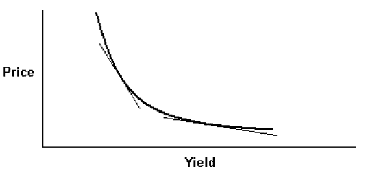
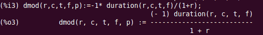
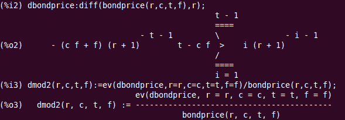
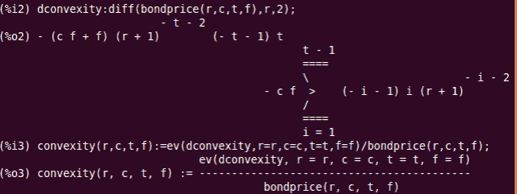
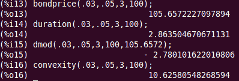

<!--yml
category: 未分类
date: 2024-05-18 06:45:12
-->

# Introducing QuantLib: Duration and Convexity | All things finance and technology…

> 来源：[https://mhittesdorf.wordpress.com/2013/03/12/introduction-to-quantlib-duration-and-convexity/#0001-01-01](https://mhittesdorf.wordpress.com/2013/03/12/introduction-to-quantlib-duration-and-convexity/#0001-01-01)

In this post I’m going to explore QuantLib’s support for assessing the riskiness of a bond. The riskiness of a bond is closely related to the magnitude of the bond’s change in price given a small change in the bond’s interest rate, which can be quantified to varying degrees of accuracy by calculating a bond’s duration and convexity.  These interest rate sensitivity measures are fundamental to classical fixed income risk management. With knowledge of a bond or bond portfolio’s duration and convexity, a hedge can be executed to neutralize the effect of changes in the interest rate environment.  Moreover, the riskiness of bonds with different yields, coupon rates and maturities can be compared using a common set of benchmarks.

As we’ve seen already, a bond’s price moves inversely to the bond’s interest rate. When interest rates go up, a bond’s price goes down and vice versa.  This relationship however, is not linear.  A bond’s price increases at an increasing rate as bond yields fall and at a decreasing rate as bond yields rise as depicted in the figure below:

[](https://mhittesdorf.wordpress.com/wp-content/uploads/2013/03/interestratesensitivity.png)

Duration and convexity seek to quantify the dynamics of the price versus yield relationship.

**Duration**

Let’s dive deeper into the concept of *duration*. There are two flavors of duration: Macaulay duration and modified duration. The formula for calculating Macaulay duration, where C = coupon, r = interest rate, P = bond price, F = the bond’s face value and n is the number of periods is:

**Macaulay_Duration  = ( C1/(1+r) + 2*C2/(1+r)^2 +…  n * (Cn+F)/(1+r)^n)/P**

Macaulay duration can be understood as a bond’s time-weighted average time to maturity.  A bond with a higher duration pays more of its cash flows further out in the future than a bond with a lower duration.  Another way of saying this is that the holder of a bond with a lower duration will get repaid more quickly than the holder of a bond with a higher duration.

Effectively, due to the time value of money, a bond with a higher Macaulay duration is more sensitive to interest rate changes than a bond with a lower Macaulay duration. This is attributable to the fact that cash flows discounted over a longer period of time have more effect on the bond’s present value than near term cash flows.

Modified duration is closely related to duration and can be computed from it. Conceptually, it is equivalent to the slope of the line tangent to the curve in the figure above.  As such, it is a first-order sensitivity measure that is only accurate for small changes in the bond’s interest rate.  Modified duration is derived from Macaulay duration in accordance with the following formula:

**Dmod = – Macaulay_Duration/(1+r)**

Alternatively, since the modified duration is the slope of the line tangent to the bond pricing function, one can also compute modified duration by taking the derivative of the bond pricing formula and dividing by the bond’s price:

**Dmod = 1/P * dP/dr**

Modified duration can be applied to calculate the change in a bond’s price for a given change in the bond’s interest rate like so:

**Change_in_P =  Dmod * Change_in_r, **where Dmod is a negative quantity reflecting the inverse relationship of bond price and yield:

**Convexity**

As previously mentioned,  duration is a linear, first-order measure of interest rate sensitivity.  Consequently, it overestimates the effect of an increase in rates on a bond’s price and, conversely, underestimates the price impact of a drop in rates.  To more accurately quantify a bond’s pricing relationship to it’s yield, the curvature of the bond pricing function must be accounted for.  This is accomplished with our second measure of interest rate sensitivity, *convexity*.  Convexity is a second-order measure of interest rate sensitivity.  As such, convexity is calculated by taking the second derivative of the bond pricing function and dividing by the bond’s price:

**Convexity = 1/P * dP2/dr2**

To reprice a bond using both duration and convexity use the following formula, which is more accurate than using (modified) duration alone:

**Change_in_P = P * ( Dmod * Change_in_r + .5 * Convexity * Change_in_r ^ 2)**

To illustrate these duration and convexity formulas and provide independent verification of QuantLib’s interest rate sensitivity calculations, I used Maxima, an open-source computer aided algebra (CAA) package. Maxima’s support for manipulating symbolic equations is similar to the commercial software products Mathematica and Maple.  At some point, I will do a series of posts on  Maxima, but for now, those of you who are curious about the meaning of the Maxima code to follow will have to rely on Maxima’s documentation:

Standard bond pricing formula:

bondprice(r,c,t,f):=(‘sum(c*f/(1+r)^i,i,1,t-1) + (c*f+f)/(1+r)^t);

[](https://mhittesdorf.wordpress.com/wp-content/uploads/2013/03/maximabondprice.png)

Macaulay duration – time weighted average maturity of the bond:

duration(r,c,t,f):=(‘sum(i*c*f/(1+r)^i,i,1,t-1) + t*(c*f + f)/(1+r)^t)/bondprice(r,c,t,f);

[](https://mhittesdorf.wordpress.com/wp-content/uploads/2013/03/maximaduration.png)

Modified duration – calculated by dividing Macaulay duration by (1 + r) and multiplying by -1:

dmod(r,c,t,f,p):=-1* duration(r,c,t,f)/(1+r);

[](https://mhittesdorf.wordpress.com/wp-content/uploads/2013/03/maximadmod.png)

Modified duration (alternative derivation) – calculated by taking the derivative of the bond’s pricing formula and dividing by the bond’s price:

dbondprice:diff(bondprice(r,c,t,f),r);
dmod2(r,c,t,f):=ev(dbondprice,r=r,c=c,t=t,f=f)/bondprice(r,c,t,f);

[](https://mhittesdorf.wordpress.com/wp-content/uploads/2013/03/maximadmod2.png)

dconvexity:diff(bondprice(r,c,t,f),r,2);
convexity(r,c,t,f):=ev(dconvexity,r=r,c=c,t=t,f=f)/bondprice(r,c,t,f);

[](https://mhittesdorf.wordpress.com/wp-content/uploads/2013/03/maximaconvexity.png)

QuantLib provides support for calculating duration, convexity, and several other measures of interest rate sensitivity, through its [BondFunctions](http://quantlib.org/reference/struct_quant_lib_1_1_bond_functions.html) class. Let’s see how to  how to calculate a bond’s duration and convexity with QuantLib:

```
#include <cstdlib>
#include <iostream>
#define BOOST_AUTO_TEST_MAIN
#include <boost/test/unit_test.hpp>
#include <boost/detail/lightweight_test.hpp>
#include <ql/quantlib.hpp>
#include <vector>
#include <boost/math/distributions.hpp>
#include <ql/instruments/bonds/fixedratebond.hpp> 
#include <ql/pricingengines/bond/bondfunctions.hpp>
#include <boost/format.hpp>

BOOST_AUTO_TEST_CASE(testCalculateBondDurationAndConvexity) {
Calendar calendar = UnitedStates(UnitedStates::GovernmentBond);
const Natural settlementDays = 3;
Date today = Date::todaysDate();
Date issueDate = today;
Date terminationDate = issueDate + Period(3, Years);
Rate rate = .03;

InterestRate couponRate(.05, ActualActual(ActualActual::Bond), 
Compounded, Annual);
Real faceValue = 100.0;
std::vector<InterestRate> coupons(3, couponRate);
Schedule schedule(issueDate, terminationDate, Period(Annual), 
calendar,
Unadjusted, Unadjusted, DateGeneration::Backward, false);
FixedRateBond fixedRateBond(settlementDays, faceValue, schedule, 
coupons);
boost::shared_ptr<YieldTermStructure> flatForwardRates(
new FlatForward(issueDate,rate, ActualActual(ActualActual::Bond), Compounded, Annual));
Handle<YieldTermStructure> flatTermStructure(flatForwardRates);
boost::shared_ptr<PricingEngine> bondEngine(
new DiscountingBondEngine(flatTermStructure));
fixedRateBond.setPricingEngine(bondEngine);

//calculate bond price
Real price = fixedRateBond.NPV();
std::cout << "Bond price: " << price << std::endl;

//calculate yield to maturity (YTM)/internal rate of return (IRR)
Real ytm = fixedRateBond.yield(ActualActual(ActualActual::Bond), 
Compounded, Annual);
std::cout << "yield to maturity: " << ytm << std::endl;

//calculate Macaulay duration
InterestRate yield(ytm, ActualActual(ActualActual::Bond), 
Compounded, Annual);
Time macDuration = BondFunctions::duration(fixedRateBond, yield, 
Duration::Macaulay, today);
std::cout << "Macaulay duration: " << macDuration << std::endl;

//calculate modified duration
Time modDuration = -1 * BondFunctions::duration(fixedRateBond, yield, 
Duration::Modified, today);
std::cout << "Modified duration: " << modDuration << std::endl;

//calculate convexity
Real convexity = BondFunctions::convexity(fixedRateBond, yield, 
today);
std::cout << "Convexity: " << convexity << std::endl;

//estimate new bond price for an increase in interest rate of 1% 
//using modified duration
Real priceDuration = price + price * (modDuration * .01);
std::cout << boost::format("Estimated bond price using only duration (rate up .01): %.2f ") %
priceDuration << std::endl;

//estimate new bond price for an increase in interest rate of 1% 
//using duration and convexity
Real priceConvexity = price + price * (modDuration * .01 + (.5 * convexity * std::pow(.01, 2)));
std::cout << boost::format("Estimated bond price using duration 
and convexity (rate up .01): %.2f") % priceConvexity << std::endl;

}
```

The output of this code when run is:
 `Bond price: 105.657
yield to maturity: 0.03
Macaulay duration: 2.8635
Modified duration: -2.7801
Convexity: 10.6258
Estimated bond price using only duration (rate up .01): 102.72
Estimated bond price using duration and convexity (rate up .01): 102.78` 

Let’s compare the duration and convexity numbers to the what the Maxima equations produce:

[](https://mhittesdorf.wordpress.com/wp-content/uploads/2013/03/maximaoutput.png)

As expected, the Maxima calculations do indeed confirm the QuantLib duration and convexity calculations, which is a good thing!

That brings this post to a close. I hope you have gained a new appreciation for how duration and convexity are employed to help assess the riskiness of a bond and reprice a bond when interest rates change. Until next time, have fun with QuantLib!