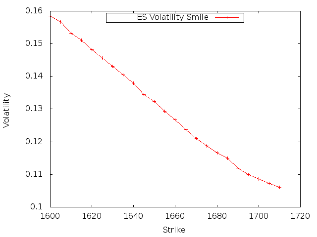
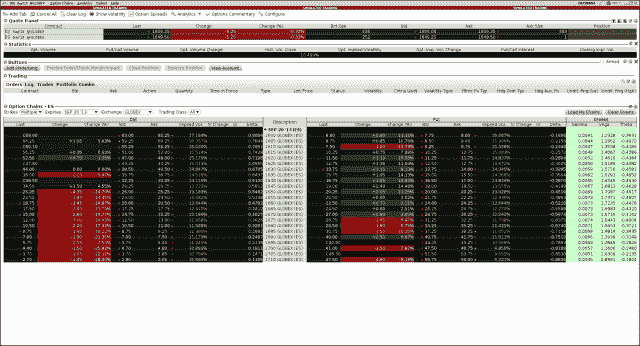

<!--yml
category: 未分类
date: 2024-05-18 06:46:00
-->

# Introducing QuantLib: Implied Volatility | All things finance and technology…

> 来源：[https://mhittesdorf.wordpress.com/2013/08/29/introducing-quantlib-implied-volatility/#0001-01-01](https://mhittesdorf.wordpress.com/2013/08/29/introducing-quantlib-implied-volatility/#0001-01-01)

Welcome back! If you read my last two posts, you are now well acquainted with the fundamentals of option theory and pricing. In particular, we have seen that volatility (or sigma) is a key input to any option valuation formula. In fact, because input variables such as strike, expiration, interest rate, and underlying price are contractually specified or observable in the market and, thus, well-known, volatility is the only input that must be derived or estimated. Assuming no dividends, which have some uncertainty as to timing and size, the value of an option, then, can be thought of as a function of one unknown.

So how does one identify the ‘correct’ level of volatility (sigma) for an option? One place to start is to look at quoted market prices for an option chain and back out sigma for every out-of-the money call and put. Sigma, in this case, is referred to as *implied volatility* as it is the level of volatility from which the market price of an option has been calculated. The resulting set of implied volatilities, if charted by strike, constitute what is referred to as a *volatility smile*, an example of which is depicted below:

[](https://mhittesdorf.wordpress.com/wp-content/uploads/2013/08/volsmile.png)

Both the shape and level of the smile say a lot about the current market price of risk for a particular underlying or asset class. Often, what one observes is that the low delta options, the ‘wing’ options, are trading at a higher implied volatility than the at-the-money options. Likewise, it is common that the out-of-the-money puts are priced with a higher sigma than the out-of-the-money calls, a phenomenon termed ‘skew’, which is manifested in the chart above.

With knowledge of the implied volatilities for each strike in an option chain, one can then begin to assess whether an option is fairly priced. Is the level of volatility being charged for a particular option too high or too low? If the option’s sigma is too high versus fair value, as determined by some independent estimate of [realized volatility](http://en.wikipedia.org/wiki/Realized_variance) over the life of the option, then you may want to sell it. Likewise, if sigma is too low, then you may want to buy the option.

So let’s look at how to generate the ES volatility smile above with QuantLib. ES is the exchange symbol for the CBOE’s E-Mini futures contract. The market as of 8/26/2013 (at approximately 2:30 Chicago time) for ES options expiring on 9/20/2013 (ESU3) is shown below. The data comes from my Interactive Brokers paper trading account.

[](https://mhittesdorf.wordpress.com/wp-content/uploads/2013/08/esoptions8262013-1430.png)

The QuantLib C++ code listing below solves for the implied volatilities corresponding to the ES option prices in the screen shot above:

```
 #include <cstdlib>
#include <iostream>>
#define BOOST_AUTO_TEST_MAIN
#include <boost/test/unit_test.hpp>
#include <ql/quantlib.hpp>
#include <boost/detail/lightweight_test.hpp>
#include <vector>
#include <boost/function.hpp>
#include <boost/date_time/posix_time/posix_time.hpp>
#include <fstream>
#include <utility>

namespace {

using namespace QuantLib;

class StrikeInfo {

    public:
        typedef std::pair<SimpleQuote,SimpleQuote> BidAsk;
        StrikeInfo(Option::Type optionType, Real strike, const BidAsk& bidAsk) : 
            _payoff(PlainVanillaPayoff(optionType, strike)), _bidAsk(bidAsk),
            _impliedVol(0.0) {}

        //copy constructor
        StrikeInfo(const StrikeInfo& that) 
           : _payoff(new PlainVanillaPayoff(that.getPayoff().optionType(), that.getPayoff().strike())),
            _bidAsk(that.getBidAsk()), _impliedVol(that.getImpliedVol()) {
        }

        //assignment operator - [implements copy-and-swap idiom](http://stackoverflow.com/questions/3279543/what-is-the-copy-and-swap-idiom)
        StrikeInfo& operator=(StrikeInfo that) {
            swap(*this, that);
        }

        //swap
        friend void swap(StrikeInfo& first, StrikeInfo& second) {
            using std::swap;
            first._payoff.swap(second._payoff);
            std::swap(first._impliedVol, second._impliedVol);
            std::swap(first._bidAsk, second._bidAsk);
        }

        const StrikedTypePayoff& getPayoff() const { return *_payoff;}
        const BidAsk& getBidAsk() const { return _bidAsk; }
        const Volatility& getImpliedVol() const { return _impliedVol; }
        void setImpliedVol(Volatility impliedVol) { _impliedVol = impliedVol;}
        Real getStrike() { return _payoff->strike(); }

    private:

        boost::scoped_ptr<StrikedTypePayoff> _payoff;
        Volatility _impliedVol;
        BidAsk _bidAsk;

};

BOOST_AUTO_TEST_CASE(testESFuturesImpliedVolatility) {

    using namespace boost::posix_time;
    using namespace boost::gregorian;

    ActualActual actualActual;
    Settings::instance().evaluationDate() = Date(26, Month::August, 2013);
    Date expiration(20, Month::September, 2013);

    Time timeToMaturity = actualActual.yearFraction(Settings::instance().evaluationDate(), expiration);
    ptime quoteTime(from_iso_string("20130826T143000"));
    time_duration timeOfDayDuration = quoteTime.time_of_day();
    timeToMaturity += (timeOfDayDuration.hours() + timeOfDayDuration.minutes()/60.0)/(24.0 * 365.0);
    std::cout << boost::format("Time to maturity: %.6f") % timeToMaturity << std::endl;
    Real forwardBid = 1656.00; 
    Real forwardAsk = 1656.25;
    Rate riskFree = .00273;  //interpolated LIBOR rate (between EDU3 and EDV3)
    DiscountFactor discount = std::exp(-riskFree * timeToMaturity);

    //calculate implied volatilities for OTM put options

    std::vector<StrikeInfo> putOptions;
    putOptions.push_back(StrikeInfo(Option::Type::Put, std::make_pair(7.75, 8.00), 1600));
    putOptions.push_back(StrikeInfo(Option::Type::Put, std::make_pair(8.50, 9.00), 1605));
    putOptions.push_back(StrikeInfo(Option::Type::Put, std::make_pair(9.25, 9.75), 1610));
    putOptions.push_back(StrikeInfo(Option::Type::Put, std::make_pair(10.25, 10.75), 1615));
    putOptions.push_back(StrikeInfo(Option::Type::Put, std::make_pair(11.25, 11.75), 1620));
    putOptions.push_back(StrikeInfo(Option::Type::Put, std::make_pair(12.50, 12.75), 1625));
    putOptions.push_back(StrikeInfo(Option::Type::Put, std::make_pair(13.75, 14.00), 1630));
    putOptions.push_back(StrikeInfo(Option::Type::Put, std::make_pair(15.00, 15.50), 1635));
    putOptions.push_back(StrikeInfo(Option::Type::Put, std::make_pair(16.50, 17.00), 1640));
    putOptions.push_back(StrikeInfo(Option::Type::Put, std::make_pair(18.00, 18.50), 1645));
    putOptions.push_back(StrikeInfo(Option::Type::Put, std::make_pair(20.00, 20.25), 1650));
    putOptions.push_back(StrikeInfo(Option::Type::Put, std::make_pair(21.75, 22.25), 1655));
    putOptions.push_back(StrikeInfo(Option::Type::Put, std::make_pair(24.00, 24.25), 1660));
    putOptions.push_back(StrikeInfo(Option::Type::Put, std::make_pair(26.25, 26.75), 1665));
    putOptions.push_back(StrikeInfo(Option::Type::Put, std::make_pair(28.75, 29.25), 1670));
    putOptions.push_back(StrikeInfo(Option::Type::Put, std::make_pair(31.25, 32.25), 1675));
    putOptions.push_back(StrikeInfo(Option::Type::Put, std::make_pair(34.25, 35.25), 1680));
    putOptions.push_back(StrikeInfo(Option::Type::Put, std::make_pair(37.25, 38.25), 1685));
    putOptions.push_back(StrikeInfo(Option::Type::Put, std::make_pair(40.75, 41.75), 1690));
    putOptions.push_back(StrikeInfo(Option::Type::Put, std::make_pair(44.25, 45.25), 1695));
    putOptions.push_back(StrikeInfo(Option::Type::Put, std::make_pair(47.50, 49.75), 1700));
    putOptions.push_back(StrikeInfo(Option::Type::Put, std::make_pair(51.50, 53.75), 1705));
    putOptions.push_back(StrikeInfo(Option::Type::Put, std::make_pair(55.75, 58.00), 1710));

   for (StrikeInfo& putOption: putOptions) {
	StrikeInfo::BidAsk bidAsk = putOption.getBidAsk();
	Real price = (bidAsk.first.value() + bidAsk.second.value())/2.0;
	const StrikedTypePayoff& payoff = putOption.getPayoff();
	if (payoff(forwardAsk) > 0) continue; //skip ITM options
        Bisection bisection;
        Real accuracy = 0.000001, guess = .20;
        Real min = .05, max = .40;
        Volatility sigma = bisection.solve([&](const Volatility & sigma) {
        Real stdDev = sigma * std::sqrt(timeToMaturity);
        BlackCalculator blackCalculator(payoff.optionType(), payoff.strike(), forwardAsk, stdDev, discount);
            	return blackCalculator.value() - price;
        	}, accuracy, guess, min, max);

	putOption.setImpliedVol(sigma);
        std::cout << boost::format("IV of %f put is %f") % putOption.getStrike() % sigma << std::endl;

    }

   //calculate implied volatilities for OTM call options

   std::vector<StrikeInfo> callOptions;
   callOptions.push_back(StrikeInfo(Option::Type::Call, std::make_pair(63.00, 65.25), 1600));
   callOptions.push_back(StrikeInfo(Option::Type::Call, std::make_pair(59.25, 60.25), 1605));
   callOptions.push_back(StrikeInfo(Option::Type::Call, std::make_pair(55.25, 56.25), 1610));
   callOptions.push_back(StrikeInfo(Option::Type::Call, std::make_pair(51.00, 52.00), 1615));
   callOptions.push_back(StrikeInfo(Option::Type::Call, std::make_pair(47.00, 48.00), 1620));
   callOptions.push_back(StrikeInfo(Option::Type::Call, std::make_pair(43.25, 44.25), 1625));
   callOptions.push_back(StrikeInfo(Option::Type::Call, std::make_pair(39.50, 40.50), 1630));
   callOptions.push_back(StrikeInfo(Option::Type::Call, std::make_pair(35.75, 36.75), 1635));
   callOptions.push_back(StrikeInfo(Option::Type::Call, std::make_pair(32.25, 33.25), 1640));
   callOptions.push_back(StrikeInfo(Option::Type::Call, std::make_pair(29.25, 29.75), 1645));
   callOptions.push_back(StrikeInfo(Option::Type::Call, std::make_pair(26.00, 26.25), 1650));
   callOptions.push_back(StrikeInfo(Option::Type::Call, std::make_pair(23.00, 23.50), 1655));
   callOptions.push_back(StrikeInfo(Option::Type::Call, std::make_pair(20.00, 20.50), 1660));
   callOptions.push_back(StrikeInfo(Option::Type::Call, std::make_pair(17.25, 17.75), 1665));
   callOptions.push_back(StrikeInfo(Option::Type::Call, std::make_pair(14.75, 15.25), 1670));
   callOptions.push_back(StrikeInfo(Option::Type::Call, std::make_pair(12.50, 13.00), 1675));
   callOptions.push_back(StrikeInfo(Option::Type::Call, std::make_pair(10.50, 11.00), 1680));
   callOptions.push_back(StrikeInfo(Option::Type::Call, std::make_pair(8.75, 9.25), 1685));
   callOptions.push_back(StrikeInfo(Option::Type::Call, std::make_pair(7.00, 7.50), 1690));
   callOptions.push_back(StrikeInfo(Option::Type::Call, std::make_pair(5.75, 6.00), 1695));
   callOptions.push_back(StrikeInfo(Option::Type::Call, std::make_pair(4.70, 4.80), 1700));
   callOptions.push_back(StrikeInfo(Option::Type::Call, std::make_pair(3.70, 3.85), 1705));
   callOptions.push_back(StrikeInfo(Option::Type::Call, std::make_pair(2.90, 3.05), 1710));

    for (StrikeInfo& callOption: callOptions) {
        StrikeInfo::BidAsk bidAsk = callOption.getBidAsk();
	Real price = (bidAsk.first.value() + bidAsk.second.value())/2.0;
	const StrikedTypePayoff& payoff = callOption.getPayoff();
	if (payoff(forwardBid) > 0) continue; //skip ITM options
        Bisection bisection;
        Real accuracy = 0.000001, guess = .20;
        Real min = .05, max = .40;
        Volatility sigma = bisection.solve([&](const Volatility & sigma) {
            Real stdDev = sigma * std::sqrt(timeToMaturity);
            BlackCalculator blackCalculator(payoff.optionType(), payoff.strike(), forwardBid, stdDev, discount);
            	return blackCalculator.value() - price;
            }, accuracy, guess, min, max);

	callOption->setImpliedVol(sigma);

        std::cout << boost::format("IV of %f call is %f") % callOption.getStrike() % sigma << std::endl;
    }

    //write strike and IV to file for each option
    std::ofstream ivFile;
    ivFile.open("/tmp/iv.dat", std::ios::out);

    //write OTM put IVs
    for (StrikeInfo& putOption: putOptions) {
	if (putOption.getImpliedVol() > 0.0) {
	    ivFile << boost::format("%f %f") % putOption.getStrike() % putOption.getImpliedVol() << std::endl; 
	}
    }

    //write OTM call IVs		
    for (StrikeInfo& callOption: callOptions) {
	if (callOption.getImpliedVol() > 0.0) {
	    ivFile << boost::format("%f %f") % callOption.getStrike() % callOption.getImpliedVol() << std::endl; 
	}
    }
    ivFile.close();

    //plot with gnuplot using commands below. Run 'gnuplot' then type in: 
    /*
    set terminal png
    set output "/tmp/volsmile.png"
    set key top center
    set key box
    set xlabel "Strike"
    set ylabel "Volatility"
    plot '/tmp/iv.dat' using 1:2 w linespoints title "ES Volatility Smile"
    */
}} 
```

When run, the code produces the following output:
 `Time to maturity: 0.070148
IV of 1600.000000 put is 0.1584
IV of 1605.000000 put is 0.1566
IV of 1610.000000 put is 0.1532
IV of 1615.000000 put is 0.1511
IV of 1620.000000 put is 0.1482
IV of 1625.000000 put is 0.1456
IV of 1630.000000 put is 0.1430
IV of 1635.000000 put is 0.1405
IV of 1640.000000 put is 0.1379
IV of 1645.000000 put is 0.1345
IV of 1650.000000 put is 0.1324
IV of 1655.000000 put is 0.1293
IV of 1660.000000 call is 0.1267
IV of 1665.000000 call is 0.1237
IV of 1670.000000 call is 0.1211
IV of 1675.000000 call is 0.1187
IV of 1680.000000 call is 0.1167
IV of 1685.000000 call is 0.1150
IV of 1690.000000 call is 0.1119
IV of 1695.000000 call is 0.1100
IV of 1700.000000 call is 0.1087
IV of 1705.000000 call is 0.1072
IV of 1710.000000 call is 0.1060` 

My output does not exactly reproduce the IVs published by Interactive Brokers but they are generally very close and the overall shape of my implied volatility smile is consistent with the IB values.

Before I wrap this post up, a few comments on the code:

*   The QuantLib [Bisection](http://quantlib.org/reference/class_quant_lib_1_1_bisection.html) solver is used to back out the implied volatility of each out-of-the-money option in a fashion very similar to how I demonstrated the calculation of a bond’s internal rate of return in the post ‘[Introducing QuantLib: Internal Rate of Return](https://mhittesdorf.wordpress.com/2013/03/03/introducing-quantlib-internal-rate-of-return/)‘.
*   As options on ES are options on futures, I employed the QuantLib [BlackCalculator](http://quantlib.org/reference/class_quant_lib_1_1_black_calculator.html), which implements the [Black 76](http://www.wilmottwiki.com/wiki/index.php?title=Black_76) variant of the Black-Scholes model, rather than the BlackScholesCalculator, which I featured in my last post.
*   The interest rate of .0273% is the point on the LIBOR curve corresponding to the expiration date of the option. This rate was found by interpolating between the September and October Eurodollar futures contracts (symbols = EDU3, EDV3).
*   The value of an option decays continuously so time to maturity was measured to minute-level precision and then annualized as a year fraction.
*   The mid-point of the option bid/ask spread was used as the option price as the market on an option is typically made some width around its theoretical value.
*   The bid serves as the underlying price for calls while the offer serves as the underlying price for puts because options are typically delta hedged. As such, a call (positive delta) would be hedged by selling futures on the bid and a put would be hedged by buying futures on  the offer.

So that’s about it for this installment of my ‘Introducing QuantLib’ series. I hope that I have now equipped you with a working understanding of  implied volatility and how to compute it using QuantLib.  As always, have fun with QuantLib!