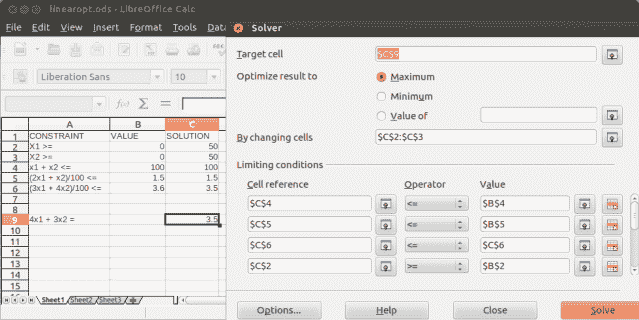

<!--yml
category: 未分类
date: 2024-05-18 06:46:47
-->

# Introducing QuantLib: Linear Optimization | All things finance and technology…

> 来源：[https://mhittesdorf.wordpress.com/2013/04/27/introducing-quantlib-linear-optimization/#0001-01-01](https://mhittesdorf.wordpress.com/2013/04/27/introducing-quantlib-linear-optimization/#0001-01-01)

Many classes of problems exist in finance for which there is more than one answer and the goal is to find the single, best answer. Often, the best, or *optimal*, answer must also satisfy a number of specific conditions, which further constrain the solution. Problems of this variety include portfolio construction, asset-liability cash flow matching, and mean-variance analysis, among others.

The problem of finding the best solution from a set of possible, or feasible, solutions is known as an optimization problem.  An optimization problem involves minimizing (or maximizing) an *objective* *function, *subject to zero or more constraints.

Optimization problems can be broadly defined as belonging to one of two categories:

*   linear programming problems – the objective function and constraints are expressed as first-order, linear equations.
*   non-linear programming problems – the objective function is expressed as an n-order, non-linear equation. The constraints can be linear or non-linear.

In this post, I’m going to demonstrate how to use QuantLib to represent and solve a classic linear programming problem: portfolio construction. In an upcoming post, I’ll tackle a non-linear programming problem: mean-variance portfolio optimization.

A great number of different algorithms have been devised to solve linear programs. One of the most widely applied and most successful methods is the Simplex method, invented in 1947 by George Dantzig.  In fact, the Simplex method is the basis for the linear solver in both Microsoft Excel and the open-source spreadsheet package, [Calc](http://www.libreoffice.org/features/calc/), which is part of the OpenOffice.org and LibreOffice suite of office productivity tools.  As I’m a big booster of open-source software, let’s look more closely at Calc’s [Solver](http://wiki.openoffice.org/wiki/Optimization_Solver).

The solver tool in Calc allows the user to specify a cell to be maximized or minimized, one or more variables to modify, and, optionally, a set of constraints.  Clicking the Solve button kicks off an iterative search process that, after a short time, produces a solution, if one exists.

Let me demonstrate with an example borrowed from the excellent book [*Optimization Methods in Finance*](http://www.amazon.com/Optimization-Methods-Finance-Mathematics-Risk/dp/0521861705), by Cornuejols and Tutuncu, which I highly recommend  for those of you who might be interested in a more in-depth treatment of financial optimization topics than I can cover in this brief post.  The problem is to construct a bond portfolio consisting of two bonds; a corporate bond and a government bond. The corporate bond yields 4%, has an ‘A’ credit rating (score = 2) and matures in 3 years.  The government bond yields 3%, has an ‘Aaa’ credit rating (score = 1) and matures in 4 years. The goal is to allocate a proportion of $100,000 to each of these two bonds such that the resulting portfolio has an average credit rating no worse than Aa (score <= 1.5) and an average maturity of at most 3.6 years while maximizing the portfolio’s yield.

To solve this linear programming problem, maximize the objective function:

Z = (4×1 + 3×2)/100, where x1 represents the corporate bond’s weighting in the portfolio and x2 represents the government bond’s weighting.

The solution is subject to the following constraints, modeled as linear inequalities:

*   x1 + x2 <= 100 (The weighting of the bonds must not exceed 100%)
*   (2×1 + x2)/100 <= 1.5 (The portfolio’s average credit rating must be at most 1.5)  
*   (3×1 + 4×2)/100 <= 3.6 (The portfolio’s average maturity must be no greater than 3.6 years)
*   x1, x2 >= 0 (A bond cannot have a negative weighting; short sales are not allowed)

Together the objective function and the constraints form a system of linear equations and can be set up in OpenOffice.org/LibreOffice’s Solver like so:

[](https://mhittesdorf.wordpress.com/wp-content/uploads/2013/04/calcsolver3.png)

The optimal solution to the problem is to allocate the $100,000 equally to the corporate and government bond: x1 = 50 and x2 = 50, such that the portfolio yields 3.5%:

[](https://mhittesdorf.wordpress.com/wp-content/uploads/2013/04/calcsolversolution4.png)

Now let’s see how to reproduce this result using QuantLib’s [Simplex](http://quantlib.org/reference/class_quant_lib_1_1_simplex.html) class. The Simplex class is one of five optimization algorithms available in Quantlib. The others are [LevenbergMarquardt](http://quantlib.org/reference/class_quant_lib_1_1_levenberg_marquardt.html), [ConjugateGradient](http://quantlib.org/reference/class_quant_lib_1_1_conjugate_gradient.html), [SteepestDescent](http://quantlib.org/reference/class_quant_lib_1_1_steepest_descent.html) and [BGFS](http://quantlib.org/reference/class_quant_lib_1_1_b_f_g_s.html).  I’ll not discuss these other algorithms in this post but they are well documented on the quantlib.org Web site.

The C++ code to solve the bond portfolio construction problem is shown below:

```
#include <cstdlib>
#include <iostream>
#define BOOST_AUTO_TEST_MAIN
#include <boost/test/unit_test.hpp>
#include <boost/detail/lightweight_test.hpp>
#include <ql/quantlib.hpp>
#include <vector>
#include <boost/format.hpp>
#include <functional>
#include <function>

namespace {

using namespace QuantLib;

//objective function to be maximized
class PortfolioAllocationCostFunction: public CostFunction {

public:
//must override this member function
Real value(const Array& x) const {
    QL_REQUIRE(x.size()==2, "Two bonds in portfolio!");
    return -1 * (4*x[0] + 3*x[1]); //mult by -1 to maximize 
}
//must override this member function
Disposable values(const Array& x) const {
    QL_REQUIRE(x.size()==2, "Two bonds in portfolio!");
    Array values(1);
    values[0] = value(x);
};  

//aggregates all constraint expressions into a single constraint
class PortfolioAllocationConstraints : public Constraint {

public:

PortfolioAllocationConstraints(const std::vector<std::function >& expressions)  : Constraint(boost::shared_ptr<Constraint::Impl>(new
    PortfolioAllocationConstraints::Impl(expressions))) {}

private:
// constraint implementation
class Impl : public Constraint::Impl {
public:

Impl(const std::vector<std::function >& expressions) :
    expressions_(expressions) {}

bool test(const Array& x) const {
    for (auto iter = expressions_.begin(); 
    iter < expressions_.end(); ++iter) {
        if (!(*iter)(x)) {
            return false;
        }
    }
    //will only get here if all constraints satisfied
    return true;
}

private:

const std::vector<std::function > expressions_;        
};
}; 

BOOST_AUTO_TEST_CASE(testLinearOptimization) {
    PortfolioAllocationCostFunction portfolioAllocationCostFunction;

    //optimization constraints	
    std::vector<std::function >  constraints(3);

    //constraints implemented as C++11 lambda expressions
    constraints[0]=[](const Array& x) {return (x[0]+x[1] <= 100.0);}; 
    constraints[1]=[](const Array& x) {return ((2*x[0]+x[1])/100.0    <= 1.5);}; 
    constraints[2]=[](const Array& x) {return ((3*x[0]+4*x[1])/100.0 <= 3.6);};

    //instantiate constraints
    PositiveConstraint greaterThanZeroConstraint;
    PortfolioAllocationConstraints portfolioAllocationConstraints(constraints);
    //class that supports functional composition of constraints
    CompositeConstraint allConstraints(portfolioAllocationConstraints,greaterThanZeroConstraint);

    //end criteria that will terminate search 
    Size maxIterations = 1000;  //end search after 1000 iterations if no solution
    Size minStatIterations = 10; //don't spend more than 10 iterations at a single point
    Real rootEpsilon = 1e-8; //end search if absolute difference of current and last root value is below epsilon
    Real functionEpsilon = 1e-9; //end search if absolute difference of current and last function value is below epsilon
    Real gradientEpsilon = 1e-5; //end search if absolute difference of norm of current and last gradient is below epsilon

    EndCriteria endCriteria(maxIterations, minStatIterations, rootEpsilon, functionEpsilon, gradientEpsilon);

    Problem bondAllocationProblem(portfolioAllocationCostFunction, allConstraints, Array(2, 1));

    //use the Simplex method 
    Simplex solver(.1);

    //if the algorithm is able to locate an optimal solution, it will stop searching at a stationary point in
    //the search space
    EndCriteria::Type solution = solver.minimize(bondAllocationProblem, endCriteria);
    std::cout << boost::format("Simplex solution type: %s") % solution<< std::endl;

    const Array& results = bondAllocationProblem.currentValue();
    std::cout << boost::format("Allocate %.2f percent to bond 1 and %.2f percent to bond 2.") % results[0] % results[1] << std::endl;  

}
}
```

The program produces the following output when run:
 `Simplex solution type: StationaryPoint
Allocate 50.00 percent to bond 1 and 50.00 percent to bond 2.` 

So the Solver and the QuantLib C++ code arrive at the same, optimal solution, which should give us confidence in the correctness of the result. With that, I’ll bring this installment of my ‘Introducing QuantLib’ series to a close. I hope you enjoyed it. As always, I encourage you to leave comments and/or questions. Have fun with QuantLib!

## About Mick Hittesdorf

I'm a versatile technical leader with a passion for data analytics, data science and Big Data technology. I have experience working for both large and small organizations, in a variety of roles. I've been responsible for the management and operations of a global data science and analytics platform, developed low latency, proprietary trading systems, managed software development teams, defined enterprise architecture strategies, written white papers and blogs, published articles in industry journals and delivered innovative solutions to clients, both in a consulting and technical sales capacity. My current areas of focus include Big Data, data engineering, data science, R, and Cloud computing