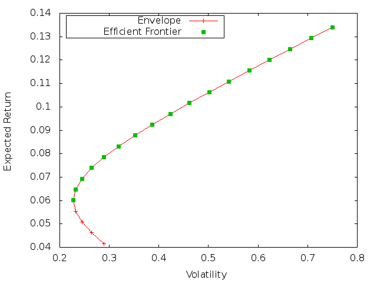
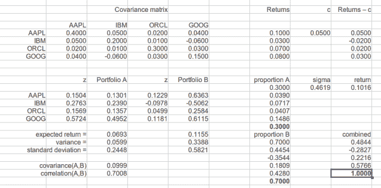

<!--yml
category: 未分类
date: 2024-05-18 06:46:39
-->

# Introducing QuantLib: The Efficient Frontier | All things finance and technology…

> 来源：[https://mhittesdorf.wordpress.com/2013/05/25/introducing-quantlib-the-efficient-frontier/#0001-01-01](https://mhittesdorf.wordpress.com/2013/05/25/introducing-quantlib-the-efficient-frontier/#0001-01-01)

No, the title of my latest blog post isn’t some obscure Star Trek reference.  Rather, the Efficient Frontier is a concept at the very core of modern portfolio theory.  The father of modern portfolio theory,  Harry Markowitz, defined the concept as the set of all efficient portfolios, where an efficient portfolio consists of that weighting of a portfolio’s assets such that the portfolio’s expected return is maximized for a given level of risk, as measured by the portfolio’s standard deviation of returns.  Charting the volatility of every efficient portfolio versus its expected return produces the following graphic: [](https://mhittesdorf.wordpress.com/wp-content/uploads/2013/05/efficient.png) Why is this important? Most people are risk averse. As such, people prefer to invest in those assets that generate the greatest return for the least amount of risk. All portfolios on the efficient frontier satisfy that requirement.  There is no  other portfolio that produces a higher return for a given amount of risk than the one on the Efficient Frontier.

In many ways, modern portfolio theory and its seminal idea, the Efficient Frontier, along with the Black-Scholes option pricing formula, can be credited with giving birth to the field that we now call quantitative finance.  So even though there is not a lot in the QuantLib library that specifically addresses the Efficient Frontier, I feel I would be remiss if I didn’t cover it.

As I’ve done in previous posts, I want to first motivate the C++ code that is to follow by presenting an example calculated in a spreadsheet. I will then reproduce the results  in C++ using QuantLib. But first, let me present a few fundamental definitions and some simple equations that are necessary in order to understand the analysis.

**Expected Return:** E(Rp) – the percentage increase/decrease in the value of a portfolio that is consistent with the historical performance of the assets in the portfolio and the relative proportion, or weightings, of those assets, where the total weight must sum to one.   The formula for calculating the expected return of a two-asset (i.e. two stocks) portfolio is:

E(Rp) = w1*R1 + (1 – w1)*R2 . where Rp is the portfolio’s expected return, R1 is the mean return of asset1, w1 is the percentage weighting of asset1 in the portfolio, and R2 is the mean return of asset2.

**Variance:** (Vp) – the amount of deviation or dispersion of the portfolio’s  return from the historical mean return of the portfolio given the weighting of the assets in the portfolio, their respective variances and the degree to which the asset’s returns move or don’t move together, known as covariance.  The formula for calculating portfolio variance for a two asset portfolio is:

Vp = w1^2*V1 + (1-w1)^2*V2 + 2*w1*(1-w1)*cov(R1,R2), where Vp is the portfolio’s variance, V1 is the variance of asset1’s returns, V2 is the variance of asset2’s returns and cov(R1,R2) is a measure of how much or how little asset1 and asset2’s returns move in the same direction at the same time.

**Volatility (σ) ‘sigma’**– the most well-accepted measure of risk. It is nothing more than scaled variance, calculated as: σp = sqrt(Vp)

Generating the Efficient Frontier requires maximizing the portfolio’s return for a given portfolio variance or conversely minimizing the portfolio variance for a given level of return.  As such, calculating the efficient portfolio amounts to an optimization problem. If you read my last post on linear optimization, you may recall that portfolio optimization is not a linear optimization problem.  Now that you’ve seen the formulas for portfolio risk and return you may realize why. The formula for calculating variance is non-linear; it is a second degree polynomial function.  Therefore, we can not use the linear programming method I demonstrated in my last post to find the Efficient Frontier. We could employ a non-linear, quadratic programming method to solve for all efficient portfolio’s one at a time, holding portfolio risk constant and maximizing the return function or, equivalently, holding portfolio return constant and minimizing the portfolio variance function.  As alluded to in my last post, I will demonstrate this approach in a future post. In this post, however, I am going to apply the classic procedure which represents the problem using matrix notation and then solves a system of linear equations in order to compute a table of minimum variance/maximum return values for a given asset weighting.

The problem can be represented in matrix notation like so:

R – c = Sz  such that z = inverse(S) {R – c}, where R is the vector of asset returns, c is a constant rate of return, S is the covariance matrix and z  is a vector that leads to the solution of the efficient portfolio weightings, x, defined as:

x = {x1….xn} where each xi represents the weighting of the respective asset in the portfolio  such that the sum of all the xi’s equals 1; where a particular weighting xi = zi/sum of all the zi’s.

Solving this problem involves a fair bit of linear algebra and matrix manipulation.   I created a LibreOffice spreadsheet to illustrate the procedure, which I’ve uploaded to my Box account at [https://www.box.com/s/zgl8qm0ujcw0xf05rehu](https://www.box.com/s/zgl8qm0ujcw0xf05rehu). A screenshot is below:

[](https://mhittesdorf.wordpress.com/wp-content/uploads/2013/05/efcalc.png)

The specifics of the problem and the solution technique are taken from Simon Benninga’s excellent book, [*Financial Modeling*, 2nd Edition](http://www.amazon.com/Financial-Modeling-2nd-Edition-Includes/dp/0262024829/ref=sr_1_1?ie=UTF8&qid=1369539924&sr=8-1&keywords=Financial+Modeling+2nd+edition), which I highly recommend. I find myself coming back to it time and time again.  In the interest of time and space, I won’t go through the spreadsheet in any detail. For that I encourage you to download the spreadsheet and go through it yourself.

In summary, the spreadsheet defines the covariance matrix of returns for four stocks, AAPL, IBM, ORCL and GOOG.  It also defines the mean return for each stock in the Returns vector.  The constant, c, is defined somewhat arbitrarily as 5%.

NOTE: In variations of this procedure, c is equated to the risk-free rate, rf, and, in this case, the efficient portfolio on the tangent line (i.e. the Capital Market Line (CML) ) drawn from the risk-free rate of return to the Efficient Frontier is known as the Market portfolio.  For more information regarding these concepts, I again recommend Simon Benninga’s book.

The excess return vector is defined as Returns – c.  Two efficient portfolios are then calculated, Portfolio A and Portfolio B.  Given these two portfolios, the entire Efficient Frontier can be generated by combining these two portfolios in various proportions that sum to 1 (e.g. invest 80% in portfolio A and 20% in portfolio B).

Effectively, the two efficient portfolios are asset1 and asset2 defined in the expected return and variance formulas defined above.  Again, for the specifics of the procedure, check out my spreadsheet.

Phew! So that was a lot of work to set the stage for the real meat of this post, which is to show how to generate the Efficient Frontier in C++ using QuantLib. Without further delay, here is the code:

```
 #include <iostream> 
#include <cstdlib&gt
#define BOOST_AUTO_TEST_MAIN
#include <boost/test/unit_test.hpp>
#include <boost/detail/lightweight_test.hpp>
#include <ql/quantlib.hpp>
#include <boost/format.hpp>
#include <functional>
#include <numeric>
#include <fstream>

namespace {
using namespace QuantLib;
double calculatePortfolioReturn(double proportionA, double expectedReturnA, double expectedReturnB) {
	return proportionA * expectedReturnA + (1-proportionA) * expectedReturnB;
}

Volatility calculatePortfolioRisk(double proportionA, Volatility volatilityA, Volatility volatilityB, double covarianceAB) {
	return std::sqrt(std::pow(proportionA,2) * std::pow(volatilityA,2) + std::pow(1-proportionA,2) * 
	std::pow(volatilityB,2) + (2 * proportionA * (1-proportionA) * covarianceAB)); 	
}

BOOST_AUTO_TEST_CASE(testEfficientFrontier) {

Matrix covarianceMatrix(4,4);

//row 1
covarianceMatrix[0][0] = .40; //AAPL-AAPL
covarianceMatrix[0][1] = .05; //AAPL-IBM
covarianceMatrix[0][2] = .02; //AAPL-ORCL
covarianceMatrix[0][3] = .04; //AAPL-GOOG
//row 2
covarianceMatrix[1][0] = .05; //IBM-AAPL
covarianceMatrix[1][1] = .20; //IBM-IBM 
covarianceMatrix[1][2] = .01; //IBM-ORCL
covarianceMatrix[1][3] = -.06; //IBM-GOOG
//row 3
covarianceMatrix[2][0] = .02; //ORCL-AAPL 
covarianceMatrix[2][1] = .01; //ORCL-IBM
covarianceMatrix[2][2] = .30; //ORCL-ORCL
covarianceMatrix[2][3] = .03; //ORCL-GOOG
//row 4
covarianceMatrix[3][0] = .04; //GOOG-AAPL
covarianceMatrix[3][1] = -.06; //GOOG-IBM
covarianceMatrix[3][2] = .03; //GOOG-ORCL
covarianceMatrix[3][3] = .15; //GOOG-GOOG

std::cout << "Covariance matrix of returns: " << std::endl;
std::cout << covarianceMatrix << std::endl;

//portfolio return vector         
Matrix portfolioReturnVector(4,1);
portfolioReturnVector[0][0] = .10; //AAPL
portfolioReturnVector[1][0] = .03; //IBM
portfolioReturnVector[2][0] = .07; //ORCL
portfolioReturnVector[3][0] = .08; //GOOG

std::cout << "Portfolio return vector" << std::endl;
std::cout << portfolioReturnVector << std::endl;

//constant 
Rate c = .05;

//portfolio return vector minus constant rate
Matrix portfolioReturnVectorMinusC(4,1);
for (int i=0; i<4; ++i) {
    	portfolioReturnVectorMinusC[i][0] = portfolioReturnVector[i][0] - c;
}

std::cout << boost::format("Portfolio return vector minus constantrate (c = %f)") % c << std::endl;
std::cout << portfolioReturnVectorMinusC << std::endl;

//inverse of covariance matrix
const Matrix& inverseOfCovarMatrix = inverse(covarianceMatrix);

//z vectors
const Matrix& portfolioAz = inverseOfCovarMatrix * portfolioReturnVector;
std::cout << "Portfolio A z vector" << std::endl;
std::cout << portfolioAz << std::endl;
double sumOfPortfolioAz = 0.0;
std::for_each(portfolioAz.begin(), portfolioAz.end(), [&](Real n) {
	sumOfPortfolioAz += n;	
});

const Matrix& portfolioBz = inverseOfCovarMatrix * portfolioReturnVectorMinusC;
std::cout << "Portfolio B z vector" << std::endl;
std::cout << portfolioBz << std::endl;
double sumOfPortfolioBz = 0.0;
std::for_each(portfolioBz.begin(), portfolioBz.end(), [&](Real n) {
	sumOfPortfolioBz += n;	
});

//portfolio weights
Matrix weightsPortfolioA(4,1);
for (int i=0; i<4; ++i) {
	weightsPortfolioA[i][0] = portfolioAz[i][0]/sumOfPortfolioAz;
}		

std::cout << "Portfolio A weights" << std::endl;
std::cout << weightsPortfolioA << std::endl;

Matrix weightsPortfolioB(4,1);
for (int i=0; i<4; ++i) {
	weightsPortfolioB[i][0] = portfolioBz[i][0]/sumOfPortfolioBz;
}		

std::cout << "Portfolio B weights" << std::endl;
std::cout << weightsPortfolioB << std::endl;

//portfolio risk and return
const Matrix& expectedReturnPortfolioAMatrix = transpose(weightsPortfolioA) * portfolioReturnVector;	
double expectedReturnPortfolioA = expectedReturnPortfolioAMatrix[0][0];
const Matrix& variancePortfolioAMatrix =  transpose(weightsPortfolioA) * covarianceMatrix * weightsPortfolioA;
double variancePortfolioA = variancePortfolioAMatrix[0][0];
double stdDeviationPortfolioA = std::sqrt(variancePortfolioA);
std::cout << boost::format("Portfolio A expected return: %f") % expectedReturnPortfolioA << std::endl;
std::cout << boost::format("Portfolio A variance: %f") % variancePortfolioA << std::endl;
std::cout << boost::format("Portfolio A standard deviation: %f") % stdDeviationPortfolioA << std::endl;

const Matrix& expectedReturnPortfolioBMatrix = transpose(weightsPortfolioB) * portfolioReturnVector;	
double expectedReturnPortfolioB = expectedReturnPortfolioBMatrix[0][0];
const Matrix& variancePortfolioBMatrix =  transpose(weightsPortfolioB) * covarianceMatrix * weightsPortfolioB;
double variancePortfolioB = variancePortfolioBMatrix[0][0];
double stdDeviationPortfolioB = std::sqrt(variancePortfolioB);
std::cout << boost::format("Portfolio B expected return: %f") % expectedReturnPortfolioB << std::endl;
std::cout << boost::format("Portfolio B variance: %f") % variancePortfolioB << std::endl;
std::cout << boost::format("Portfolio B standard deviation: %f") % stdDeviationPortfolioB << std::endl;

//covariance and correlation of returns
const Matrix& covarianceABMatrix = transpose(weightsPortfolioA) * covarianceMatrix * weightsPortfolioB;
double covarianceAB = covarianceABMatrix[0][0];
double correlationAB = covarianceAB/(stdDeviationPortfolioA * stdDeviationPortfolioB);
std::cout << boost::format("Covariance of portfolio A and B: %f") % covarianceAB << std::endl;
std::cout << boost::format("Correlation of portfolio A and B: %f") % correlationAB << std::endl;

//generate envelope set of portfolios
double startingProportion = -.40;
double increment = .10;
std::map<double, std::pair<Volatility,double> > mapOfProportionToRiskAndReturn;
std::map<Volatility, double> mapOfVolatilityToReturn;
for (int i=0; i<21; ++i) {
	double proportionA = startingProportion + i*increment;
	Volatility riskEF = calculatePortfolioRisk(proportionA, stdDeviationPortfolioA, stdDeviationPortfolioB, covarianceAB);
	double returnEF = calculatePortfolioReturn(proportionA, expectedReturnPortfolioA, expectedReturnPortfolioB);
	mapOfProportionToRiskAndReturn[proportionA] = std::make_pair(riskEF, returnEF);
	mapOfVolatilityToReturn[riskEF] = returnEF;
}

//write data to a file
std::ofstream envelopeSetFile;
envelopeSetFile.open("/tmp/envelope.dat",std::ios::out);
for (std::map<double, std::pair<Volatility,double> >::const_iterator i=mapOfProportionToRiskAndReturn.begin(); i != mapOfProportionToRiskAndReturn.end(); ++i) {
	envelopeSetFile << boost::format("%f %f %f") % i->first % i->second.first % i->second.second << std::endl;
}
envelopeSetFile.close();

//find minimum risk portfolio on efficient frontier
std::pair<Volatility,double> minimumVariancePortolioRiskAndReturn = *mapOfVolatilityToReturn.begin(); 
Volatility minimumRisk = minimumVariancePortolioRiskAndReturn.first; 
double maximumReturn = minimumVariancePortolioRiskAndReturn.second;
std::cout << boost::format("Maximum portfolio return for risk of %f is %f") % minimumRisk % maximumReturn << std::endl;

//generate efficient frontier
std::map<Volatility, double> efficientFrontier;
for (std::map<double, std::pair<Volatility,double> >::const_iterator i=mapOfProportionToRiskAndReturn.begin(); i != mapOfProportionToRiskAndReturn.end(); ++i) {
	efficientFrontier[i->second.first] = i->second.second;
	if (i->second.first == minimumRisk) break;
}

//write efficient frontier to file
std::ofstream efFile;
efFile.open("/tmp/ef.dat", std::ios::out);
for (std::map<Volatility, double>::const_iterator i=efficientFrontier.begin(); i != efficientFrontier.end(); ++i) {
	efFile << boost::format("%f %f") % i->first % i->second << std::endl;
}
efFile.close();

//plot with gnuplot using commands below. Run 'gnuplot' then type in: 
/*
set key top left
set key box
set xlabel "Volatility"
set ylabel "Expected Return"
plot '/tmp/envelope.dat' using 2:3 with linespoints title "Envelope", '/tmp/ef.dat' using 1:2  w points pointtype 5 t "Efficient Frontier"
*/

}

}
```

The code produces the following output
 `Covariance matrix of returns:
| 0.4 0.05 0.02 0.04 |
| 0.05 0.2 0.01 -0.06 |
| 0.02 0.01 0.3 0.03 |
| 0.04 -0.06 0.03 0.15 |`
 `Portfolio return vector
| 0.1 |
| 0.03 |
| 0.07 |
| 0.08 |`
 `Portfolio return vector minus constant rate (c = 0.050000)
| 0.05 |
| -0.02 |
| 0.02 |
| 0.03 |`
 `Portfolio A z vector
| 0.150387 |
| 0.27627 |
| 0.156862 |
| 0.572366 |`
 `Portfolio B z vector
| 0.122915 |
| -0.0977877 |
| 0.0499195 |
| 0.118124 |`
 `Portfolio A weights
| 0.130105 |
| 0.239012 |
| 0.135707 |
| 0.495176 |`
 `Portfolio B weights
| 0.636303 |
| -0.506224 |
| 0.258422 |
| 0.611499 |`
 `Portfolio A expected return: 0.069294
Portfolio A variance: 0.059949
Portfolio A standard deviation: 0.244845
Portfolio B expected return: 0.115453
Portfolio B variance: 0.338835
Portfolio B standard deviation: 0.582096
Covariance of portfolio A and B: 0.099883
Correlation of portfolio A and B: 0.700817
Maximum portfolio return for risk of 0.227896 is 0.060063` 
Towards the end of the source code listing, you can see that all of the envelope portfolios are written to disk. The envelope portfolios constitute the superset of all portfolios generated by this procedure, some of which are NOT efficient.  Lastly, the portfolios lying on the Efficient Frontier are written to disk.  I do this so I can chart the Efficient Frontier with my favorite open-source charting tool, [gnuplot](http://www.gnuplot.info/).  In the commented section at the end of my code listing, you can find the gnuplot script I wrote to create the chart.

As you may have noticed, I made heavy use of the QuantLib [Matrix](http://quantlib.org/reference/class_quant_lib_1_1_matrix.html) class in this example. The Matrix class supports the most common linear algebra functions including inverse, transpose, determinant and matrix multiplication/division/addition/subtraction. Complementing the Matrix class is an [Array](http://quantlib.org/reference/class_quant_lib_1_1_array.html) class that can be used to represent vectors, though I didn’t actually use the Array class in this example. Rather, I found it easier and more consistent to just use an nx1 matrix. QuantLib also provides several matrix decomposition utility classes defined in `<ql/math/matrixutilities/... />`  that can operate on the Matrix class, such as [SVD](http://quantlib.org/reference/class_quant_lib_1_1_s_v_d.html). In addition several QuantLib namespace level functions are provided to operate on instances of Matrix, such as factorReduction() and CholeskyDecomposition().

With that, I’ll bring this rather lengthy post to its conclusion. I hope you enjoyed it and as always please post questions, comments and suggestions. Have fun with QuantLib!