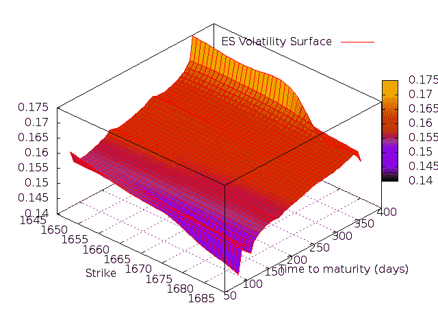
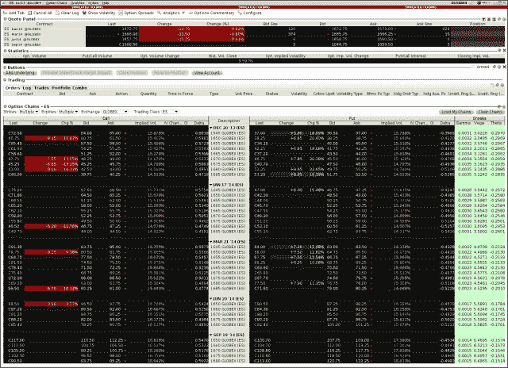

<!--yml
category: 未分类
date: 2024-05-18 06:45:44
-->

# Introducing QuantLib: The Volatility Surface | All things finance and technology…

> 来源：[https://mhittesdorf.wordpress.com/2013/10/10/introducing-quantlib-the-volatility-surface/#0001-01-01](https://mhittesdorf.wordpress.com/2013/10/10/introducing-quantlib-the-volatility-surface/#0001-01-01)

In this post, which largely builds upon my previous post on implied volatility, I’m going to introduce the concept of a volatility surface. A volatility surface renders a volatility measure, such as implied volatility or forward volatility, along the dimensions of both strike and time to maturity. As such, not only does it relate option volatility to strike as does a volatility smile, it also depicts the term structure of volatility for an option contract, much like a yield curve does for interest rates. To find the volatility for a particular option, one must simply locate the point on the surface corresponding to the option’s strike and expiration. The volatility can then be used to price the option with an appropriate option pricing model, such as [Black-Scholes](https://mhittesdorf.wordpress.com/2013/07/29/introducing-quantlib-black-scholes-and-the-greeks/).

A volatility surface can be visualized as a series of volatility smiles, one for each option expiration, where the x axis is strike, y is time to maturity and z is volatility (sigma). Essentially, the volatility surface is constructed by computing the volatility smile for each option expiration and knitting them together, filling in missing data with interpolated or extrapolated values as necessary, such that the result is a continuous, smooth, 3D surface.

An example is shown below, which was generated using implied volatility values for options on the the CBOE’s S&P E-Mini futures contract (symbol: ES).

[](https://mhittesdorf.wordpress.com/wp-content/uploads/2013/10/volsurface.png)

The data used to create the volatility surface above was taken from the Implied Vol. column of this Interactive Brokers screenshot:

[](https://mhittesdorf.wordpress.com/wp-content/uploads/2013/10/esoptions9302013-0903.png)

QuantLib provides explicit support for creating and working with volatility surface objects through its [BlackVarianceSurface](http://quantlib.org/reference/class_quant_lib_1_1_black_variance_surface.html) class. The BlackVarianceSurface class requires a list of strikes, a list of maturity dates and Matrix of volatilities, where the rows of the Matrix correspond to the strikes and the columns correspond to the option expiration dates.

The example code below shows how to construct an instance of a BlackVarianceSurface class from implied volatilities obtained from Interactive Brokers for the September, 2013 through December, 2014 ES future option contract expirations. Alternatively, one could solve for the implied volatilities using the technique described in my previous post in this series.

An important feature of the BlackVarianceSurface class that deserves mention is that it allows for the interpolation algorithm to be specified by the programmer. The default algorithm is [BilinearInterpolation](http://quantlib.org/reference/class_quant_lib_1_1_bilinear_interpolation.html).  QuantLib provides other interpolation classes such as [BicubicSpline](http://quantlib.org/reference/class_quant_lib_1_1_bicubic_spline.html),  and [Polynomial2DSpline](http://quantlib.org/reference/class_quant_lib_1_1_polynomial2_d_spline.html), which all inherit from the [Interpolation2D](http://quantlib.org/reference/class_quant_lib_1_1_interpolation2_d.html) base class.

In the example that follows, I extract the volatility for several strikes and maturities from the ES volatility surface, including strikes that must be interpolated.  Then I set the  interpolator to be BicubicSpline and calculate the volatilities again for the same strikes and maturities.  Lastly, I export the x, y and z volatility surface values to a file so that I can generate a 3D surface plot with [gnuplot](http://www.gnuplot.info/), an open-source charting tool.

The gnuplot script commands follow the C++ code at the end of the listing. I encourage you to run the gnuplot script on your own machine, as gnuplot supports some pretty cool features that allow you  to explore the volatility surface interactively.

So here is the code:

```
 #include <cstdlib>
#include <iostream>
#define BOOST_AUTO_TEST_MAIN
#include <boost/test/unit_test.hpp>
#include <ql/quantlib.hpp>
#include <vector>
#include <boost/assign/std/vector.hpp>

 BOOST_AUTO_TEST_CASE(testVolatilitySurface) {

   using namespace boost::assign;
   std::vector strikes;
   strikes += 1650.0, 1660.0, 1670.0, 1675.0, 1680.0;

   std::vector expirations;
   expirations += Date(20, Month::Dec, 2013), Date(17, 
        Month::Jan, 2014), Date(21, Month::Mar, 2014),
        Date(20, Month::Jun, 2014), Date(19, Month::Sep, 2014);

   Matrix volMatrix(strikes.size(), expirations.size());

   //1650 - Dec, Jan, Mar, Jun, Sep
   volMatrix[0][0] = .15640;
   volMatrix[0][1] = .15433;
   volMatrix[0][2] = .16079;
   volMatrix[0][3] = .16394;
   volMatrix[0][4] = .17383;

   //1660 - Dec, Jan, Mar, Jun, Sep
   volMatrix[1][0] = .15343;
   volMatrix[1][1] = .15240;
   volMatrix[1][2] = .15804;
   volMatrix[1][3] = .16255;
   volMatrix[1][4] = .17303;

   //1670 - Dec, Jan, Mar, Jun, Sep
   volMatrix[2][0] = .15128;
   volMatrix[2][1] = .14888;
   volMatrix[2][2] = .15512;
   volMatrix[2][3] = .15944;
   volMatrix[2][4] = .17038;

   //1675 - Dec, Jan, Mar, Jun, Sep
   volMatrix[3][0] = .14798;
   volMatrix[3][1] = .14906;
   volMatrix[3][2] = .15522;
   volMatrix[3][3] = .16171;
   volMatrix[3][4] = .16156;

   //1680 - Dec, Jan, Mar, Jun, Sep
   volMatrix[4][0] = .14580;
   volMatrix[4][1] = .14576;
   volMatrix[4][2] = .15364;
   volMatrix[4][3] = .16037;
   volMatrix[4][4] = .16042;

   Date evaluationDate(30, Month::Sep, 2013);
   Settings::instance().evaluationDate() = evaluationDate;
   Calendar calendar = UnitedStates(UnitedStates::NYSE);
   DayCounter dayCounter = ActualActual(); 
   BlackVarianceSurface volatilitySurface(Settings::instance().evaluationDate(), 
        calendar, expirations, strikes,     volMatrix, dayCounter);		
   volatilitySurface.enableExtrapolation(true);

   std::cout << "Using standard bilinear interpolation..." << std::endl;		
   Real dec1650Vol = volatilitySurface.blackVol(expirations[0], 1650.0, true);
   std::cout << boost::format("Dec13 1650.0 volatility: %f") % dec1650Vol << std::endl;

   Real dec1655Vol = volatilitySurface.blackVol(expirations[0], 1655.0, true);
   std::cout << boost::format("Dec13 1655.0 volatility (interpolated): %f") % dec1655Vol << std::endl;

   Real dec1685Vol = volatilitySurface.blackVol(expirations[0], 1685.0, true);
   std::cout << boost::format("Dec13 1685.0 volatility (interpolated): %f") % dec1685Vol << std::endl;

   Real jun1655Vol = volatilitySurface.blackVol(expirations[3], 1655.0, true);
   std::cout << boost::format("Jun14 1655.0 volatility (interpolated): %f") % jun1655Vol << std::endl;

   Real sep1680Vol = volatilitySurface.blackVol(expirations[4], 1680.0, true);
   std::cout << boost::format("Sep14 1680.0 volatility: %f") % sep1680Vol << std::endl;

   //change interpolator to bicubic splines
   volatilitySurface.setInterpolation<Bicubic>();

   std::cout << "Using bicubic spline interpolation..." << std::endl;
   dec1650Vol = volatilitySurface.blackVol(expirations[0], 1650.0, true);
   std::cout << boost::format("Dec13 1650.0 volatility: %f") % dec1650Vol << std::endl;

   dec1655Vol = volatilitySurface.blackVol(expirations[0], 1655.0, true);
   std::cout << boost::format("Dec13 1655.0 volatility (interpolated): %f") % dec1655Vol << std::endl;

   dec1685Vol = volatilitySurface.blackVol(expirations[0], 1685.0, true);
   std::cout << boost::format("Dec13 1685.0 volatility (interpolated): %f") % dec1685Vol << std::endl;

   jun1655Vol = volatilitySurface.blackVol(expirations[3], 1655.0, true);
   std::cout << boost::format("Jun14 1655.0 volatility (interpolated): %f") % jun1655Vol << std::endl;

   sep1680Vol = volatilitySurface.blackVol(expirations[4], 1680.0, true);
   std::cout << boost::format("Sep14 1680.0 volatility: %f") % sep1680Vol << std::endl; 

   //write out data points for gnuplot surface plot (using last interpolator - bicubic splines)
   std::ofstream volSurfaceFile;
   volSurfaceFile.open("/tmp/volsurface.dat", std::ios::out);

   for (Date expiration: expirations) {
      for (Real strike = strikes[0] - 5.0; strike <= strikes[4] + 5.0; ++strike) {
         Real volatility = volatilitySurface.blackVol(expiration, strike, true);
         volSurfaceFile << boost::format("%f %f %f") % strike % 
            dayCounter.dayCount(Settings::instance().evaluationDate(), 
            expiration) % volatility << std::endl;
      }
   }

   volSurfaceFile.close();

}

/* gnuplot script to generate 3D surface plot

set key top center
set xlabel "Strike"
set ylabel "Time to maturity (days)"
set border 4095
set ticslevel 0
set dgrid3d 41,41
set pm3d 
splot "volsurface.dat" u 1:2:3 with lines title "ES Volatility Surface"

*/ 
```

When run, the program produces the following output:
 `Using standard bilinear interpolation...
Dec13 1650.0 volatility: 0.156400
Dec13 1655.0 volatility (interpolated): 0.154922
Dec13 1685.0 volatility (interpolated): 0.143587
Jun14 1655.0 volatility (interpolated): 0.163246
Sep14 1680.0 volatility: 0.160420
Using bicubic spline interpolation...
Dec13 1650.0 volatility: 0.156400
Dec13 1655.0 volatility (interpolated): 0.154662
Dec13 1685.0 volatility (interpolated): 0.143587
Jun14 1655.0 volatility (interpolated): 0.163750
Sep14 1680.0 volatility: 0.160420` 

As you can see, the choice of interpolator can impact the shape of the volatility surface which can, in turn, alter the price of options calculated with the corresponding volatilities.

So that’s about it for this latest installment of my Introducing QuantLib series. I hope you enjoyed it. Please do not hesitate to post any comments or questions you might have. I would love to get some more feedback on these posts from my readers. As always, until next time, have fun with QuantLib!