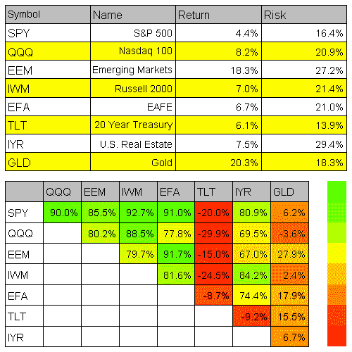
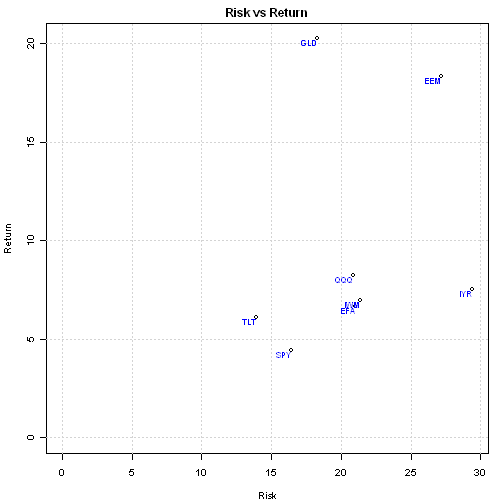
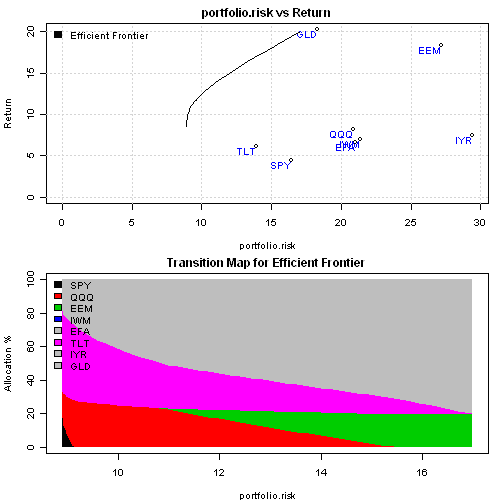

<!--yml
category: 未分类
date: 2024-05-18 14:48:46
-->

# Introduction to Asset Allocation | Systematic Investor

> 来源：[https://systematicinvestor.wordpress.com/2011/10/13/introduction-to-asset-allocation/#0001-01-01](https://systematicinvestor.wordpress.com/2011/10/13/introduction-to-asset-allocation/#0001-01-01)

This is the first post in the series about [Asset Allocation](http://en.wikipedia.org/wiki/Asset_allocation), Risk Measures, and Portfolio Construction. I will use simple and naive historical input assumptions for illustration purposes across all posts.

In these series I plan to discuss:

The plan for this post is an Introduction to Asset Allocation.  I will show how to create and visualize input assumptions, set constraints, and create [Markowitz mean-variance efficient frontier](http://en.wikipedia.org/wiki/Efficient_frontier).

First let’s load [Systematic Investor Toolbox](https://github.com/systematicinvestor/SIT) and download historical prices from [Yahoo Finance](http://finance.yahoo.com/):

```

# load Systematic Investor Toolbox
setInternet2(TRUE)
source(gzcon(url('https://github.com/systematicinvestor/SIT/raw/master/sit.gz', 'rb')))

load.packages('quantmod')

# load historical prices from Yahoo Finance
symbols = spl('SPY,QQQ,EEM,IWM,EFA,TLT,IYR,GLD')
symbol.names = spl('S&P 500,Nasdaq 100,Emerging Markets,Russell 2000,EAFE,20 Year
Treasury,U.S. Real Estate,Gold')

getSymbols(symbols, from = '1980-01-01', auto.assign = TRUE)

# align dates for all symbols & convert to monthly
hist.prices = merge(SPY,QQQ,EEM,IWM,EFA,TLT,IYR,GLD)
	month.ends = endpoints(hist.prices, 'months')
	hist.prices = Cl(hist.prices)[month.ends, ]
	colnames(hist.prices) = symbols

# remove any missing data
hist.prices = na.omit(hist.prices['1995::2010'])

# compute simple returns
hist.returns = na.omit( ROC(hist.prices, type = 'discrete') )

```

To create input assumptions, I will compute mean, standard deviation, and Pearson correlation using historical monthly returns:

```

# compute historical returns, risk, and correlation
ia = list()
ia$expected.return = apply(hist.returns, 2, mean, na.rm = T)
ia$risk = apply(hist.returns, 2, sd, na.rm = T)
ia$correlation = cor(hist.returns, use = 'complete.obs', method = 'pearson')

ia$symbols = symbols
ia$symbol.names = symbol.names
ia$n = len(symbols)
ia$hist.returns = hist.returns

# convert to annual, year = 12 months
annual.factor = 12
ia$expected.return = annual.factor * ia$expected.return
ia$risk = sqrt(annual.factor) * ia$risk

# compute covariance matrix
ia$risk = iif(ia$risk == 0, 0.000001, ia$risk)
ia$cov = ia$cor * (ia$risk %*% t(ia$risk))

```

Now its a good time to visualize input assumptions:

```

# visualize input assumptions
plot.ia(ia)

# display each asset in the Risk - Return plot
layout(1)
par(mar = c(4,4,2,1), cex = 0.8)
x = 100 * ia$risk
y = 100 * ia$expected.return

plot(x, y, xlim = range(c(0, x)), ylim = range(c(0, y)),
	xlab='Risk', ylab='Return', main='Risk vs Return', col='black')
grid();
text(x, y, symbols,	col = 'blue', adj = c(1,1), cex = 0.8)

```

[](https://systematicinvestor.wordpress.com/wp-content/uploads/2011/10/plot1-small3.png)

[](https://systematicinvestor.wordpress.com/wp-content/uploads/2011/10/plot2-small3.png)

There many [problems](http://www.cbo.gov/doc.cfm?index=3235&type=0&sequence=5) with these input assumptions, to name a few:

*   historical mean might not be a good proxy for expected returns
*   weighted historical mean maybe a better choice because it puts more weight on the recent observations
*   correlations are not stable
*   volatility tends to cluster
*   input assumptions for cash and bonds are better approximated by current yields and short-term variations

I will only use these simple and naive historical input assumptions for illustration purposes.

To create [efficient frontier](http://en.wikipedia.org/wiki/Efficient_frontier), I will consider portfolios with allocations to any asset class ranging between 0% and 80% and total portfolio weight equal to 100%. (I limited the maximum allocation to any asset class to 80%, just as an example)

```

# Create Efficient Frontier
n = ia$n

# 0 <= x.i <= 0.8 
constraints = new.constraints(n, lb = 0, ub = 0.8)

# SUM x.i = 1 ( total portfolio weight = 100%)
constraints = add.constraints(rep(1, n), 1, type = '=', constraints)

# create efficient frontier consisting of 50 portfolios
ef = portopt(ia, constraints, 50, 'Sample Efficient Frontier')

# plot efficient frontier
plot.ef(ia, list(ef))

```

[](https://systematicinvestor.wordpress.com/wp-content/uploads/2011/10/plot3-small2.png)

The Transition Map displays portfolio weights as we move along the efficient frontier. I display portfolio risk along the X axis, and portfolio weights along the Y axis. The width of the slice represents the portfolio weight for the given risk level. For example, in the above Transition Map plot, the allocation to Gold (GLD – gray) was about 20% at the lower risk level and steadily grew to 80% at the higher risk level. Similarly, the allocation to Bonds (TLT – pink) was about 50% at the lower risk level and steadily shrank to 0% at the higher risk level.

Finally I want to go over logic of “portopt” function that creates efficient frontier for us. The first step to create efficient frontier is to find the top,right (maximum return portfolio) and bottom,left (minimum risk portfolio). Next, I divide the return space between minimum risk portfolio and maximum return portfolio into nportfolios equally spaced points. For each point, I find minimum risk portfolio with additional constraint that portfolio return has to be equal target return for this point. The last step is to compute returns and risks for portfolio on efficient frontier.

```

portopt <- function
(
	ia,				# Input Assumptions
	constraints = NULL,		# Constraints
	nportfolios = 50,		# Number of portfolios
	name = 'Risk',			# Name
	min.risk.fn = min.risk.portfolio	# Risk Measure
)
{
	# set up output 
	out = list(weight = matrix(NA, nportfolios, ia$n))
		colnames(out$weight) = ia$symbols		

	# find maximum return portfolio	
	out$weight[1, ] = max.return.portfolio(ia, constraints)

	# find minimum risk portfolio
	out$weight[nportfolios, ] = match.fun(min.risk.fn)(ia, constraints)	

	# find points on efficient frontier
	out$return = portfolio.return(out$weight, ia)
	target = seq(out$return[1], out$return[nportfolios], length.out = nportfolios)

	constraints = add.constraints(ia$expected.return, target[1], type = '=', constraints)

	for(i in 2:(nportfolios - 1) ) {
		constraints$b[1] = target[i]
		out$weight[i, ] = match.fun(min.risk.fn)(ia, constraints)
	}

	# compute risk / return
	out$return = portfolio.return(out$weight, ia)
	out$risk = portfolio.risk(out$weight, ia)
	out$name = name

	return(out)			
}

```

I will discuss a Maximum Loss risk measure and compare it to a traditional Risk, as measured by standard deviation, risk measure in the next post.

To view the complete source code for this example, please have a look at the [aa.test() function in aa.test.r at github](https://github.com/systematicinvestor/SIT/blob/master/R/aa.test.r).