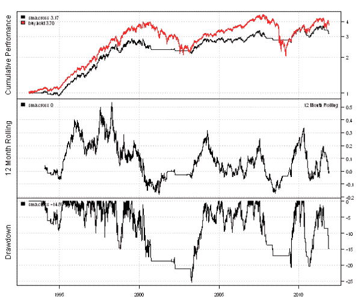
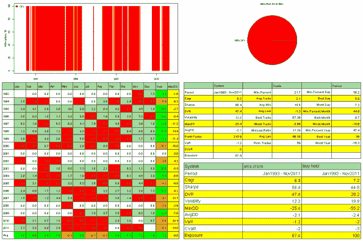
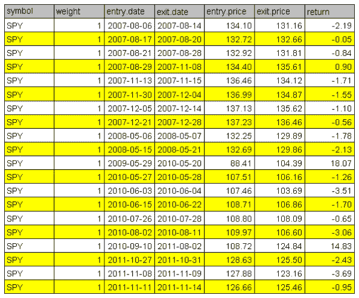

<!--yml
category: 未分类
date: 2024-05-18 14:39:18
-->

# Introduction to Backtesting library in the Systematic Investor Toolbox | Systematic Investor

> 来源：[https://systematicinvestor.wordpress.com/2011/11/25/introduction-to-backtesting-library-in-the-systematic-investor-toolbox/#0001-01-01](https://systematicinvestor.wordpress.com/2011/11/25/introduction-to-backtesting-library-in-the-systematic-investor-toolbox/#0001-01-01)

I wrote a simple [Backtesting](http://www.investopedia.com/terms/b/backtesting.asp) library to evaluate and analyze Trading Strategies. I will use this library to present the performance of trading strategies that I will study in the next series of posts.

It is very easy to write a simple Backtesting routine in R, for example:

```

bt.simple <- function(data, signal) 
{
	# lag singal
	signal = Lag(signal, 1)

	# back fill
	signal = na.locf(signal, na.rm = FALSE)
	signal[is.na(signal)] = 0

	# calculate Close-to-Close returns
	ret = ROC(Cl(data), type='discrete')
	ret[1] = 0

	# compute stats	
	bt = list()
		bt$ret = ret * signal
		bt$equity = cumprod(1 + bt$ret)    	    	
	return(bt)
}

# Test for bt.simple functions
load.packages('quantmod')

# load historical prices from Yahoo Finance
data = getSymbols('SPY', src = 'yahoo', from = '1980-01-01', auto.assign = F)

# Buy & Hold
signal = rep(1, nrow(data))
buy.hold = bt.simple(data, signal)

# MA Cross
sma = SMA(Cl(data),200)
signal = ifelse(Cl(data) > sma, 1, 0)
sma.cross = bt.simple(data, signal)

# Create a chart showing the strategies perfromance in 2000:2009
dates = '2000::2009'
buy.hold.equity = buy.hold$equity[dates] / as.double(buy.hold$equity[dates][1])
sma.cross.equity = sma.cross$equity[dates] / as.double(sma.cross$equity[dates][1])

chartSeries(buy.hold.equity, TA = c(addTA(sma.cross.equity, on=1, col='red')),	
	theme ='white', yrange = range(buy.hold.equity, sma.cross.equity) )	

```

The code I implemented in the [Systematic Investor Toolbox](https://systematicinvestor.wordpress.com/systematic-investor-toolbox/) is a bit longer, but follows the same logic. It provides extra functionality: ability to handle multiple securities, weights or shares backtesting, and customized reporting. Following is a sample code to implement the above strategies using the backtesting library in the [Systematic Investor Toolbox](https://systematicinvestor.wordpress.com/systematic-investor-toolbox/):

```

# Load Systematic Investor Toolbox (SIT)
setInternet2(TRUE)
con = gzcon(url('https://github.com/systematicinvestor/SIT/raw/master/sit.gz', 'rb'))
	source(con)
close(con)

	#*****************************************************************
	# Load historical data
	#****************************************************************** 	
	load.packages('quantmod')
	tickers = spl('SPY')

	data <- new.env()
	getSymbols(tickers, src = 'yahoo', from = '1970-01-01', env = data, auto.assign = T)
	bt.prep(data, align='keep.all', dates='1970::2011')

	#*****************************************************************
	# Code Strategies
	#****************************************************************** 
	prices = data$prices    

	# Buy & Hold	
	data$weight[] = 1
	buy.hold = bt.run(data)	

	# MA Cross
	sma = bt.apply(data, function(x) { SMA(Cl(x), 200) } )	
	data$weight[] = NA
		data$weight[] = iif(prices >= sma, 1, 0)
	sma.cross = bt.run(data, trade.summary=T)			

	#*****************************************************************
	# Create Report
	#****************************************************************** 
	plotbt.custom.report(sma.cross, buy.hold)

```

The **bt.prep** function merges and aligns all symbols in the data environment. The **bt.apply** function applies user given function to each symbol in the data environment. The **bt.run** computes the equity curve of strategy specified by **data$weight** matrix. The **data$weight** matrix holds weights (signals) to open/close positions. The **plotbt.custom.report** function creates the customized report, which can be fined tuned by the user. Here is a sample output:

```

> buy.hold = bt.run(data)
Performance summary :
        CAGR    Best    Worst
        7.2     14.5    -9.9

> sma.cross = bt.run(data, trade.summary=T)
Performance summary :
        CAGR    Best    Worst
        6.3     5.8     -7.2

```

The visual performance summary:
[](https://systematicinvestor.wordpress.com/wp-content/uploads/2011/11/plot1-small8.png)

The statistical performance summary:
[](https://systematicinvestor.wordpress.com/wp-content/uploads/2011/11/plot2-small7.png)

The trade summary:
[](https://systematicinvestor.wordpress.com/wp-content/uploads/2011/11/plot3-small5.png)

To view the complete source code for this example, please have a look at the [bt.test() function in bt.r at github](https://github.com/systematicinvestor/SIT/blob/master/R/bt.r).