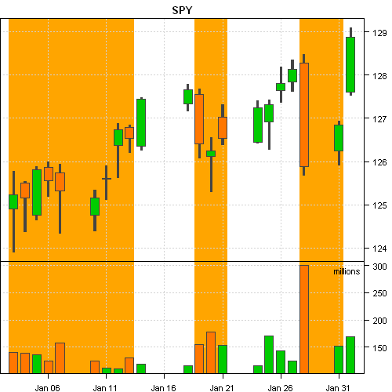
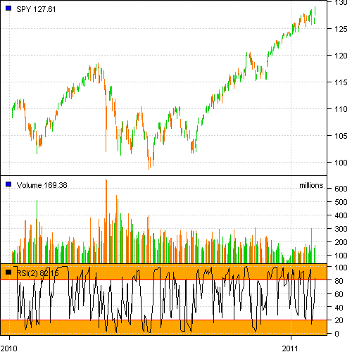
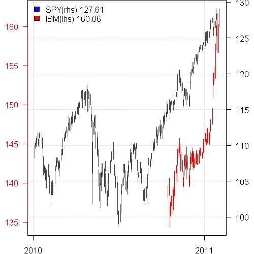
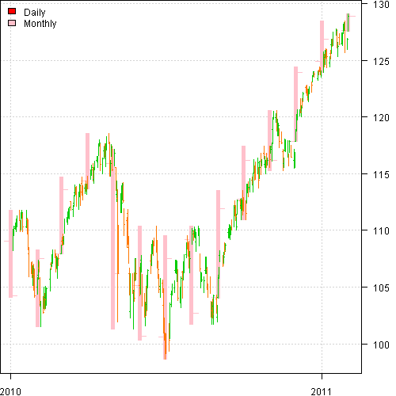
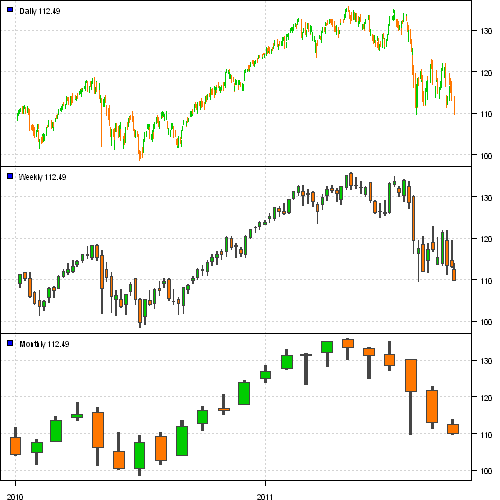

<!--yml
category: 未分类
date: 2024-05-18 14:38:35
-->

# Introduction to PloTA library in the Systematic Investor Toolbox | Systematic Investor

> 来源：[https://systematicinvestor.wordpress.com/2011/10/04/introduction-to-plota-library-in-the-systematic-investor-toolbox/#0001-01-01](https://systematicinvestor.wordpress.com/2011/10/04/introduction-to-plota-library-in-the-systematic-investor-toolbox/#0001-01-01)

PloTA ( plot + ta ) library in the Systematic Investor Toolbox is a simple plot interface to charting Time Series and Technical Analysis plots. I created it as an alternative to charting functionality in [quantmod](http://www.quantmod.com/) package. It is designed to mimic default plot interface and works with [xts](http://cran.r-project.org/web/packages/xts/index.html) objects. PloTA implements following methods:

*   plota – main plot method
*   plota2Y – add second Y axis to existing plot

*   plota.lines – plot lines
*   plota.candle – plot Candle
*   plota.ohlc – plot Open/High/Low/Close
*   plota.hl – plot High/Low
*   plota.volume – plot Volume
*   plota.scale.volume – scale Volume

*   plota.grid – add grid
*   plota.legend – plot legend
*   plota.layout – specify plot layout

*   plota.theme.blue.red – color theme
*   plota.theme.green.orange – color theme
*   plota.theme.gray.orange – color theme

To start using PloTA, let’s first load Systematic Investor Toolbox:

```

###############################################################################
# Load Systematic Investor Toolbox (SIT)
# https://systematicinvestor.wordpress.com/systematic-investor-toolbox/
###############################################################################
setInternet2(TRUE)
con = gzcon(url('http://www.systematicportfolio.com/sit.gz', 'rb'))
    source(con)
close(con)

```

Next let’s load [quantmod](http://www.quantmod.com/) package and download price history for SPY and IBM:

```

load.packages('quantmod')

# download sample data from Yahoo
data.spy = getSymbols('SPY', from = '1980-01-01', auto.assign = FALSE)
data.ibm = getSymbols('IBM', from = '1980-01-01', auto.assign = FALSE)

```

Next I will show a few simple uses of PloTA library.

To create a simple chart of SPY:

```

y = data.spy['2011:01:01::2011:02:01']
highlight = which(Cl(y) < 127)

png(filename = 'plot1.png', width = 500, height = 500, units = 'px', pointsize = 12, bg = 'white')

layout(c(1,1,2))
plota(y, type = 'candle', main = 'SPY', plotX = F, x.highlight = highlight)
	y = plota.scale.volume(y)
plota(y, type = 'volume', x.highlight = highlight)

dev.off()

```

[](https://systematicinvestor.wordpress.com/wp-content/uploads/2011/10/plot1.png)

To create a simple chart of SPY with RSI and Legend:

```

y = data.spy['2010:01:01::2011:02:01']

layout(c(1,1,2,3))
plota(y, type = 'candle', plotX = F)
	plota.legend('SPY', 'blue', y)

y = plota.scale.volume(y)
plota(y, type = 'volume', plotX = F)
	plota.legend('Volume', 'blue', Vo(y))

rsi = RSI(Cl(y),2)
plota(rsi, type = 'l', y.highlight = c(c(Inf,80),c(20,-Inf)))
	abline(h = 20, col = 'red')
	abline(h = 80, col = 'red')
	plota.legend('RSI(2)', 'black', rsi)

```

[](https://systematicinvestor.wordpress.com/wp-content/uploads/2011/10/plot2.png)

To create a chart with second Y axis:

```

y = data.spy['2010:01:01::2011:02:01']

# to plot second Y axis, free some space on left side
# e.g. set LeftMargin=3
plota(y, type = 'ohlc', LeftMargin=3)

y0 = y;
y = data.ibm['2010:10:15::2011:02:01']
plota2Y(y, ylim = range(OHLC(y)),las=1, col='red', col.axis = 'red')
	plota.ohlc(y, col = 'red')
	plota.legend('SPY(rhs),IBM(lhs)', 'blue,red', list(y0,y))

```

[](https://systematicinvestor.wordpress.com/wp-content/uploads/2011/10/plot3.png)

To plot daily and monthly on the same plot:

```

y = data.spy['2010:01:01::2011:02:01']

plota(y, type = 'candle')
	y1 = to.monthly(y)
		index(y1) = as.Date(index(y1))
	plota.ohlc(y1, col = 'pink')
	plota.candle(y)
	plota.legend('Daily,Monthly', 'red,pink')

```

[](https://systematicinvestor.wordpress.com/wp-content/uploads/2011/10/plot42.png)

To plot daily, weekly and monthly:

```

y = data.spy['2010:01:01::2011']

layout(c(1,2,3))
plota(y, type = 'candle', plotX = F)
	plota.legend('Daily', 'blue', y)

plota(y, ylim = range(OHLC(y)), plotX = F)
	y1 = to.weekly(y)
		index(y1) = as.Date(index(y1))
	plota.candle(y1)
	plota.legend('Weekly', 'blue', y1)

plota(y, ylim = range(OHLC(y)))
	y1 = to.monthly(y)
		index(y1) = as.Date(index(y1))
	plota.candle(y1)
	plota.legend('Monthly', 'blue', y1)

```

[](https://systematicinvestor.wordpress.com/wp-content/uploads/2011/10/plot5.png)

I will show more examples of PloTA in the future posts.

To view the complete source code for this example, please have a look at the [plota.test() function in plota.r at github](https://github.com/systematicinvestor/SIT/blob/master/R/plota.r).