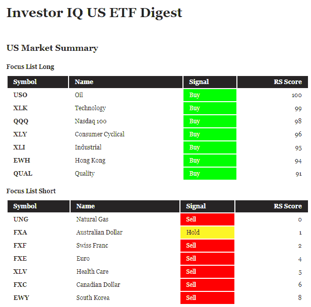

<!--yml
category: 未分类
date: 2024-05-12 17:42:17
-->

# Investor IQ: Focus List | CSSA

> 来源：[https://cssanalytics.wordpress.com/2019/05/22/investor-iq-focus-list/#0001-01-01](https://cssanalytics.wordpress.com/2019/05/22/investor-iq-focus-list/#0001-01-01)

Our Investor IQ weekly publication which is updated every Monday morning (on the top right hand corner of this blog) provides basic trend-following and relative strength (RS) signals for both US and Canadian ETFs and individual stocks. We recently added a “Focus List” at the request of some of our readers which highlights both long and short positions to focus on. The focus list long positions have a relative strength>90% and are either a buy or a hold position based on a composite of trend-following and momentum signals. The focus list short positions have a relative strength<10% and are either a sell or a hold position. An example can be seen in the picture below:

We also recently added signals for the Dow 30 stocks and also the S&P/TSX 60 stocks in Canada. We plan to expand the universe of both ETFs and Stocks over time. As a result of the trade war, we have included the Chinese Yuan (CYB) to the currency section for US ETFs as being one ticker worth watching as it has been an early warning for the stock market in recent times.